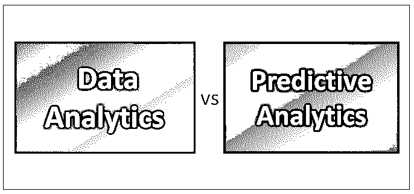
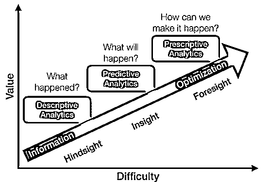

# 数据分析与预测分析

> 原文：<https://www.educba.com/data-analytics-vs-predictive-analytics/>

## 数据分析与预测分析的区别

分析是指使用数据、机器学习、统计分析和数学或基于计算机的模型来提高洞察力并做出更好的决策。分析被定义为“在组织决策和解决问题的背景下，通过分析和洞察将数据转化为行动的过程。”许多工具都支持分析，如 Microsoft Excel、SAS、R、Python(库)。让我们在这篇文章中详细了解数据分析和预测分析。

主要有三种类型的分析:–描述性分析、预测性分析和规定性分析。

<small>Hadoop、数据科学、统计学&其他</small>

Source: Google Image

**描述性分析:**这种类型的分析用于汇总数据或将数据转化为相关信息。换句话说，它总结了已经发生的事情。这种类型的分析有一些有意义的影响，但对预测没有太大帮助。

**预测分析**:–[预测分析涉及高级统计](https://www.educba.com/what-is-predictive-analytics/)、建模、数据挖掘和一种或多种机器学习技术，以挖掘数据并允许分析师做出预测。预测分析用于预测未来会发生什么。

**规定性分析:**–这种形式的分析比描述性和预测性分析更上一层楼。通过这种类型的分析，我们能够根据一项行动可能的不同选择来预测可能的后果，它还可以用于为任何预先指定的结果找到最佳行动方案。

### 数据分析和预测分析之间的直接比较(信息图表)

以下是数据分析和预测分析之间的六大对比:

### 

### 数据分析和预测分析的主要区别

让我们来了解一下数据分析和预测分析之间的一些区别，这些术语看起来很相似:

1.  数据分析(DA)涉及处理和检查数据集，以得出关于这些数据集所包含的信息的结论。预测分析通过彻底检查历史数据，检测这些数据中的模式或关系，然后及时总结这些关系，来帮助预测未来。
2.  数据分析使用工具和技术来帮助企业做出更加明智、[实时、](https://www.educba.com/real-time-analytics/)和务实的商业决策。预测分析可以预测风险，并在数据中找到传统分析不容易发现的关系。
3.  数据分析涉及在大量数据集中发现隐藏模式，将数据分割和分组到逻辑集合中，以发现行为和检测趋势，而预测分析涉及使用一些高级分析技术。
4.  通常，数据科学家和研究人员使用数据分析来验证或反驳科学模型、理论和假设。而预测分析，随着专业系统和软件的使用越来越多，帮助数据科学家和研究人员对预测和可能的结果充满信心。
5.  数据分析是一门科学，它使用原始数据并生成有目的的信息，这些信息有一个明确的目标，可以得出关于这些信息的结论。数据分析使用传统的算法或机械流程来构建深刻的见解。例如，运行多个数据集以寻找彼此之间有意义的相关性。预测分析使用先进的计算模型和算法来智能地构建预测或预测平台，例如，商品交易商可能希望预测商品价格、集合分析、[欺诈检测](https://www.educba.com/fraud-detection-analytics/)等的短期运动。
6.  在数据分析领域工作需要很强的统计知识，而在预测分析领域工作需要很强的技术知识和基本的统计知识。他/她可能会被要求使用和处理技术工具，如 SAS，R 和 Hadoop。
7.  数据分析通常用于企业对消费者(B2C)应用。许多组织收集、存储、分析和清理与其客户、业务合作伙伴、市场竞争对手等相关的数据。然后使用数据分析来研究趋势和模式。预测分析有助于未来的决策。例如，[社交网络](https://www.educba.com/social-media-marketing-tips/)网站根据特定标准(如年龄、性别和最重要的人口统计数据)收集与其用户相关的数据，包括他们的兴趣、社区喜好和其他细分偏好。预测分析揭示了此类用户未来最有可能购买的产品或偏好的购物项目。

### 数据分析和预测分析对照表

解释了数据分析和预测分析之间的比较表。

| **比较依据** | **数据分析** | **预测分析** |
| **Form** | 数据分析是一种“通用”的分析形式，在企业中用于制定数据驱动的决策。 | 预测分析是企业用来预测未来结果的“专门”分析形式。 |
| **结构** | 数据分析通常由数据收集和数据分析组成，可能有一种或多种用途。 | 预测分析包括定义项目和数据收集、统计建模、分析和监控，然后预测结果 |
| **Data** | 原始数据被搅拌以获得用于数据分析的干净数据。 | 为预测分析提供干净的数据 |
| **序列** | 数据分析按以下步骤排序——收集、检查、清理、转换数据，并得出结论。 | 预测分析按以下步骤进行——建立数据模型、训练模型、预测和预测结果。 |
| **Outcome** | 数据分析的结果可能是可预测的，也可能不是，这取决于业务案例要求。 | 预测分析允许我们声明假设，并使用统计模型进行检验。之后，预测模型让你有能力创建一个关于未来的精确模型。 |
| **用途** | 一般来说，数据分析可用于发现隐藏模式、未识别的相关性、客户偏好、市场趋势和其他有用信息，从而帮助企业做出更明智的决策。 | 预测分析有助于回答诸如“如果需求下降 10%或供应商价格上涨 5%会发生什么？”"接下来的几个月，我们假设要付多少燃料费？"在新的商业企业中亏损的风险是什么？" |

### 结论

如今，跨组织收集了大量数据。这些数据可能与客户、业务合作伙伴、应用程序用户、访问者、内部员工和外部利益相关者等相关。这些数据被搅拌和分类，以发现和分析模式。数据分析是指涉及定性和定量方法和流程的各种工具和技术，这些工具和技术利用收集到的数据，生成用于提高效率、生产力、降低风险和增加业务收益的结果。数据分析技术因组织的需求而异。

预测分析作为数据分析的一个子集，是一种专门的决策工具，它使用先进的技术资产和基于渐进统计的算法和模型来生成未来预测，以便企业可以将资金和精力集中并用于更积极和预期的结果。

### 推荐文章

这是数据分析与预测分析的指南。在这里，我们讨论了数据分析与预测分析的直接比较、关键差异以及信息图表和比较表。您也可以阅读以下文章，了解更多信息——

1.  商业分析与商业智能的区别？
2.  [商业智能与数据分析——哪个更有用](https://www.educba.com/business-intelligence-vs-data-analytics/)
3.  [预测分析与数据科学——了解 8 个有用的对比](https://www.educba.com/predictive-analytics-vs-data-science/)
4.  [数据可视化与数据分析——你需要知道的 7 件事](https://www.educba.com/data-visualisation-vs-data-analytics/)
5.  [7 商业分析与预测分析之间最有用的对比](https://www.educba.com/business-analytics-vs-predictive-analytics/)

