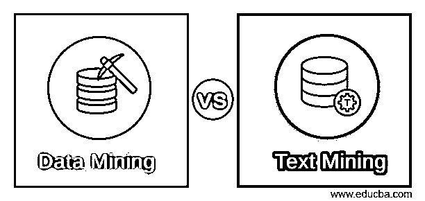
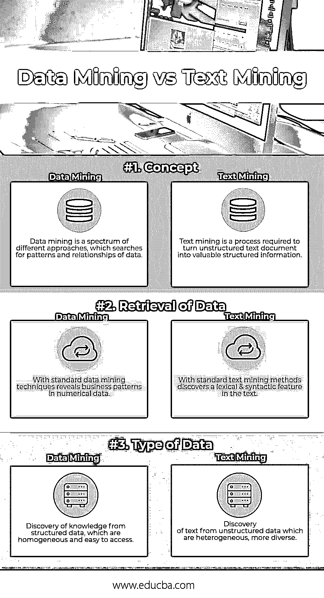

# 数据挖掘与文本挖掘

> 原文：<https://www.educba.com/data-mining-vs-text-mining/>

## 数据挖掘和文本挖掘的区别

数据挖掘与文本挖掘是与数据分析相关的比较概念。[数据挖掘](https://www.educba.com/what-is-data-mining/)指的是分析大型数据集以识别有意义模式的过程，而文本挖掘则是分析非结构化格式的文本数据，并将其映射为结构化格式以获得有意义的见解。数据挖掘主要依赖于统计技术和算法，而文本挖掘依赖于统计技术和语言分析。数据挖掘高度依赖于数字业务数据，而文本挖掘过程依赖于文本数据的词汇和语法结构。

### 数据挖掘

数据挖掘为探索检索和推理之间的有趣关系提供了一个极好的机会，这是关于数据挖掘本质的一个基本问题。

<small>Hadoop、数据科学、统计学&其他</small>

数据挖掘过程分为以下步骤:

*   收集、提取、转换数据并将其加载到数据仓库中。
*   在内部服务器或云中存储和管理数据、多维数据库。
*   为业务分析师、管理团队和信息技术专业人员提供数据访问，并确定他们希望如何使用应用软件组织数据。
*   最后，以易于共享的格式呈现数据，如表格或图表。

### 文本挖掘

文本挖掘需要能够分析非结构化文本格式的复杂的语言和统计技术，以及将每个文档与可操作的元数据相结合的技术，这可以被认为是结构化这种类型的数据的一种锚。

文本挖掘包括多种方法和技术，例如:

*   **基于关键字的技术:**输入基于文本中的关键字选择，这些关键字被过滤为一系列字符串，而不是单词或“概念”。
*   **统计技术:**指基于机器学习的系统。统计技术利用一组训练文档作为模型来管理和分类文本。
*   基于语言的技术:这种方法可以利用语言处理系统。文本分析的输出允许对文本的结构、语法和逻辑的浅显理解。(为了更好地理解这是如何工作的，这篇关于文本挖掘和 NLP 的文章是有帮助的。)

所有这些方法都有一个共同的特征，即它们都关心以近似的方式处理文本，而它们却不能理解文本。

### 数据挖掘和文本挖掘的直接比较(信息图表)

以下是数据挖掘和文本挖掘之间的三大比较:

### 数据挖掘和文本挖掘的主要区别

数据挖掘和文本挖掘之间的区别在以下几点进行了解释:

*   数据挖掘系统本质上分析可以被描述为同质和通用的数字。它提取、转换数据并将其加载到数据仓库中。业务分析师使用数据挖掘软件应用程序以易于理解的形式(如表格或图形)呈现分析的数据。货币、日期、名称可能需要管理，但是它们很容易链接到数据，并且不需要对它们的上下文有任何深刻的理解。文本挖掘工具必须面对主要的技术挑战，例如异构文档格式(文本文档、电子邮件、社交媒体帖子、逐字文本等。)，以及多语种文本和短信语言特有的缩写和俚语。
*   数据挖掘集中于依赖数据的活动，如会计、采购、供应链、CRM 等。所需的数据易于访问并且是同质的。一旦定义了算法，就可以快速部署解决方案。所处理数据的复杂性使得文本挖掘项目需要更长的部署时间。在丰富内容之前，文本挖掘会计算几个中间语言分析阶段(语言猜测、[标记化](https://www.educba.com/tokenization-in-python/)、分割、形态句法分析、歧义消除、交叉引用等)。接下来，相关术语提取和元数据关联步骤处理非结构化内容的结构化，以培育特定领域的应用程序。此外，项目可能涉及一些异构的语言、格式或领域。最后，很少有公司有自己的分类法。然而，这对于开始一个文本挖掘项目是强制性的，并且可能需要几个月的时间来开发。
*   几十年来，数据挖掘一直被认为是一项成熟、可靠的工业技术。历史上，文本挖掘被认为是复杂的、特定领域的、特定语言的、敏感的、实验性的等等。换句话说，人们对文本挖掘的理解还不足以获得管理层的支持，因此，它从未被认为是“必须的”。然而，随着数字化的到来，社交网络的兴起和连通性的提高，公司现在更加关注他们的在线声誉，并在选择越来越多的世界中寻找提高客户忠诚度的方法。因此，情感分析成为文本挖掘的新焦点。公司已经意识到信息是由文本构成的战略资产，文本挖掘不再是奢侈品，而是必需品！

### 数据挖掘和文本挖掘对照表

下面是描述数据挖掘和文本挖掘之间的比较的要点列表。

| **比较基准** | **数据挖掘** | **文本挖掘** |
| **概念** | 数据挖掘是一系列不同的方法，它搜索数据的模式和关系。 | [文本挖掘](https://www.educba.com/what-is-text-mining/)是将非结构化文本文档转化为有价值的结构化信息的过程。 |
| **数据检索** | 用标准的数据挖掘技术揭示数字数据中的商业模式。 | 使用标准的文本挖掘方法发现文本中的词汇和句法特征。 |
| **数据类型** | 从[结构化数据](https://www.educba.com/type-of-data-mining/)中发现知识，这些数据是同构的，易于访问。 | 从异构的、更加多样化的非结构化数据中发现文本。 |

### 结论

文本和数据挖掘现在被认为是有效业务管理所需的补充技术，文本挖掘工具变得更加重要。自然语言处理是文本挖掘的一个子集，当客户 100%参与并可以帮助定义准确和完整的特定领域分类法时，自然语言处理就显得更加重要。反过来，这有助于信息提取和元数据关联变得更加容易和高效。自然语言永远不会像数字那样容易处理，但文本挖掘现在更加成熟，它与数据挖掘的关联更有意义。别忘了 80%的信息是由文字构成的！

### 推荐文章

这是数据挖掘和文本挖掘的指南。在这里，我们将讨论直接比较、主要差异以及信息图和比较表。您也可以阅读以下文章，了解更多信息——

1.  [商业智能与数据挖掘——哪个更有用](https://www.educba.com/business-intelligence-vs-data-mining/)
2.  [成功企业的 8 项重要数据挖掘技术](https://www.educba.com/data-mining-techniques/)
3.  [9 数据科学与数据挖掘之间的惊人差异](https://www.educba.com/data-science-vs-data-mining/)
4.  [获得最佳结果的 7 种重要数据挖掘技术](https://www.educba.com/data-mining-techniques/)

