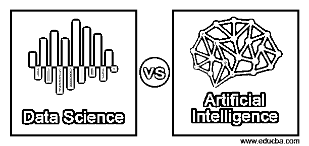
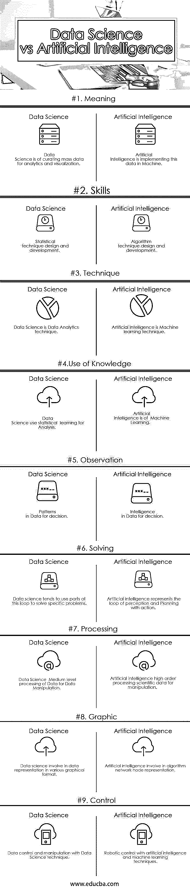

# 数据科学 vs 人工智能

> 原文：<https://www.educba.com/data-science-vs-artificial-intelligence/>

## 数据科学与人工智能的区别

人工智能是一种大幅度利用感知进行模式识别和无监督数据处理的数学、算法开发和逻辑判别，以机器人技术的前景来理解机器人技术的神经网络。人工智能调查的特点是调查“有洞察力的操作者”,任何看到其状况并采取行动增加其有效实现目标的风险的小工具。数据科学是一种“将测量、信息调查及其相关策略结合在一起的想法”，以便用数据“理解和剖析真正的奇迹”。它利用从算术、洞察力、数据科学和软件工程的广阔领域内的众多领域中提取的系统和推测，特别是从机器学习、表征、组检查、漏洞评估、计算科学、信息挖掘、数据库和表示的子领域中提取的系统和推测。

**让我们详细了解一下 AI 和数据科学:**

<small>Hadoop、数据科学、统计学&其他</small>

*   **人工智能**在现在，是令人难以置信和可行的然而没有任何地方接近人类的知识。人们毫无例外地利用他们周围的信息展示和过去收集的信息来理解一切。无论如何，人工智能现在没有这个能力。人工智能只是通过大量的信息转储来明确他们的目标。这意味着人工智能需要庞大的信息库来完成像修改字母这样简单的事情。通俗地说，当一台机器模仿人们与其他人的个性(例如“学习”和“批判性思维”)相联系的“心理”能力时，“人造智能”这一表达就被联系起来了
*   人工智能的范围是有争议的:随着机器变得越来越熟练，被认为需要“洞察力”的任务经常被排除在定义之外，这是一个被称为人工智能影响的奇迹，引发了一个笑话“人工智能是尚未完成的事情”。
*   例如，光学字符识别被“人造智能”习惯性地回避，已经变成一种常规技术。从 2017 年开始，授权人工智能的能力基本上包括有效理解人类语言，与重要的转移框架、复杂信息(包括图片和记录)中的异常状态进行斗争。各种模型如伯努利模型、朴素贝叶斯模型等。
*   **数据** **科学**是一个程序和框架的跨学科领域，用于从不同结构的信息中提取知识或知识。这意味着信息科学使人工智能能够通过在一段时间后连接比较信息来理解问题的答案。
*   在一般意义上，信息科学考虑人工智能，以便更快、更有效地从这些庞大的数据集中发现适当的、有意义的数据。
*   这方面的一个例子是[脸书的面部识别](https://www.educba.com/facebook-ipo/)框架，一段时间后，它积累了大量关于现有客户的信息，并对新客户应用类似的面部识别方法。另一个例子是谷歌的自动驾驶汽车，它从周围环境中逐渐积累信息，并形成这些数据，以做出明智的选择。

数据科学是一种“将测量、信息调查及其相关策略结合在一起的想法”，以便用数据“理解和剖析真正的奇迹”。它利用从算术、洞察力、数据科学和软件工程的广阔领域内的众多领域中提取的系统和推测，特别是从机器学习、表征、组检查、漏洞评估、计算科学、信息挖掘、数据库和表示的子领域中提取的系统和推测。

### 数据科学和人工智能的面对面比较(信息图)

以下是数据科学与人工智能之间的 9 大对比

### 数据科学和人工智能的主要区别

两者都是市场上的热门选择；让我们讨论一些主要差异:

1.  数据科学是收集和管理大量数据以进行分析，而人工智能是在机器中实现这些数据以理解这些数据
2.  数据科学是统计技术等技能的集合，而人工智能算法技术。
3.  数据科学[使用统计学习](https://www.educba.com/top-10-free-statistical-analysis-software/)而人工智能属于机器学习
4.  数据科学观察数据中的模式以进行决策，而人工智能则研究智能报告以进行决策
5.  数据科学从感知和计划与行动的 AIs 环路看是环路的一部分
6.  在数据科学中，处理是数据操作的中级水平，而 AIs 是用于操作的科学数据的高级处理
7.  在数据科学中，涉及图形表示，而在[中涉及人工智能算法](https://www.educba.com/artificial-intelligence-algorithm/)和网络节点表示
8.  人工智能技术涉及机器人控制过程，而数据科学涉及数据挖掘和操作。

### 数据科学与人工智能对照表

以下是一些关键的比较

| **比较的基础** | **数据科学** | **人工智能** |
| **意为** | 数据科学是为了分析和可视化而管理大量数据 | 人工智能正在机器中实现这些数据 |
| **技能** | 统计技术设计和发展 | 算法技术设计与开发 |
| **技术** | 数据科学是一种数据分析技术 | 人工智能是一种机器学习技术 |
| **知识的运用** | 数据科学使用统计学习进行分析 | 人工智能属于机器学习 |
| **观察** | 用于决策的数据模式 | 决策数据中的智能 |
| **求解** | 数据科学倾向于使用这个循环的一部分来解决特定的问题 | 人工智能代表了感知和行动规划的循环 |
| **处理** | 数据科学中等水平的数据处理，用于数据操作 | 人工智能高阶处理科学数据以供操作 |
| **图形** | 数据科学涉及以各种图形格式表示数据 | 人工智能参与算法网络节点表示 |
| **控制** | 用数据科学技术控制和处理数据 | 具有人工智能和机器学习技术的机器人控制 |

### 结论

在调查信息处理领域，在接下来的几年里，我们将会看到从选择性地利用选择帮助框架到额外利用为我们的利益做出选择的框架的转变。特别是在信息检查领域，我们目前正在为特定问题创建单独的诊断答案，尽管这些安排不能在各种设置中交叉使用，例如，为区分股票价值发展的不一致性而创建的答案不能用于理解图片的实质。这种情况将会持续到以后，尽管人工智能框架将会

将各个相互联系的部分结合起来，然后有能力处理日益复杂的任务，这些任务目前只是为人们保留的——这是一种我们今天已经能够看到的清晰模式。一个处理关于证券交易的当前信息的框架，以及另外根据新闻写作或记录采取和分解政治结构的改进、从站点或人际组织的写作中提取感觉、筛选和预测适用的货币相关标记等，需要广泛的子组件的组合。

### 推荐文章

这是数据科学与人工智能之间最大差异的指南。在这里，我们还讨论了数据科学与人工智能的关键差异，包括信息图和比较表。您也可以看看以下文章——

1.  [数据科学 vs 商业智能](https://www.educba.com/data-science-vs-business-intelligence/)
2.  [数据科学 vs 软件工程](https://www.educba.com/data-science-vs-software-engineering/)
3.  [人工智能 vs 商业智能](https://www.educba.com/artificial-intelligence-vs-business-intelligence/)
4.  [人工智能跨领域应用](https://www.educba.com/artificial-intelligence-tools-applications/)

