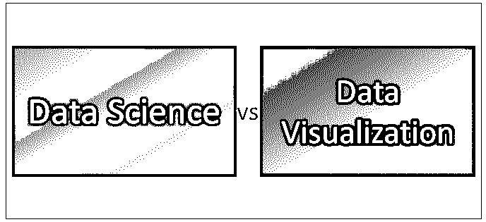
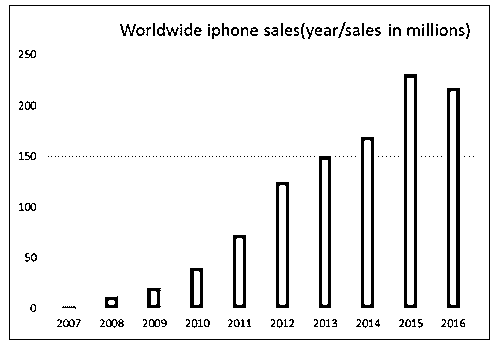

# 数据科学与数据可视化

> 原文：<https://www.educba.com/data-science-vs-data-visualization/>

## 数据科学与数据可视化的区别

数据科学被定义为解释数据并从中获取有用信息的艺术，而数据可视化涉及数据的表示，基本上，它们不能被视为两个完全不同的实体，因为它们以数据可视化是数据科学的子集的方式绑定在一起，所以它们之间发生的差异很少是基于应用程序、工具、流程、所需技能和重要性。

数据科学在我们日常生活中最好的例子是亚马逊在购物时给用户的推荐。机器正在学习用户的网络活动，并对其进行解释和操作，从而根据你的兴趣和购物选择给出最佳建议。为了提供这种建议，数据科学家表示(可视化)用户的 web 活动并进行分析，以便为用户提供最佳选择，这就是数据可视化发挥作用的地方。

<small>Hadoop、数据科学、统计学&其他</small>

数据科学和数据可视化不是两个不同的实体。他们相互联系在一起。数据可视化是数据科学的一个子集。数据科学不是单一的流程、方法或任何工作流。它是处理数据的小型模型的组合效果。这是一个数据挖掘技术的过程。

**用例** **示例**:为了描述我们日常生活中的任何事件/故事，它可以作为一个演讲来传达，但是当它被可视化地呈现时，它的真正价值才会被确立和理解。

此外，它不仅代表最终结果，也适用于理解原始数据。为了获得更好的见解，以及如何解决问题或从中获得影响系统的有意义的信息，表示数据总是更好的。

为了更好地理解数据科学和数据可视化，
假设我们想预测 2018 年 iPhone 的销量，

如何准确预测未来的销售？前提条件是什么，你的预测有多大把握，误差率是多少？所有这些都用数据科学来回答和论证。

一个预言的先决条件**，**
1。历史数据–2010 年至 2017 年的 iPhone 销量
2。位置级别购买历史
3。用户的详细信息，如年龄等
3。关键因素–组织的最近变化、最近的市场价值以及客户对过去销售的评价

当历史数据被很好地挖掘时，会有许多属性被考虑来准备机器进行预测。

进行任何预测或分类或任何类型的分析的一个主要关键是，始终要对输入数据有一个更好的了解。你对数据了解得越多，预测就越准确。一个人能从历史数据中获得多少洞察力？最好的方法是把它形象化。

数据可视化在两个阶段发挥着关键作用

1.  分析的初始阶段(即，表示可用数据并推断要使用哪些属性和参数来构建预测机器)。这刺激数据科学家用各种方法提供解决方案。因此，在我们的示例中，历史数据表示哪一个历史年份最适合进行分析。这是基于可视化来决定的。
2.  第二，结果。2018 年的预测结果必须以一种能传达给全世界的方式呈现出来。未来几年手机和谷歌 pixel 销量对比。它将为组织带来更好的决策。

回到 iPhone 分析，必须分析历史数据，并挑选出对预测率有重大影响的最佳属性(如位置、季节、年龄方面的销售)。

然后选择最佳模型(如线性回归、逻辑回归、
和支持向量机等算法)。使用历史数据训练模型，并获得来年的预测。这是数据科学中涉及的流程的高级图。

一旦下一年的预测结果确定下来，它就可以被表示出来，并获得一些影响产品销售和营销技术的见解。

### 数据科学和数据可视化之间的直接比较(信息图表)

以下是数据科学和数据可视化之间的 7 大对比:

### 数据科学和数据可视化的主要区别

1.  数据科学由解决问题的多种统计解决方案组成，而可视化是一种技术，数据科学家使用它来分析数据并将其表示为终点。
2.  数据科学是关于训练机器的算法(自动化-没有人力，机器将模拟人类，以减少许多手动过程。而是对活动的观察和解读)。数据可视化是关于图表、绘图、选择基于表示的最佳模型。

### 数据科学和数据可视化对照表

下面列出了一些要点，描述了数据科学和数据可视化之间的比较

| **比较依据** | **数据科学** | **数据可视化** |
| **概念** | 关于数据的见解。数据的解释。预测，事实 | 数据的表示(无论是源还是结果) |
| **应用/用例** | 下一届世界杯预测，自动汽车 | 关键绩效指标，
组织指标 |
| 谁会这么做？ | 数据科学家、数据分析师、数学家 | 数据科学家，UI/UX |
| **工具** | Python、Matlab、R(不一而足) | Tableau，SAS，Power BI，d3 js(不多说了)。Python 和 R 也有生成图表的库。 |
| **流程** | 数据采集、数据挖掘、数据管理、数据清理、建模、测量 | 用任何图表形式或图形来表示它 |
| **有多重要** | 许多组织依靠数据科学的结果来制定决策。 | 它帮助数据科学家了解问题的来源以及如何解决问题或提供建议。 |
| **技能** | 统计、算法 | 数据分析和绘图技术。 |

### 结论

谈到数据科学，有许多观点。简单来说，就是如何在各种情况下解决问题，比如预测、分类、推荐、情感分析。简而言之，所有这些都可以用解决问题的统计方法来完成。它是(机器学习、深度学习、神经网络、自然语言处理、数据管理等)的结合

数据可视化是解决问题的一个关键因素。这是你剧本的照片(用外行人的话来说)。

### 推荐文章

这是数据科学与数据可视化之间差异的指南。在这里，我们讨论了数据科学与数据可视化的直接比较、关键差异以及信息图和比较表。您也可以阅读以下文章，了解更多信息——

1.  [了解数据科学与统计学之间的 5 个有用对比](https://www.educba.com/data-science-vs-statistics/)
2.  [数据科学 vs 人工智能——9 个牛逼的对比](https://www.educba.com/data-science-vs-artificial-intelligence/)
3.  【Tableau 数据可视化最佳指南

