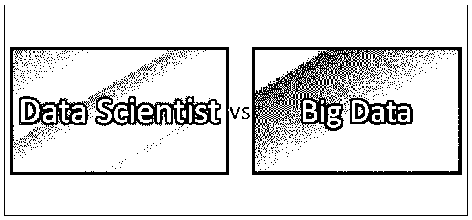
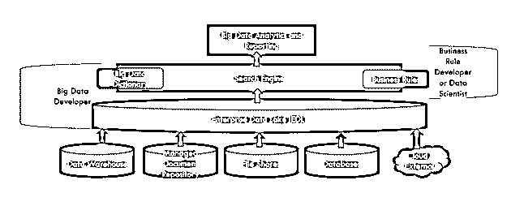
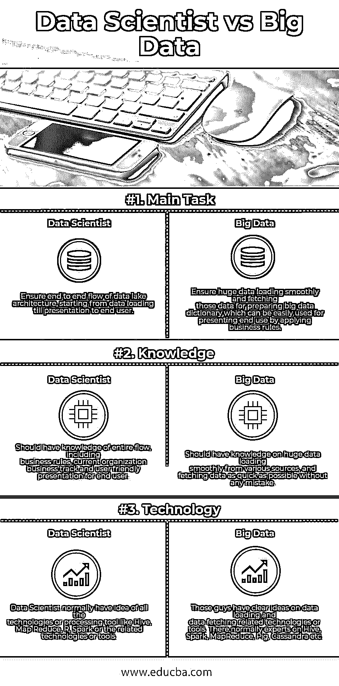

# 数据科学家 vs 大数据

> 原文：<https://www.educba.com/data-scientist-vs-big-data/>

## 数据科学家与大数据的区别

数据科学家了解完整的[数据湖体系结构](https://www.educba.com/data-lake-architecture/)的整个流程，从数据加载开始，直到呈现给最终用户。数据科学家执行和开发数据流，从数据加载开始，直到最终用户以显示格式获得适当的数据。而大数据是整个架构的一部分。大数据分别限于数据加载、取数和准备数据字典任务。大数据确保加载和获取的数据是准备预期数据字典的一部分。

### 数据生命周期

*   大量数据来自各种来源，如数据仓库工具、托管文档存储库、文件共享、数据库和云或外部。
*   数据已经加载到称为企业数据湖的 HDFS 系统中。它可能需要在了解大数据的同时进行学习。它是如何装载和储存的。
*   数据加载成功后，有多种方法来挑选这些数据并创建一个所需的大数据字典。其中一个非常流行的是 Hive，它将数据加载为一个相似的表，并支持 HiveQL(一种类似 SQL 的语言)。它内部使用了 map-reduce 程序，该程序对于理解大数据至关重要。
*   现在又有了一个创建业务规则的前景，这些规则将使用大数据字典进行分析并用于报告目的。这些业务规则是由业务规则开发人员编写的，他们主要是统计、数学方面的专家，并且对该组织的当前业务(包括预测计算)有着深刻的理解。
*   现在，业务规则和大数据字典都准备好了。现在报告开发者的任务是。他们根据业务规则开发人员使用大数据字典定义的规则，在不同的视图中设计报告结构。该报告可以很容易地获得，并提供了该组织未来前景。

现在，如果我们考虑整个流程，有四种人参与设置、部署和演示。

<small>Hadoop、数据科学、统计学&其他</small>

*   Hadoop 管理(用于设置 HDFS 系统)
*   大数据开发人员(负责加载数据，并通过获取这些巨大的数据来准备字典)
*   业务规则开发人员(负责开发业务规则)
*   报告开发人员(设计并向最终用户演示)

现在，一名数据科学家应该掌握以上 4 个部分的全部知识，这 4 个部分通常由个人负责。

### 数据科学家和大数据之间的直接比较

以下是数据科学家和大数据之间的三大对比:

### 数据科学家和大数据之间的主要区别

数据科学家和大数据之间的一些主要差异解释如下:

1.  为了提高终端用户的系统性能，数据科学家主要依靠大数据人员，因为在数据获取部分可以实现最大性能调整。而大数据人员完全负责数据加载和数据获取逻辑方面的数据或速度优化。人们通常会根据数据量或组织要求调整地图缩小任务或将整个设置移动到 hive 或 spark。
2.  数据科学家需要清楚地了解任何组织的业务需求，以帮助准备业务规则或表示逻辑。他们是根据他们的业务表现或当前活动提供适当的组织增长可能性的关键人物。而大数据人员根本不需要了解组织业务或表示逻辑。这些人主要关注如何平稳地加载来自不同来源的数据，以及如何更快地获取数据以准备数据字典。
3.  数据科学家通常对 HDFS 系统设置有基本的了解。而大数据人员了解 HDFS 系统的整个设置，无论他们是否作为管理员参与该任务。因为数据加载或数据获取的性能调优显然与系统设置有关。越来越多的系统会自动影响数据加载或获取的性能。但一切都取决于该组织真正需要多少数据，这也是由数据科学家决定的。
4.  规则开发是数据科学家的关键任务之一，而大数据人员可以轻松避免这一任务。

### 数据科学家和大数据对照表

下面是数据科学家和大数据的对比表。

| **BASIS FOR****比较** | **数据科学家** | **大数据** |
| **主要任务** | 确保端到端的数据湖体系结构流程，从数据加载开始，直到呈现给最终用户。 | 通过应用业务规则，确保大量数据顺利加载，并提取这些数据以准备大数据字典，该字典可轻松用于呈现最终用户。 |
| **知识** | 我们应该了解整个流程，包括业务规则、当前组织的业务跟踪以及面向最终用户的用户友好的演示。 | 应该具备从各种来源平稳加载大量数据的知识，并尽可能快地获取数据，而不出现任何错误。 |
| **技术** | 数据科学家通常了解所有技术或处理工具，如 Hive、Map Reduce、R、Spark 或相关技术或工具。 | 这些人对数据加载和数据获取相关的技术或工具有清晰的想法。通常有 Hive、Spark、MapReduce、Pig、Cassandra 等方面的专家。 |

### 结论

数据科学家与大数据是类似的专家，他们帮助以可展示的格式传输数据(来自各种来源)，为特定组织提供关于其未来增长或改进点的可能性的正确识别或指导。

因此，作为一个结论，数据科学可以了解以下整个部分

*   Hadoop 管理(用于设置 HDFS 系统)
*   大数据开发人员(负责加载数据，并通过获取这些巨大的数据来准备字典)
*   业务规则开发人员(负责开发业务规则)
*   报告开发人员(设计并向最终用户演示)

和大数据开发人员具备以下知识:

*   从各种类型的资源中加载数据的过程。
*   接受结构化和非结构化数据，并根据系统需求管理这些数据的加载。
*   充分了解 HDFS 和地图减少编程。
*   了解更新的数据引擎，如 hive 或 Spark。
*   根据最终用户的要求，深入参与数据优化。
*   整个数据流架构中保证数据流的关键成员之一。

### 推荐文章

这是数据科学家与大数据之间差异的指南。在这里，我们讨论了数据科学家与大数据的直接比较、关键差异以及信息图和比较表。您也可以阅读以下文章，了解更多信息——

1.  [云计算与大数据分析的 11 个惊人差异](https://www.educba.com/cloud-computing-vs-big-data-analytics/)
2.  [大数据分析的 5 个必备解决方案](https://www.educba.com/challenges-of-big-data-analytics/)
3.  [数据科学家 vs 数据工程师–7 个惊人的对比](https://www.educba.com/data-scientist-vs-data-engineer/)
4.  [数据科学家 vs 机器学习](https://www.educba.com/data-scientist-vs-machine-learning/)
5.  [大数据分析工作:惊人指南](https://www.educba.com/big-data-analytics-jobs/)

