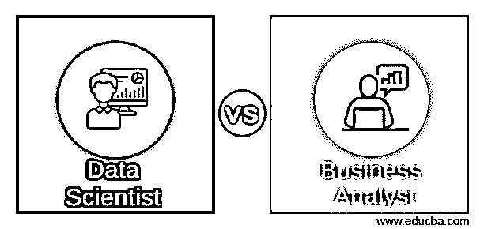
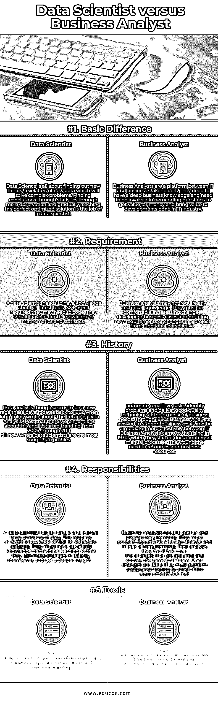

# 数据科学家 vs 业务分析师

> 原文：<https://www.educba.com/data-scientist-vs-business-analyst/>

## 数据科学家和业务分析师之间的区别

数据在任何业务的指数级增长中扮演着重要角色。为了理解数据的趋势，需要进行大量的分析和研究。它需要特殊的技能来帮助理解数据的模式，并得出结论，即数据将如何导致业务的增长，以及不断变化的功能将如何带来必要的变化。这项工作由数据科学家和业务分析师共同完成。尽管这两种角色都有助于任何领域的扩展，但数据科学家和业务分析师都有各自不同的角色和职责。让我们了解一下数据科学家和业务分析师之间的区别。尽管这两份工作的主要座右铭是业务增长，但他们实际工作中的差异将会进一步显现。

### 数据科学家和业务分析师之间的直接比较

以下是数据科学家和业务分析师之间的五大区别:

<small>Hadoop、数据科学、统计学&其他</small>

### 数据科学家和业务分析师之间的主要区别

虽然数据科学家和业务分析师这两个角色看起来有相似的区别，但在以下方面有所不同:

*   一个[数据科学家](https://www.educba.com/who-is-a-data-scientist/)需要分析大量的数据，应该能够使用数学和统计操作进行操作并做出必要的改变。他们还需要发现新的模式，并对未来做出预测。他们必须有技术知识，还应该知道像 Python、 [R](https://www.educba.com/course/beginners-training-r-programming/) 等语言。另一方面，[业务分析师](https://www.educba.com/what-is-the-role-of-a-business-analyst/)必须具备端到端业务的知识。他们应该了解 it 变革的影响，并努力带来既能提高客户效率又能提高员工生产力的变革。他们应该与[利益相关者](https://www.educba.com/effective-stakeholder-management/)不断合作和沟通，并对需求有一个清晰的认识。他们还必须从商业角度帮助设计 IT 系统，并与他们协调。

*   当我们对数据和 IT 行业之间的同步需求不断增加时，对数据科学家的需求就出现了。如今，公司的所有部门都需要一名数据分析师。他们通过编程专业知识提供复杂的分析，而不需要等待 IT 行业的任何输入。他们只需要数据，就可以继续进行分析，这将把组织带到一个新的竞争水平，并揭示隐藏的趋势和模式，这将有助于组织在市场中领先。需要业务分析师来改变现有的业务运作。他们必须分析当前的实践，并带来对组织更有效、更有利的改变。他们应该向项目客户、最终用户和主题专家提出问题。接下来，需要将收集到的总需求与变更的定义和需求一起记录下来。业务分析师是给项目进度表中的估计带来精确性的人。

*   数据科学家的职责包括数据可视化，他们需要探索数据并从数据中找到隐藏的细节，这将揭示当前的趋势，并帮助他们建立模式，进而帮助预测未来的建议。他们必须精通[机器学习](https://www.educba.com/data-science-vs-machine-learning/)和数据挖掘，这将有助于构建分析应用程序，从而在市场中获得高利润。他们必须将技术发现传达给销售和营销团队。业务分析师需要识别利益相关者，分析并记录需求。他们必须评估提议的解决方案，并与所有利益相关者进行沟通。一旦完成，他们将与开发团队一起执行变更，并在截止日期前跟进。他们还需要进行用户验收测试，并获得客户的认可。此后，他们还负责创建用户手册和最终文档。

*   数据科学家使用的主要工具是[数据仓库](https://www.educba.com/business-intelligence-vs-data-warehouse/)、数据可视化、[机器学习](https://www.educba.com/big-data-vs-machine-learning/)以及 Python、R 和 SQL 等语言。另一方面，商业分析师拥有商业软件，如 i Rise、Jama、BitImpluse，它们有助于提供不同行业的解决方案。

### 数据科学家和业务分析师对照表

下面是数据科学家和业务分析师之间的比较表

| **比较依据** | **数据科学家** | **商业分析师** |
| **基本差异** | [数据科学就是](https://www.educba.com/what-is-data-science/)发现新事物，发现新数据，解决复杂问题。数据科学家的工作是通过纯粹的观察从统计数据中找到结论，并逐步达到完美的优化解决方案 | 业务分析师是 IT 和业务涉众之间的平台。他们需要有深厚的商业知识，并需要参与到高要求的问题中，以获得资金价值，并为 IT 行业的发展带来价值。 |
| **要求** | 数据科学家需要了解所有最新的工具、SQL，如果需要，他们可能需要编码。他们应该对数学和统计学有深入的了解。 | 业务分析师可能不需要任何技术知识。他们必须能够自如地从功能角度评估变更、开发业务案例以及定义项目中的新需求或变更。 |
| **历史** | 虽然数据分析似乎是最近的一个新潮流，但它可以追溯到 1962 年约翰·图基写的《数据分析的未来》。帖子中提到了这一点，它从 2006 年开始流行，从 2011 年到现在，数据科学家是最受欢迎的职位。 | 20 世纪 70 年代，当业务分析师开始记录所有手工流程时，他们来到了这个兴起的时代。他们发现有必要以牺牲业务需求为代价，自动执行重复性任务，发现问题并交付高质量的技术。到了 20 世纪 80 年代，业务分析师发展到支持业务目标，并成为 IT 资源和业务资源之间更有效的中介。 |
| **职责** | 数据科学家必须处理和提取大量数据。这需要深入了解 SQL 来分离数据集。他们必须拥有先进的机器学习知识，这样他们才能自己对数据进行更改，并获得更深入的洞察力。 | 业务分析师需要收集和准备需求。他们必须准备文档，还要分析和建模所有的需求。分析后，他们必须接管所需的变更，并将其传达给 IT 团队。一旦变更完成，他们必须执行验收测试，以检查是否满足要求。 |
| **工具** | 数据科学家的工具不是别人，就是数据仓库、数据可视化、[机器学习](https://www.educba.com/machine-learning-software/)。 | 有各种商业分析工具，如[蓝图](https://www.educba.com/what-is-blueprint/)、Axure、Bit impulse 等。这提高了生产率。 |

### 结论

因此，它们都执行增加企业价值的工作。他们履行的不同角色和职责有助于组织了解其价值，并提供了一种提高和增加其市场价值的方法。业务分析师的流程改进和数据科学家的预测有助于公司拥有安全的现在和光明的未来。

### 推荐文章

这是数据科学家和业务分析师的指南。在这里，我们讨论了数据科学家与业务分析师的直接比较、关键差异以及信息图和比较表。您也可以阅读以下文章，了解更多信息——

1.  [商业分析 vs 商业智能](https://www.educba.com/business-intelligence-vs-business-analytics/)
2.  [7 商业分析与预测分析之间最有用的对比](https://www.educba.com/business-analytics-vs-predictive-analytics/)
3.  [商业智能与商业分析——哪个更好](https://www.educba.com/business-intelligence-vs-business-analytics/)
4.  [9 数据科学与数据挖掘之间的惊人差异](https://www.educba.com/data-science-vs-data-mining/)
5.  [计算机科学与数据科学——找出最佳的 8 个对比](https://www.educba.com/computer-science-vs-data-science/)

