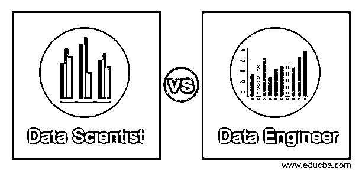
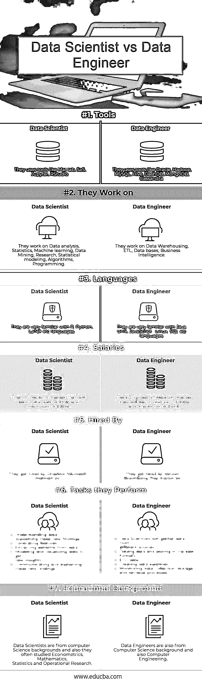

# 数据科学家 vs 数据工程师

> 原文：<https://www.educba.com/data-scientist-vs-data-engineer/>

## 数据科学家和数据工程师的区别

在直接讨论数据科学家和数据工程师之间的区别之前，首先，我们要知道这些术语实际上指的是什么。

数据科学家和数据工程师是大数据中的两条赛道。通常，数据科学家通过应用统计学、机器学习来分析数据，以解决关键的业务问题。简而言之，他们进行由机器学习和计算机科学驱动和自动化的高级数据分析。另一方面，数据工程师是设计、构建、整合各种资源的数据并管理大数据的软件工程师。此外，他们还为数据科学家分析大数据基础架构做准备。

<small>Hadoop、数据科学、统计学&其他</small>

### 数据科学家和数据工程师的面对面比较(信息图表)

以下是数据科学家和数据工程师之间的 7 大对比:

### 数据科学家和数据工程师的主要区别

以下是数据科学家和数据工程师的区别:

| **比较依据** | **数据科学家** | **数据工程师** |
| **职责** | 

*   Data scientists will conduct research when answering industry and business questions.
*   They also use massive data from outside and inside to deal with business.
*   Data scientists also use the most developed machine learning analysis programs and statistical methods to prepare data for prescriptive and predictive modeling.
*   And explore and examine data to discover hidden patterns.
*   Automate your work by using predictive and normative analysis.
*   Tell stories to key stakeholders based on their analysis.

 | 

*   Discover opportunities for data collection.
*   Data engineers also develop, test, build and maintain architectures.
*   Ensure that the architecture supports the business requirements.
*   For data modeling, mining and production, they develop data set processes.
*   Data engineers also use various languages and tools (such as scripting languages) to put systems together. In order to improve the efficiency, reliability and quality of data, they also put forward some methods.

 |
| **工作前景** | 

*   Since the hype
*   Since the beginning, the role of data scientist has been very popular, but these days, companies want to have a data science team, rather than prefer unicorn data scientists with creativity, communication skills, curiosity, intelligence, technical expertise, etc.
*   For recruiters, it is difficult to find a person who has the qualities that the company is looking for, and the demand obviously exceeds the supply.
*   Therefore, we can conclude that the bubble of data scientists will burst in the near future.

 | 

*   Data streams need to be replaced and redirected in the future.
*   Therefore, the center of interest is here, and the number of jobs for recruiting data engineers has gradually increased over the years.

 |
| **需要发展知识和专长** | 数据科学家需要成为交流和展示分析结果的专家。 | 数据工程师需要精通系统监控和数据清理。 |

### 数据科学家和数据工程师对照表

下面是数据科学家和数据工程师的对比表

| **比较依据** | **数据科学家** | **数据工程师** |
| **工具** | 他们使用像 Matlab，SAS，Jupyter，RStudio 这样的工具 | 他们使用 Oracle、Hadoop、MySQL、Hive、DashDB、MongoDB、Cassandra 等工具 |
| 他们在工作 | 他们从事数据分析、统计学、机器学习、数据挖掘、研究、统计建模、算法、编程 | 他们从事数据仓库、ETL、数据库和商业智能方面的工作 |
| **语言** | 他们非常熟悉 R、Python、LaTeX 等语言 | 他们非常熟悉 Java、Unix、JavaScript、 [Linux](https://www.educba.com/what-is-linux/) 、SQL 等语言。 |
| **工资** | 在中等市场，他们的收入最低为 43k 美元，最高为 364k 美元 | 数据工程师在中等市场，他们的最低收入为 34，000 美元，最高收入为 34.1 万美元 |
| **受雇于** | 他们被 Dropbox、微软、沃尔玛等公司雇佣 | 他们被威瑞森、彭博、Play station 等公司雇佣。 |
| **执行的任务** | 

*   理解数据
*   生成特征
*   从数据中提取模式
*   建模和可视化数据以获得新的见解
*   传达和解释这些新发现

 | 

*   数据科学家将从不同来源收集数据
*   整理数据并以最佳格式存储
*   [ETL 任务](https://www.educba.com/etl-process/)
*   创建数据管道
*   监控数据收集、存储和检索过程

 |
| **教育背景** | 数据科学家来自计算机科学背景，他们也经常学习计量经济学、数学、统计学和运筹学。 | 数据工程师也是计算机专业出身，也是计算机工程。 |

### 数据科学家与数据工程师一起工作

这两种技能(数据科学家和数据工程师之间的区别)对于数据团队的正常运作至关重要。我们很难找到一只独角兽，一个拥有数据科学家和数据工程师技能的个体。因此，我们需要建立一个团队，每个成员都可以补充其他成员的技能。他们在一起工作得很好是很重要的。

为了避免这种情况或困境，重要的是要认识到他们在我们的商业企业中所扮演的不同的互补角色。无论怎样强调数据科学家和数据工程师之间的沟通都不为过，确保数据科学家和数据工程师的角色和团队都有充足的资源和丰富的想象力也同样重要。这是因为数据需要针对数据科学家的用例进行优化。清楚地了解这是如何工作的，对于减少数据管道中的人为错误非常重要。

如果从一开始就没有做好充分的准备，可能会毁掉我们企业的努力。我们需要摆脱这种情况，即数据科学家在没有充分完成数据管道的情况下加入。这使得他们要么被迫钻研所需的硬编码数据工程，要么无所事事，这让他们很不舒服，代价也很高。这两个选项都没有很好地利用他们的能力或我们企业的资源。

### 结论

总之，两者一起处理数据。他们都是必需的，因为很难找到特定个人的所有技能，因此，数据科学家和数据工程师必须相互补充，以便有效地为企业工作。因为担心数据管道的数据科学家效率较低，而担心业务洞察力的数据工程师效率较低。将两者结合起来，它们肯定能很好地工作。

### 推荐文章

这是数据科学家和数据工程师的指南。在这里，我们讨论了数据科学家与数据工程师的直接比较、主要差异以及信息图和比较表。您也可以阅读以下文章，了解更多信息——

1.  [数据科学家 vs 数据工程师 vs 统计学家](https://www.educba.com/data-scientist-vs-data-engineer-vs-statistician/)
2.  [数据科学家的工作](https://www.educba.com/data-scientist-work/)
3.  [多态性与遗传](https://www.educba.com/polymorphism-vs-inheritance/)
4.  [数据科学 Vs 数据工程](https://www.educba.com/data-science-vs-data-engineering/)

