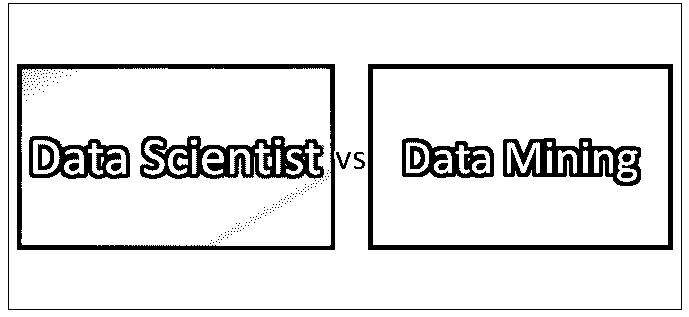
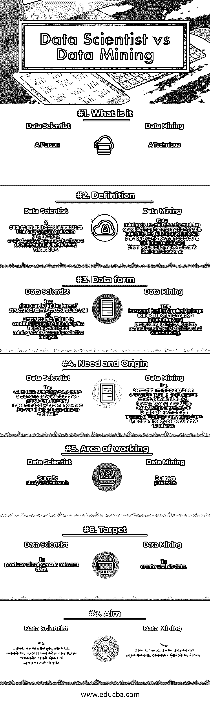

# 数据科学家 vs 数据挖掘

> 原文：<https://www.educba.com/data-scientist-vs-data-mining/>

## 数据科学家和数据挖掘的区别

数据科学家是创建编程代码、使用它们形成一组丰富的统计数据组合，并使用其知识来创建和生成与业务相关的数据洞察的人。数据科学本质上是一个关于系统和过程的跨学科领域，它从不同形式的数据中提取见解和知识。

另一方面，数据挖掘是发现和发现大型数据集形式的模式的过程，涉及统计学、机器学习和数据库系统的交叉功能。智能流程和提取工具用于提取数据模式。总体目标是从数据集中提取相关信息，并将其转换为可识别的结构以供进一步使用。涉及[数据管理工具](https://www.educba.com/database-management-tools/)，推理考虑，复杂度考虑，有趣的度量，发现结构的后处理等。这个想法是从大量数据中提取模式和知识，而不是提取数据本身。它还支持决策支持系统的任何应用，包括与人工智能、商业智能和机器学习相关的应用。

<small>Hadoop、数据科学、统计学&其他</small>

数据和客户保密在安全方面的价值与日俱增，因此迫切需要部署数据科学家，因为他们不仅旨在保护您的数据，而且还提供有意义的分析和提取，以促进您的组织和业务的未来趋势，以及公司如何通过维护各种条形图、饼图和其他形式的直方图来改善现状。数据科学家与数据开发人员的不同之处在于，数据开发人员(无论是 ETL 开发人员还是大数据开发人员)的目标是转换数据，并将数据塑造成数据科学家应用其技术所需的形式。

实际的挖掘任务包括使用有趣的模式，如数据记录组，如聚类分析，异常检测，如异常记录和依赖性，如序列模式挖掘，关联规则挖掘。空间索引是一种广泛使用的数据库技术。

### 数据科学家和数据挖掘之间的直接差异

以下是数据科学家和数据挖掘之间的 7 大对比:

### 数据科学家和数据挖掘之间的主要区别

以下是要点列表，描述了数据科学家和数据挖掘之间的主要区别:

1.  数据科学家拥有强大的技术技能和正确的工具集，可以通过应用数学函数(如共线性、回归分析等)来工作和获取相关信息。他还应用算法并定期进行社会计算分析，而数据挖掘使用元数据，元数据是关于数据的数据，元数据用于根据您的关键字和查询提取信息。[数据挖掘技术](https://www.educba.com/data-mining-techniques/)还利用应用算法的潜力，从当前和遗留系统中提取过去的趋势。
2.  数据科学家的角色和职责包括无指导研究、创建基于问题的开放式公司、从多个外部和内部来源提取大量数据。他还采用复杂的分析程序、统计和[机器学习方法来创建数据](https://www.educba.com/machine-learning-methods/)，稍后用于规范建模和[预测建模](https://www.educba.com/predictive-modeling/)，而数据挖掘包括设计、实施持久数据存储、性能调整方法，通过管理数据存储和数据库的完整性、机密性和可用性来创建自动备份和容量规划。
3.  让我们借助一个例子来理解一个数据科学家的作用。考虑这样一个场景，你正在经营一家糖果店，你想知道哪些糖果得到了最积极的反馈。在这种情况下，你的数据来源将不仅限于数据库，它们还可以扩展到社交媒体网站和客户反馈信息。在这种情况下，数据科学家将会拯救你。他是你的合适人选，因为他拥有来自所有相关来源的历史数据，而不仅仅是来自一个数据库。然而，如果有同样的情况，但你更感兴趣的是找出过去 8 年的糖果数据，而不是你需要一种称为挖掘的技术。在数据挖掘中，您深入挖掘数据历史，并找到所有看似无关的信息。
4.  数据科学家需要设计数据驱动的解决方案来应对组织中遇到的最新挑战。人们还期望他发明新的算法，通过构建新的工具来自动化工作，从而有效地解决复杂的问题，而数据挖掘主要关注于根据客户需求和行业要求实现系统。它还提供了一个分析各种数据源的工具，以发现欺诈模式和可能的安全漏洞。

### 数据科学家和数据挖掘对照表

以下是要点列表，描述了数据科学家和数据挖掘之间的对照表。

| **比较依据** | **数据科学家** | **数据挖掘** |
| **什么事** | 一个人 | 一种技术 |
| **定义** | 数据科学家比任何随机的软件工程分析师更擅长统计，比任何统计学家更擅长软件开发技能。 | 数据挖掘是获取或收集存储在数据库中的以前未知和模糊的信息的方法。这些信息可用于制定相关的商业决策。 |
| **来自**的数据 | 数据可以是结构化、半结构化以及非结构化的形式。这是数据挖掘、统计和预测分析等数据分析领域的延续。 | 这一术语通常用于使用收集、提取、分析、统计和仓储的大规模数据或信息生成和处理。 |
| **需要和起源** | 数据科学家这个词在 80 年代初就已经出现了，但他们的主要需求是在当今世界有大量数据需要维护的情况下出现的 | 数据挖掘这个术语已经并行发展，并在 90 年代变得非常流行。它起源于 KDD(数据库中的知识发现)，这是一个从数据库中已经存在的数据中发现知识的过程。 |
| **工作区域** | 科学研究 | 业务流程 |
| **目标** | 产生以客户为中心的相关数据 | 来创建可用的数据 |
| **瞄准** | 他的目标是建立预测模型，社交媒体分析趋势，并得出未知的事实 | 目的是搜索和找到先前已知的隐藏数据 |

### 结论

在这篇数据科学家与数据挖掘的文章中，我们了解了数据科学家与数据挖掘的主要区别。希望你喜欢这篇文章。请继续关注我们的博客，获取更多文章。

### 推荐文章

这是数据科学家和数据挖掘之间差异的指南。在这里，我们讨论了数据科学家与数据挖掘的直接比较、关键差异以及信息图和比较表。您也可以阅读以下文章，了解更多信息——

1.  [数据科学家与业务分析师–找出 5 大不同点](https://www.educba.com/data-scientist-vs-business-analyst/)
2.  [数据科学家 vs 数据工程师–7 个惊人的对比](https://www.educba.com/data-scientist-vs-data-engineer/)
3.  [预测分析与数据挖掘——哪个更有用](https://www.educba.com/predictive-analytics-vs-data-mining/)
4.  [了解数据挖掘和数据分析的 7 大区别](https://www.educba.com/data-mining-vs-data-analysis/)

