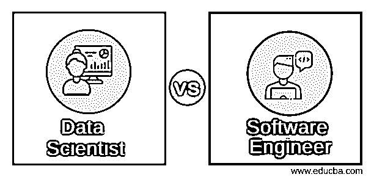
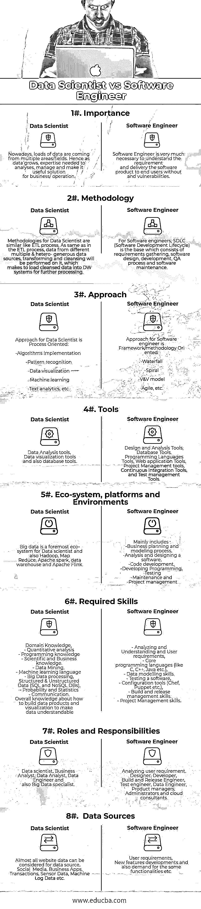

# 数据科学家 vs 软件工程师

> 原文：<https://www.educba.com/data-scientist-vs-software-engineer/>

## 数据科学家和软件工程师的区别

数据科学家是专业的分析数据专家，他们拥有解决复杂问题的技术技能，还能找到探索实际需要解决什么问题的方法。他们负责收集数据，分析数据并解释大量数据，以确定不同的方法来帮助和改善运营，从而获得超越竞争对手的竞争优势。

数据科学家将拥有数学知识，他们是计算机科学家，也是趋势观察者的一部分。而且，他们擅长商业和 IT 领域。

<small>Hadoop、数据科学、统计学&其他</small>

数据科学家通过处理数据历史来解释正在发生的事情，他们还使用各种高级 MLA(机器学习算法)来识别未来事件的发生，这有助于做出决策和预测，利用这种预测性因果分析和规定性分析来改善业务和运营。在这个过程中，数据科学家必须从多个角度研究数据。

软件工程师是这样一个人，他拥有知识，并将[软件工程](https://www.educba.com/data-science-vs-software-engineering/)的有纪律的、结构化的原则应用到软件的所有层面——设计、开发、测试、维护和评估，以避免软件产品的低质量。

软件工程师推荐最新的电脑软件和操作系统来满足这些要求，比如 iPhones 和 Windows 10 上的 iOS。他们负责创建模型和图表的计算机代码，技术知识是这些专业人员所必需的。

软件工程师应该具备技术专长、显著的成就以及使用开源工具的经验。他们应该对模式设计技术、自动化测试过程和容错系统有丰富的知识和经验。软件工程师还应该知道如何创建和维护 IT 基础设施、大规模数据存储以及基于云的系统。

### 数据科学家与软件工程师的面对面比较

下面是前 8 名对比数据科学家 vs 软件工程师

### 数据科学家和软件工程师的主要区别

以下是数据科学家和软件工程师之间最重要的区别

1.数据科学由数据架构、机器学习算法和分析过程组成，而软件工程更多的是向最终用户交付高质量软件产品的训练有素的架构。

2.数据科学家负责分析数据，并将数据转化为有助于业务的知识，软件工程师负责为最终用户构建软件产品。

3.大数据领域的增长是数据科学的输入来源，而在软件工程领域，市场或客户对新特性和功能的需求推动了新软件的设计和开发。

4.通过分析和处理数据，[数据科学家](https://www.educba.com/data-scientist-vs-data-engineer/)帮助做出良好的商业决策；而软件工程通过开发所需的软件产品使生活变得简单。

5.[数据科学](https://www.educba.com/data-science-vs-software-engineering/)流程由数据驱动；软件工程过程是由最终用户需求驱动的。

6.数据抽取过程是数据科学中基本且必要的步骤；需求收集和按需求设计是软件工程中的一个重要角色。

7.随着数据生成的增加，可以观察到数据工程师在软件工程学科中作为一个子网出现。数据工程师构建系统，整合所有数据，从软件工程师构建的各种系统和应用程序中存储和检索数据。

8.数据科学的一个例子:关于电子商务网站(Flipkart，Amazon 等)中类似产品的建议。);系统自动处理我们的搜索/我们浏览的产品，并据此给出建议。

9.对于软件工程来说，让我们以设计任何有助于改善业务的应用程序为例，这些应用程序是通过用户反馈收集的。

### 数据科学家与软件工程师对照表

以下是要点列表，描述了数据科学家与软件工程师之间的比较

| **比较
的依据** | **数据科学家** | **软件工程师** |
| **重要性** | 如今，大量数据来自多个领域。因此，随着数据的增长，需要专业知识来分析、管理数据，并使其成为对业务/运营有用的解决方案。 | 软件工程师非常有必要理解需求，并将软件产品无漏洞地交付给最终用户。 |
| **方法论** | 数据科学家的方法类似于 ETL 过程。
与 ETL 过程中的[一样，来自不同的多个&异构数据源的数据将在其上进行转换和清洗，从而将清洗后的数据加载到数据仓库系统中进行进一步处理。](https://www.educba.com/etl-process/) | 对于软件工程师来说，软件开发生命周期是由需求收集、软件设计、开发、质量保证过程和软件维护组成的基础。 |
| **接近** | 数据科学家的方法是面向过程的:
-算法实现
-模式识别
-数据可视化
-机器学习
-[文本分析](https://www.educba.com/text-mining-vs-text-analytics/)等。 | 软件工程师的方法是面向框架/方法的:
-瀑布
-螺旋
-V & V 模型
-敏捷，等等。 |
| **工具** | 数据分析工具、
数据可视化工具以及数据库工具。 | 设计和分析工具、数据库工具、
编程语言工具、Web 应用工具、
项目管理工具、持续集成工具、[测试管理工具](https://www.educba.com/test-management-tools/)。 |
| **生态系统、平台和环境** | 大数据是数据科学家最重要的生态系统，也是 [Hadoop](https://www.educba.com/hadoop-vs-hive/) 、 [Map Reduce](https://www.educba.com/mapreduce-interview-questions/) 、 [Apache spark](https://www.educba.com/apache-spark-vs-apache-flink/) 、[数据仓库](https://www.educba.com/data-warehouse-interview-questions/)和 [Apache Flink](https://www.educba.com/apache-spark-vs-apache-flink/) 。 | 主要包括:
-业务规划和建模过程、
-分析和设计一个软件、
-代码开发、
-开发编程、
-测试
-维护和
-项目管理 |
| **所需技能** | –领域知识，
–定量分析
–编程知识
–科学和商业知识。
—[数据挖掘](https://www.educba.com/data-mining-vs-text-mining/)、
—机器学习语言
—大数据处理、结构化&非结构化数据(SQL 和 NoSQL DBs)、
—概率统计
—通信。关于如何构建数据产品和可视化以使数据可理解的总体知识 | –分析和理解用户需求，
–核心编程语言(如 C， [C++](https://www.educba.com/c-programming-language-basics/) ，Java 等)。)、
–数据建模技巧。
–测试软件，
–配置工具(厨师、木偶等)。)，
–建立和发布管理技能。
–项目管理技能。 |
| **角色和职责** | 数据科学家、业务分析师、数据分析师、数据工程师以及大数据专家。 | 分析用户需求。
设计师、开发人员、
构建和发布工程师、
测试工程师、数据工程师、
[产品经理、](https://www.educba.com/product-manager-interview-question/)、
管理员和云顾问。 |
| **数据来源** | 几乎所有的网站数据都可以考虑作为数据源。
社交媒体、商业应用、交易、传感器数据、机器日志数据等。 | 用户需求、新功能开发以及对某些功能的需求等。 |

### 结论–数据科学家 vs 软件工程师

数据科学家总是更关注数据和隐藏的模式，数据科学家在数据的基础上发展他们的分析。[数据科学家的工作包括数据建模](https://www.educba.com/data-analyst-interview-questions/)、机器学习、算法和[商业智能仪表板](https://www.educba.com/business-intelligence-dashboard/)。但是软件工程师构建软件应用程序。他们将参与 SDLC 流程的所有阶段，从设计到与客户一起审查。

有一个非常重要的观察结果是，软件工程师构建的软件应用程序将基于数据工程师或数据科学家确定的需求。所以数据科学和软件工程在某种程度上是齐头并进的。

关于这一点的结论是，“数据科学”是“数据驱动的决策”，以在业务中做出好的决策，而软件工程是在不偏离用户需求的情况下进行软件开发的有纪律和结构化的方法。

### 推荐文章

这是数据科学家和软件工程师之间的区别、他们的意义、直接比较、关键区别、比较表和结论的指南。您也可以阅读以下文章，了解更多信息——

1.  [数据科学家 vs 数据工程师–7 个惊人的对比](https://www.educba.com/data-scientist-vs-data-engineer/)
2.  [数据科学与软件工程| 8 大有用对比](https://www.educba.com/data-science-vs-software-engineering/)
3.  [如何在软件测试中有更好的职业成长](https://www.educba.com/software-tester-work/)

