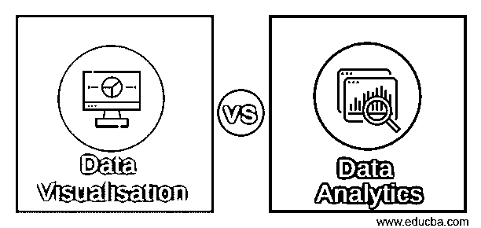
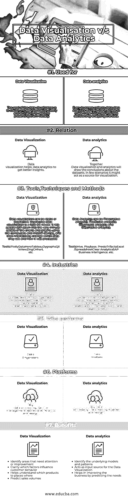

# 数据可视化与数据分析

> 原文：<https://www.educba.com/data-visualisation-vs-data-analytics/>

## 数据可视化和数据分析的区别

[数据可视化](https://www.educba.com/course/data-visualization-r-shiny-basic-tutorials/)就是将数据以可视化的形式表现出来。这种视觉形式可以是[图](https://www.educba.com/pivot-chart-in-excel/)，图形、列表或地图等。这种表示有助于人们理解数据的数量。

[数据分析是](https://www.educba.com/what-is-data-analytics/)检查数据集(结构化或非结构化)的方法，目的是获得有用的见解，从而得出关于数据集的结论。[数据分析技术](https://www.educba.com/big-data-techniques/)和技术在许多组织中广泛使用。

<small>Hadoop、数据科学、统计学&其他</small>

### **数据可视化和数据分析(信息图表)之间的直接比较**

以下是数据可视化和数据分析之间的 7 大区别:

### 数据可视化与数据分析的主要区别

以下是要点列表，描述了数据可视化和数据分析之间的主要区别:

1.  数据可视化是以图像或图形格式呈现数据。数据分析也是一个过程，可以更容易地识别复杂数据集中的模式并从中获取意义。
2.  数据可视化使决策者能够看到可视化呈现的[分析](https://www.educba.com/data-science/courses/tableau-training/)，因此他们能够掌握困难的概念或识别新的模式。
3.  深入观察一个属性的可视化将导致对该属性的分析。
4.  分析流程，包括[大数据分析](https://www.educba.com/big-data-analytics-techniques/)工具的部署和使用，可以帮助公司提高运营效率、增加收入并获得超越业务竞争对手的竞争优势。
5.  描述性分析侧重于描述已经发生的事情，并提出其根本原因。
6.  说明性分析有助于公司预测商业机会，并做出影响利润的决策，如有针对性的营销活动等。
7.  预测分析有助于挖掘历史数据集，以发现预示未来情况和行为的模式
8.  在可视化中，我们有静态和交互式的可视化。
9.  静态可视化专注于特定的数据存储，用户无法超越单一视图来探索他们面前的其他故事。这个故事是在一个引人入胜的单页布局中特别捕捉到的。
10.  交互式可视化帮助用户选择特定的数据点来构建他们选择的可视化故事。
11.  数据分析洞察通过允许从业者不仅探索他们的数据，而且理解潜在的因素和影响，而不仅仅是问为什么，从而将发现提升到一个新的水平。
12.  使用图表、图形和设计元素，数据可视化可以帮助企业更容易地解释趋势和统计数据。数据可视化还揭示了模式、趋势和相关性，否则可能无法检测到。
13.  数据分析师将数字转换成纯文本(英语)，无论是销售数字、市场研究、物流还是运输成本。
14.  计算机使得以闪电般的速度处理大量数据成为可能。今天，数据可视化已经成为科学和艺术的快速融合，在未来几年肯定会改变企业的面貌。
15.  [数据分析](https://www.educba.com/8-data-analytics-trends-that-will-dominate-2019/)是许多公司正在采用的趋势实践。在开始购买数据分析工具之前，组织应该首先了解整个环境。
16.  我们举个例子来理解，数据可视化很清楚。例如，让我们将感恩节作为我们场景中的一个用例，众所周知，感恩节那天的销售额会非常高，采购量也会达到顶峰。
    为了帮助企业主了解物品的购买历史，饼图或图表比查看购买历史中的数字更有助于他/她理解。以便企业主可以根据趋势规划业务。
17.  让我们以数据分析为例来了解分析的力量。我们都在网上购物，如果我们有一段时间不购物，我们一定会在邮箱里看到这条来自我们最喜欢的电子商务网站的消息——“我们想念你”。此消息背后的场景包括对我们的订单和订单历史的“详细检查”。分析工具为企业提供智能，以吸引客户增加收入。

### 数据可视化和数据分析比较表

下面是数据可视化和数据分析之间的比较表。

|  | **数据可视化** | **数据分析** |
| **用于** | 数据可视化的目标是通过可视化的方式向用户清晰有效地传达信息。 | 每个企业都收集数据；数据分析将通过分析数据帮助企业做出更明智的商业决策。 |
| **关系** | 数据可视化有助于数据分析获得更好的见解 | 数据可视化和分析将一起得出关于数据集的结论。在少数情况下，它可以作为可视化的来源。 |
|  **工具、技术和方法** |  数据可视化可以是静态的，也可以是交互式的。交互式数据可视化稍新一些，它允许人们使用计算机和移动设备深入图表和图形的非常微小的细节，然后交互式地改变他们看到的数据和数据的处理方式。**工具:***阴谋地**数据英雄*表*Dygraphs**QlikView**ZingCHhart 等。* |  数据分析可以是说明性分析、预测性分析、诊断性分析和描述性分析**工具:**蜂巢，聚合库，很快*三连胜**Excel/电子表格**清除分析**SAP 商业智能等。* |
| **行业** | 数据可视化技术被广泛应用于金融、银行、医疗、零售等领域 | 数据分析技术广泛应用于商业、金融、医疗保健、犯罪侦查、旅行社等领域 |
| **谁表演** | 数据工程师 | 数据分析师 |
| **平台** | 大数据处理、服务管理仪表板、分析和设计。 | Big data processing, Data mining,分析和设计。 |
|  **好处** | Identify areas that need attention or improvement明确哪些因素会影响客户行为有助于了解哪些产品适用于哪些地方预测销量 | Identify the underlying models and patterns充当数据可视化的输入源，通过预测需求来帮助改善业务 |

### 结论

就企业需求而言，数据可视化和数据分析之间的区别非常明显。同样清楚的是，可视化虽然重要，但不能成为数据处理解决方案的唯一组成部分，数据可视化和数据分析一起将为企业带来良好的结论。

根据组织处理的数据类型和组织的规模，选择可视化工具和分析工具因组织而异。

### 推荐文章

这是数据可视化和数据分析之间差异的有用指南。在这里，我们讨论了直接比较、关键差异以及信息图和比较表。您也可以阅读以下文章，了解更多信息——

1.  [5 个必须知道的挑战&大数据分析解决方案](https://www.educba.com/challenges-of-big-data-analytics/)
2.  [找出小数据与大数据的 10 大区别](https://www.educba.com/small-data-vs-big-data/)
3.  [大数据分析在酒店业的重要性(Fast)](https://www.educba.com/big-data-analytics-techniques/)

