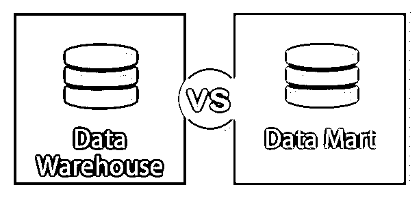

# 数据仓库与数据集市

> 原文：<https://www.educba.com/data-warehouse-vs-data-mart/>

## 数据仓库和数据集市的区别

下面的文章提供了数据仓库和数据集市的概要。数据仓库允许来自多个来源的数据，而数据集市只关注每个集市的一个数据源。因此，数据集市是设计、处理和维护数据的更简单的选择，因为它一次只关注一个主题/子部门。另一方面，数据仓库由复杂的设计组成，数据处理需要应用复杂的查询，维护由数据仓库管理员执行，因为与数据集市相比，这里的数据量非常大。

### 数据仓库与数据集市的直接比较(信息图表)

下面是数据仓库和数据集市之间的 8 大区别

<small>Hadoop、数据科学、统计学&其他</small>

### 数据仓库和数据集市的主要区别

让我们讨论一些主要差异:

*   数据仓库与数据集市之间的一个关键区别是，数据仓库是一个服务于决策制定目的的中央数据存储库，而数据集市是用于特定用户的数据仓库的逻辑子集。
*   数据仓库由于其巨大的规模和对各种来源的集成而具有失败的风险。另一方面，数据集市失败的风险更低，因为它的规模更小，集成的数据来源更少。
*   数据仓库为其集中式系统提供企业范围的视图，并且是独立的，而数据集市提供部门视图和分散存储，因为它是数据仓库的[子集。](https://www.educba.com/what-is-data-warehouse/)
*   数据仓库是面向应用的，而数据集市是用于决策支持系统的。
*   数据集市存储汇总数据，而数据仓库以详细的形式存储数据。此外，在数据集市中，数据是高度非规范化的形式，而在数据仓库中，数据是稍微非规范化的。
*   数据存储在数据仓库中一个单一的、集成的、集中的存储库中，而在数据集市中，数据存储在低成本的服务器中供特定部门使用。
*   构建数据仓库时，遵循自顶向下的方法；在构建数据集市时，遵循自底向上的方法。
*   数据仓库是面向主题的、时变的，存在时间较长，而数据集市是为与组织相关的特定领域设计的，存在时间较短。
*   [星型模式用于](https://www.educba.com/what-is-star-schema/)数据集市建模，而事实星座模式用于数据仓库建模。一般来说，事实星座模式包括广泛的主题领域；另一方面，星型模式用于数据集市中单主题建模的方法。

### 数据仓库与数据集市对照表

让我们来看看 8 大对比:

| **数据仓库** | **数据集市** |
| 数据仓库存储来自多个主题领域的数据。 | 数据集市保存与特定领域相关的数据，如财务、人力资源、销售等。 |
| 它是组织中数据的中央存储库。 | 它是数据仓库的子集。 |
| 数据作为来自不同来源的一个存储库集成到数据仓库中。 | 数据从比数据仓库更少的来源集成到数据集市中。 |
| 数据仓库通常是根据事实星座模式建模的。 | [数据集市被设计为](https://www.educba.com/what-is-data-mart/)使用星型模式关注维度模型。 |
| 就其规模而言，很难设计和使用数据仓库，数据仓库可能会超过 100 千兆字节。 | 由于数据集市体积小，灵活性强，设计和使用起来相对容易。 |
| 数据仓库是为组织中的决策而设计的。 | 数据集市是为特定的用户组或部门设计的。 |
| 它遵循自上而下的方法。 | 它遵循自下而上的方法。 |
| 数据仓库保存的非规范化数据比数据集市少。 | 数据集市存储高度非规范化的数据。 |

### 结论

数据仓库为用户提供了一个单一的集成界面，在这里可以方便地进行决策支持查询，而数据集市提供了部门视图和存储。数据仓库因其规模较大而难以构建，而数据集市因其规模较小(特定于某些主题领域)而易于维护和创建。

组织可以根据他们的需求为不同的部门建立数据集市，并相应地合并它们以创建一个数据仓库，或者他们可以先创建一个数据仓库，然后根据需要为特定的部门创建几个数据集市。但是由于时间和成本的限制，组织通常会首先构建数据集市，然后将它们合并以创建数据仓库。

云计算技术在减少有效构建企业范围的数据仓库的时间和成本方面提供了优势。此外，由于数据仓库和数据集市都包含非规范化数据，我们需要找到提高查询性能的解决方案。提取、转换和加载(ETL)就是这样一个概念，从多个来源提取数据，然后根据业务需求转换数据，最后将数据加载到一个系统中。

### 推荐文章

这是数据仓库和数据集市之间最大区别的指南。在这里，我们还将讨论信息图和比较表的主要区别。你也可以看看下面的文章来了解更多-

1.  [数据与信息–最大差异](https://www.educba.com/data-vs-information/)
2.  [数据仓库 vs Hadoop](https://www.educba.com/data-warehouse-vs-hadoop/)
3.  [大数据与数据仓库的区别](https://www.educba.com/big-data-vs-data-warehouse/)
4.  [数据狗 vs 普罗米修斯](https://www.educba.com/datadog-vs-prometheus/)

