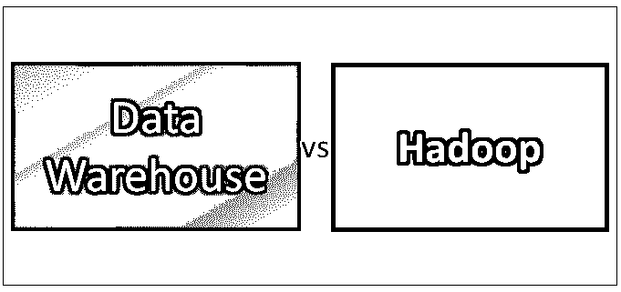
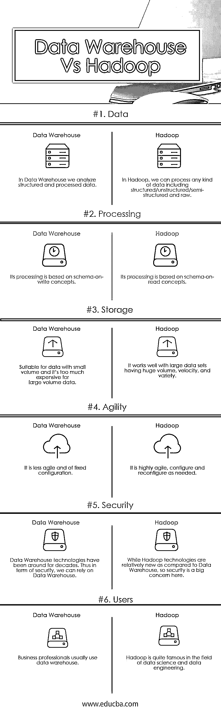

# 数据仓库与 Hadoop

> 原文：<https://www.educba.com/data-warehouse-vs-hadoop/>

## 数据仓库与 Hadoop 的区别

在数据仓库中，数据在特定的模式结构下以有序的格式排列，而 Hadoop 可以保存有或没有通用格式的数据。与数据仓库相比，这使得 Hadoop 数据不那么冗余，也不那么一致。虽然 Hadoop 系统可以保存碎片数据，但它有助于业务专业人员存储各种数据，这是数据仓库所无法做到的，因为它的关键特性是组织整洁。然而，对于有效的决策，Hadoop 和数据仓库都在组织中扮演着有效的角色。

### Hadoop 是什么？

最近谁没听说过大数据？随着每天从不同来源生成数百 TB 的数据，很明显，当今的现代世界是一个大数据世界

<small>Hadoop、数据科学、统计学&其他</small>

当你开始谈论大数据时，你迟早会开始讨论大数据世界最热门的话题:Hadoop，但它到底是什么？

Hadoop 是一个开源的、基于 Java 的编程框架，支持在分布式计算环境中处理和存储极大的数据集。

#### Hadoop 的 4 个模块

Hadoop 由 4 个模块组成

1.  **分布式文件系统**

分布式文件系统允许数据以易于访问的格式存储在大量链接的存储设备上。

2.  **地图缩小**

Map Reduce 是两种操作的结合——从数据库中读取数据并将其转换为适合分析的格式(Map)和执行数学运算(Reduce)。

3.  **Hadoop Common**

Hadoop Common 提供了存储在 HDFS (Hadoop 分布式文件系统)中的数据所需的工具

4.  **纱线**

YARN 管理存储数据和运行分析的系统资源。

### 什么是数据仓库？

数据仓库是为查询和分析数据而设计的关系数据库。它通常包含来自不同来源的历史数据。

数据仓库环境包括 ETL 解决方案、在线分析处理(OLAP)引擎、客户端分析工具和其他管理数据分析过程并将其交付给业务用户的应用程序。

**让我们总结一下什么是数据仓库—**

1.  #### Theme-oriented

数据仓库可用于分析特定的主题领域，如销售、财务和库存。每个主题领域都包含详细的数据。

2.  #### Complete

数据仓库集成了来自多个数据源的数据。例如，日期格式相同，男性/女性代码一致。在数据仓库中，只有一种识别产品的方法，他们使用相同的客户记录，而不是副本

3.  #### Non-volatile

数据被不加修改地存储在数据仓库中，它不会改变。因此，数据仓库中的历史数据永远不应该被修改。

4.  #### Time-varying

用户可以从数据仓库中检索 3 个月、6 个月、12 个月甚至更早的数据。

5.  #### is not a virtual

数据仓库是一个物理的、持久的存储库。

### 数据仓库和 Hadoop 之间的直接比较(信息图表)

以下是数据仓库和 Hadoop 之间的 6 大对比:

### 数据仓库与 Hadoop——使用哪个？

*   如果您有干净、一致和高质量的数据，那么您应该选择数据仓库，因为 Hadoop 的一些解决方案缺乏数据质量。
*   如果您有原始的非结构化数据，那么您应该选择 Hadoop，因为 Hadoop 可以很好地处理非结构化/原始数据，而数据仓库只能处理结构化数据。
*   对于低延迟和交互式报告，您应该选择数据仓库
*   对于 OLTP/实时/点查询，您应该选择数据仓库，因为 Hadoop 可以很好地处理批量数据。
*   对于大容量数据集，您应该选择 Hadoop，因为 Hadoop 旨在解决大数据问题。

### 数据仓库和 Hadoop 对照表

下面是描述数据仓库和 Hadoop 之间比较的要点列表。

| **比较依据** | **数据仓库** | **Hadoop** |
| **数据** | 在数据仓库中，我们分析结构化和处理过的数据 | 在 Hadoop 中，我们可以处理任何类型的数据，包括结构化/非结构化/半结构化和原始数据 |
| **处理** | 它的处理基于写模式的概念 | 它的处理基于读取模式的概念 |
| **存储** | 适用于小容量数据，但对于大容量数据来说成本太高 | 它适用于具有巨大容量、速度和多样性的大型数据集 |
| **敏捷度** | 它不太灵活，而且配置固定 | 它非常灵活，可以根据需要进行配置和重新配置 |
| **安全** | 数据仓库技术已经存在了几十年。因此，在安全性方面，我们可以依赖数据仓库 | 与数据仓库相比，Hadoop 技术相对较新，因此安全性是一个大问题 |
| **用户** | 商业人士通常使用数据仓库 | Hadoop 在数据科学和数据工程领域相当有名 |

### 结论

现在我们已经了解了数据仓库和 Hadoop，让我们回过头来检查一下我们在这篇关于数据仓库和 Hadoop 的文章开始时提出的问题

1)如果有大数据，需要数据仓库吗？

**回答—**只要您的组织需要可靠、可信和可访问的数据，那么您就需要数据仓库。

Hadoop 会取代数据仓库吗？

**回答—**比较数据仓库和 Hadoop 就像比较苹果和橘子。数据仓库和 Hadoop 在不同的用例场景中都有各自的优势。在某些情况下，我们仍然依赖传统的数据仓库技术，但随着时间的变化，我们更加关注 Hadoop 框架来处理大数据问题。

3)这是传统数据仓库时代的死亡吗？

**回答–**如你所见，这不是一个真正简单的问题，因此不适合简单回答。诚然，大数据将在未来几年改变传统的数据仓库方法，但它不会淘汰数据仓库的概念和实践。

### 推荐文章

这是数据仓库与 Hadoop 的一个有用的指南。在这里，我们讨论了数据仓库与 Hadoop 的直接比较、关键差异以及信息图和比较表。您也可以阅读以下文章，了解更多信息——

1.  [Hadoop 与 Splunk–找出最佳的 7 个差异](https://www.educba.com/hadoop-vs-splunk/)
2.  [Hadoop 与 elastic search——哪个更有用](https://www.educba.com/hadoop-vs-elasticsearch/)
3.  [大数据与数据仓库——找出最佳差异](https://www.educba.com/big-data-vs-data-warehouse/)
4.  [商业智能 vs 数据仓库](https://www.educba.com/business-intelligence-vs-data-warehouse/)
5.  [Splunk vs Nagios](https://www.educba.com/splunk-vs-nagios/)

