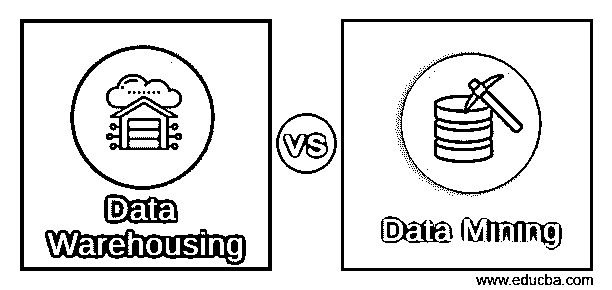
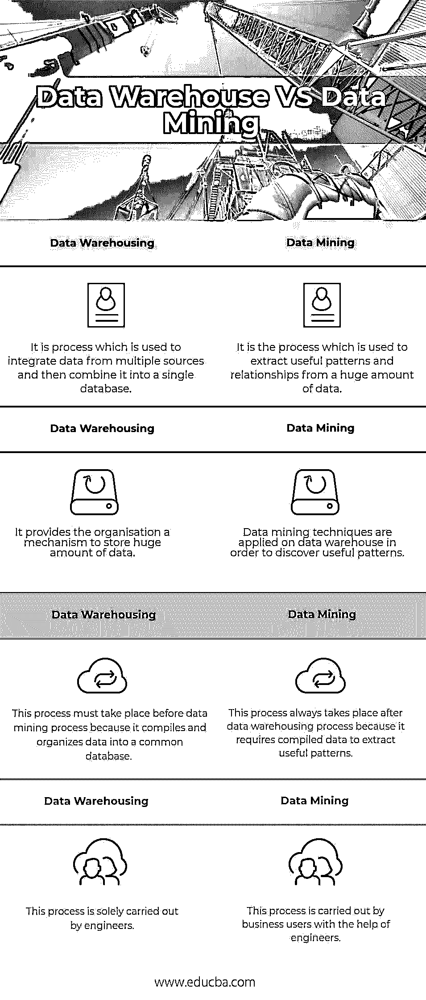

# 数据仓库与数据挖掘

> 原文：<https://www.educba.com/data-warehousing-vs-data-mining/>

## 数据仓库与数据挖掘的区别

**[数据仓库](https://www.educba.com/what-is-data-warehouse/)** 是一个环境，其中来自多个来源的重要数据存储在一个模式下。然后用于报告和分析。数据仓库是一种关系数据库，它是为查询和分析而设计的，而不是为事务处理而设计的。它通常包含来自交易数据的历史数据。而构建数据仓库是为了支持管理功能。

[**数据挖掘**](https://www.educba.com/what-is-data-mining/) 用于从数据中提取有用的信息和模式。任何传统的数据库都可以进行数据挖掘，但是因为数据仓库包含高质量的数据，所以在数据仓库系统上进行数据挖掘是很好的。数据挖掘通过发现隐藏的模式和关联、构建分析模型、执行分类和预测来支持知识发现。

<small>Hadoop、数据科学、统计学&其他</small>

让我们详细了解数据仓库和数据挖掘之间的区别

**主要特征**

1.  **数据仓库:**

数据仓库的主要特征讨论如下:

1.  **面向主题:**数据仓库是面向主题的，因为它提供关于主题的知识，而不是组织正在进行的操作。这些主题可以是产品、客户、供应商、销售、收入等。数据仓库侧重于为决策建立模型和分析数据。
2.  **集成**:数据仓库是通过组合来自不同来源的数据而构建的，如关系数据库、平面文件等。
3.  **时变:**数据仓库中存在的数据提供关于特定时间段的信息。
4.  **非易失性**:非易失性是指数据一旦入库就不应该改变。

**数据仓库的好处**

1.  一致和高质量的数据
2.  成本降低
3.  更及时的数据访问
4.  提高性能和生产力

**数据挖掘:**

下面讨论了数据挖掘的主要特性:

1.  模式的自动发现
2.  对可能结果的预测
3.  创建可操作的信息
4.  关注大型数据集和数据库

**数据挖掘的好处:**

1.  直接营销:预测谁最有可能对什么产品感兴趣的能力
2.  趋势分析:了解市场趋势是一种战略优势，因为它有助于降低成本和市场及时性。
3.  欺诈检测:数据挖掘技术有助于发现哪些保险索赔、手机通话或信用卡购物可能是欺诈性的。
4.  金融市场预测:数据挖掘技术被广泛用于帮助金融市场建模。

### **数据仓库与数据挖掘**的面对面比较(信息图表)

下面是数据仓库和数据挖掘之间的四大比较:

### 数据仓库和数据挖掘的主要区别

数据仓库和数据挖掘之间的一些主要区别如下:

*   数据仓库是提取和存储数据以简化报告的过程。数据挖掘是使用模式识别逻辑来识别样本数据集中的趋势，而数据挖掘的典型用途是识别欺诈，并标记不寻常的行为模式。例如，当您在以前从未使用过的其他地理位置进行交易时，信用卡公司会向您发出警报。由于数据挖掘，这种欺诈检测是可能的。
*   数据仓库和数据挖掘的主要区别在于，数据仓库是将数据编译和组织到一个公共数据库中的过程，而数据挖掘是从该数据库中提取有意义的数据的过程。数据挖掘只能在数据仓库完成后进行**。**
*   数据仓库是存储数据的仓库。另一方面，数据挖掘是一组广泛的活动，用于发现模式，并赋予这些数据以意义。
*   数据仓库仅仅是从不同的来源提取数据，清洗数据并将其存储在仓库中。而数据挖掘旨在使用查询来检查或探索数据。

例如，一家公司的数据仓库存储了项目和员工的所有相关信息。使用数据挖掘，人们可以使用这些数据生成不同的报告，如利润生成等。

*   数据仓库是一个体系结构，而数据挖掘是一个过程，是发现新模式的各种活动的结果。
*   数据仓库是一种组织数据的技术，因此应该有公司的可信度和完整性，但是，数据挖掘有助于提取那些没有发现的有意义的模式，这些模式必须通过仅处理数据或查询数据仓库中的数据来发现。
*   数据仓库包含集成和处理的数据，以便在计划和决策制定时执行数据挖掘，但是通过数据挖掘发现的数据导致发现对未来预测有用的模式。
*   数据仓库支持基本的统计分析。从数据挖掘中获取的信息有助于市场细分、客户分析、信用风险分析、欺诈检测等任务。
*   数据仓库是将所有相关数据汇集在一起的过程，而数据挖掘是分析未知数据模式的过程。
*   数据仓库通常存储数月或数年的数据。这是为了支持历史分析。数据挖掘是使用模式识别逻辑来识别样本数据集中的趋势。

### 数据仓库和数据挖掘对照表

下面是数据仓库和数据挖掘之间的主要比较。

| **数据仓库** | **数据挖掘** |
| 这是一个用于集成来自多个来源的数据，然后将其合并到一个数据库中的过程。 | 它是用于从大量数据中提取有用模式和关系的过程。 |
| 它为组织提供了存储大量数据的机制。 | 数据挖掘技术应用于数据仓库，以发现有用的模式。 |
| 这个过程必须发生在数据挖掘过程之前，因为它将数据编译和组织到一个公共数据库中。 | 这个过程总是发生在数据仓库过程之后，因为它需要编译数据来提取有用的模式。 |
| 这一过程完全由工程师完成。 | 这个过程由业务用户在工程师的帮助下执行。 |

### 结论

数据挖掘和数据仓库的区别在于系统设计、使用的方法和目的。数据仓库是在任何数据挖掘发生之前必须发生的过程。数据仓库是数据挖掘过程可能发生的“环境”。最后，可以说数据仓库有效地组织了数据，从而可以挖掘数据。

### 推荐文章

这是数据仓库和数据挖掘的指南。在这里，我们讨论了数据仓库与数据挖掘的直接比较、关键区别以及信息图和比较表。您也可以阅读以下文章，了解更多信息——

1.  [数据仓库职业](https://www.educba.com/career-in-data-warehousing/)
2.  [数据挖掘与统计——哪个更好](https://www.educba.com/data-mining-vs-statistics/)
3.  [了解数据挖掘与文本挖掘](https://www.educba.com/data-mining-vs-text-mining/)
4.  [大数据与数据仓库——找出最佳差异](https://www.educba.com/big-data-vs-data-warehouse/)
5.  [甲骨文数据仓库](https://www.educba.com/oracle-data-warehousing/)

