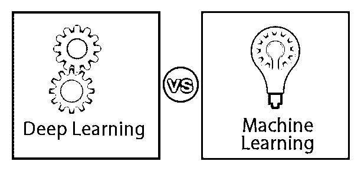
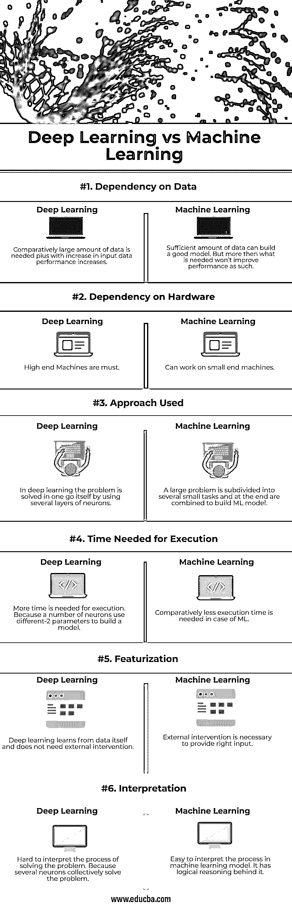

# 深度学习 vs 机器学习

> 原文：<https://www.educba.com/deep-learning-vs-machine-learning/>

## 深度学习和机器学习的区别

机器学习和深度学习属于人工智能的同一范畴；机器学习有三种不同的学习方法，即监督学习、非监督学习和强化学习。而深度学习是机器学习的子集，因此它几乎没有机器学习的属性，但在训练模型所需的数据量、对硬件的依赖性、用于解决问题的方法、执行时间、特征和解释等方面与机器学习不同。

### 深度学习和机器学习的面对面比较(信息图)

以下是深度学习与机器学习之间的 6 大差异

<small>Hadoop、数据科学、统计学&其他</small>

### 深度学习和机器学习的主要区别

机器学习和深度学习都是人工智能的子集。以下是这两种方法之间的主要区别。

1.  在机器学习中，主要关注的是基于模型的输入数据经验来改进模型的学习过程。在机器学习中，有标签或无标签的数据首先会经过[数据工程](https://www.educba.com/what-is-data-engineering/)和特征化。数据越清晰，模型就越好。在深度学习的情况下，重点更多地是让模型自己学习，即训练和错误方法，以达到最终的解决方案。
2.  机器学习倾向于原子化和预测回归或分类问题，如基于 n 个特征预测 x 客户是否会支付贷款。另一方面，深度学习试图创建人类思维的复制品，以解决特定的问题。比如通过看图片识别哪个是猫哪个是狗等等。
3.  在机器学习中，我们处理两类问题监督学习和非监督学习。在有监督的输入和输出中，数据被标记，另一方面，在无监督的学习中，数据不被标记。在深度学习的情况下，该模型进一步接近强化学习。每一个错误都有惩罚，而正确的决定会有回报。
4.  在机器学习中，我们选择了一个合适的算法(有时是多个，然后为我们的模型选择了最好的一个)，定义参数并提供数据，机器学习算法将在训练数据上学习，并在用测试数据验证/评估时，模型将被部署用于特定任务。另一方面，在深度学习中，我们定义了一层感知器。感知器可以被认为是人类大脑中的一个神经元。一个神经元通过多个树突获得输入，处理它(采取一个小的行动/决定)，并通过轴突末梢将输出发送到该层中的下一个神经元。同样，感知器具有输入节点(来自输入数据特征或感知器的前一层)、做出小决策的驱动功能和将输出发送到该层中下一个感知器的输出节点。
5.  从机器学习创建模型的过程包括:提供输入数据的特征，根据问题选择算法，定义必要的参数和超参数，在训练集上训练，以及运行优化。根据测试数据评估模型。在深度学习的情况下，过程是相同的，直到提供具有特征的输入数据。在此之后，我们定义了模型的输入和输出层，其中包含了感知器的数量。我们根据问题的复杂程度选择所需的隐藏层数。我们为每一层定义感知器，并为每个感知器定义输入、激活函数和输出节点。一旦定义了模型，然后输入数据，模型就会通过反复试验自行训练。
6.  在机器学习中，创建模型所需的数据量相对较少。在深度学习的情况下，方法是反复试验以学习最佳可能的结果。因此，可用于训练的数据越多，模型就越强。在机器学习中，如果我们也增加数据量，但超过一定限度后，学习过程就会停滞。在深度学习的情况下，模型不断学习，这是问题的复杂性，复杂的问题需要更多的数据。
7.  例如，机器学习模型用于提供音乐流的推荐。现在，为了让模型做出推荐歌曲/专辑/艺术家的决定，它将检查相似的特征(音乐品味)并将推荐相似的播放列表。对于深度学习来说，最好的例子是自动文本生成。在谷歌上搜索或写邮件时，深度学习模型会根据以前的经验自动建议可能的结果。

### 深度学习 vs 机器学习对比表

我们来讨论一下深度学习和机器学习的顶级对比

| **比较的基础** | **深度学习** | **机器学习** |
| 数据依赖性 | 需要相对大量的数据，而且随着输入数据的增加，性能也会提高 | 足够多的数据可以建立一个好的模型。但是超过需要的量并不能提高性能。 |
| 对硬件的依赖 | 高端机是必须的。 | 能在小型机器上工作。 |
| 使用的方法 | 在深度学习中，问题是通过使用几层神经元来一气呵成地解决的。 | 一个大问题被细分成几个小任务，最后组合起来建立 ML 模型。 |
| 执行所需的时间 | 执行需要更多的时间。因为许多神经元使用不同的-2 参数来建立模型。 | 在 ML 的情况下需要相对较少的执行时间。 |
| 特征化 | 深度学习从数据本身学习，不需要外部干预。 | 为了提供正确的输入，外部干预是必要的。 |
| 解释 | 很难解释解决问题的过程。因为几个神经元集体解决问题。 | 易于解释机器学习模型中的过程。它背后有逻辑推理。 |

### 结论

我们已经讨论了机器学习模型和深度学习模型的不同之处。当数据解释简单(不复杂)时，我们使用机器学习，以在重复操作中提供自动化。当我们拥有非常大量的数据，或者一个问题太复杂而无法用机器学习解决时，我们会使用深度学习模型。深度学习比机器学习需要更多的资源，它很昂贵，但更准确。

### 推荐文章

这是深度学习 vs 机器学习的指南。这里我们用信息图和比较表来讨论区别。您也可以看看以下文章，了解更多信息–

1.  [数据科学家 vs 机器学习](https://www.educba.com/data-scientist-vs-machine-learning/)
2.  [数据挖掘 vs 机器学习](https://www.educba.com/data-mining-vs-machine-learning/)
3.  [机器学习 vs 人工智能](https://www.educba.com/machine-learning-vs-artificial-intelligence/)
4.  [机器学习 vs 神经网络](https://www.educba.com/machine-learning-vs-neural-network/)

