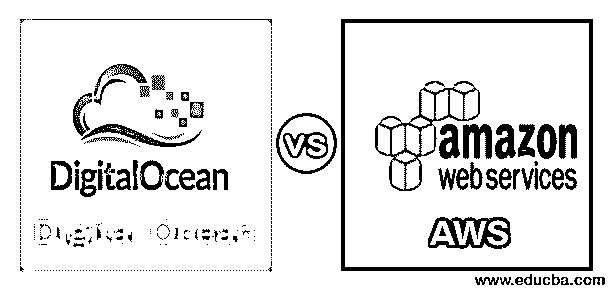
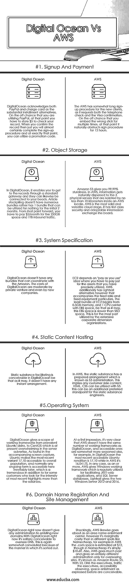

# 数字海洋 vs 自动气象站

> 原文：<https://www.educba.com/digital-ocean-vs-aws/>

## 数字海洋与自动气象站的区别

以下文章提供了数字海洋与自动气象站的概要。数字海洋和亚马逊网络服务(AWS)是两个著名的分布式计算管理。数字海洋在私人企业和非主流设计师中非常突出，尽管 AWS 在中等规模到企业规模的组织中最为人所知。从表面上看， [AWS 是分布式计算中的](https://www.educba.com/what-is-aws/)主要力量，因为它有一个巨大的基础和大量的公司维度客户，这使他们能够发展巨大的规模，并传递对后续维度的支持。在任何情况下，最近，数字海洋已经从不同的方向获得了巨大的关注，本文展示了数字海洋在分布式计算世界中所做的工作，以及这两个竞争对手在分布式计算领域中的真实对比。

<small>Hadoop、数据科学、统计学&其他</small>

### 数字海洋与自动气象站的面对面比较(信息图)

以下是数字海洋和自动气象站之间的六大对比:

### 数字海洋与自动气象站的主要区别

让我们讨论一下数字海洋和自动气象站之间的一些主要区别:

*   因此，有了 AWS，每个人都可以管理大型可扩展应用程序的成本。
*   尽管如此，数字海洋开发者和小应用程序。AWS 是根本；如果你是一个努力工作的 DevOps 专家，你没有精力引入补丁和更新，那么亚马逊是你的正确选择。电脑化的海洋，
*   如果你需要一个 MySQL 的例子，在这一点上，你应该选择数字海洋。AWS 提供了一个简单的仪表板、一个很棒的人员组、简单的配置等等。计算机化的海洋只关注自动缩放、可靠、简单的管理。

### 数字海洋与自动气象站对照表

以下是数字海洋和自动气象站之间的最高对比:

| **参数** | **AWS** | **数字海洋** |
| **注册和支付** | AWS 对新客户的注册程序有点长，因为它要求电话检查和签证确认。万一您多次嵌入了错误的棒，在这一点上，它自然会妨碍签名过程 12 个小时。 | Digital Ocean 承认 PayPal 和签帐卡是重要的分期付款选择。万一你正在使用贝宝，在这一点上，你必须存储 5 美元，以检查您的记录。当你确认记录后，你几乎肯定会完成注册程序，而且就在那时，你可以使用一个促销代码。 |
| **对象存储:**(这是另一个熟悉在云端托管静态文档的想法，就像我们在 Dropbox 或 Google Drive 中做的那样) | 亚马逊 S3 给你 99.99%的坚固。在 AWS 中，信息自然地分散到 3 个物理服务器上，这些服务器在 AWS 场所内相距不小于 10 公里。AWS 是最坚实和最通用的云阶段。它具有一流的安全性和适应性的信息交换板。 | 在数字海洋中，它使你能够通过一个标准的网关获得记录，它们同样可以连接到你的珠子上。文章储存没有很多捆绑包，而是有一个捆绑包，可以在最初的两个月内免费使用。从那时起，你必须每月为 250 GB 的空间和 1 TB 的入站流量支付 5 美元。 |
| **系统规格** | EC2 依赖于“按需付费”的理念，即您只需为您已经精确利用的资产付费。然而，AWS 另外还有一种轻型帆船，它伴随着固定费率和固定设备细节。EC2 的最小捆绑包从 0.5GB 内存和 1 个 CPU 中心和 EBS 空间开始，尽管如此，该 EBS 空间比 SSD 空间慢。这在很大程度上被广泛的公司维度组织所利用。 | 数字海洋没有任何可以与亚马逊协调的捆绑包。私营企业甚至新公司对数字海洋的投资是适度的。 |
| **静态内容托管** | 在 AWS 中，静态物质有一个准备好的安排，这就是所谓的 S3 管理。这意味着任何客户端内容，HTML，CSS 可以利用 S3。这可能是静态物质工程师的另一个首选观点。 | 静态物质促进在数字海洋中是可以想象的，尽管如此，它没有任何即时的安排。 |
| **操作系统** | 在第一印象中，很明显 AWS 没有数字海洋那么多的工作框架，可访问的框架也更加成熟，例如，在数字海洋中，最新的可访问 Ubuntu 版本是 17.10，而在 AWS 中是 16.04 LTS。在任何情况下，作为一个或多个，AWS 给 Windows 一个工作框架，这是经常用来促进。NET web 应用程序和 SQL Server 数据库。光帆给出了两个 Windows Server 2012 和 2016。 | 数字海洋提供了一个工作框架的范围，从流行的 Ubuntu 发行版到目前在服务器广告中占主导地位的 CentOS。正如在随附的截屏中发现的，Ubuntu 使最新的版本 17.10 对所有人开放，通常任何正在进行的形式都不可避免地会在稍后开放，这对于一些寻求最新亮点的强度而不是坚实度的客户来说是巨大的。 |
| **域名注册和网站管理** | 令人震惊的是，AWS 同样作为一个地区名称登记中心；然而，它比在不同的地方稍微贵一点，比如 Name cheap 例如，在 AWS 中。com space 的价格估计为 12 美元，尽管名义上很便宜，实际上只要 10.69 美元。此外，AWS 走了很长的路，只对网站监管进行了完全不同的管理。它被称为[亚马逊 53 号路线](https://www.educba.com/amazon-route-53/)。对于 53，DNS 主管、流量主管、可访问性观察、空间登记如前所述都是可以想象的。 | 数字海洋现在没有给任何管理登记新的领域。现在有了数字海洋，监管 DNS 是完全可能的。由于分类的方式，这又有点复杂。 |

### 结论

Digital Ocean vs AWS 都是出色的分布式计算管理，提供了先进的亮点，有助于使复杂的 web 应用程序优于平均成本。数字海洋没有相同数量的亮点，但可访问的亮点令人愉快地组成，尽管在 AWS include association 中是完整的残骸，但 AWS 有大量的亮点，很难在这篇小文章中深入研究。AWS 通常被视为公司层面的分布式计算管理，但鉴于现实，它有一个可容忍的价值模型，其亮点相当于数字海洋；没有人特别倾向于向数字海洋转移。在任何情况下，数字海洋实质上更容易使用，而且业余爱好者和有可靠价值的人在全球共谋；从今以后，数字海洋是为新客户建议的，而 AWS 在很大程度上是为有经验的客户提供帮助的。

### 推荐文章

这是数字海洋与自动气象站之间最大差异的指南。在这里，我们讨论了数字海洋和自动气象站之间的主要区别，并给出了各自的信息图表和比较表。您也可以看看以下文章，了解更多信息–

1.  [Primavera vs MS-Project](https://www.educba.com/primavera-vs-ms-project/)
2.  [什么是 AWS？亚马逊网络服务](https://www.educba.com/what-is-aws/)
3.  [冒烟测试与健全性测试](https://www.educba.com/smoke-testing-vs-sanity-testing/)
4.  [AWT 与 Swing–最大差异](https://www.educba.com/awt-vs-swing/)

