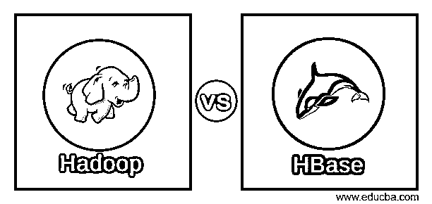
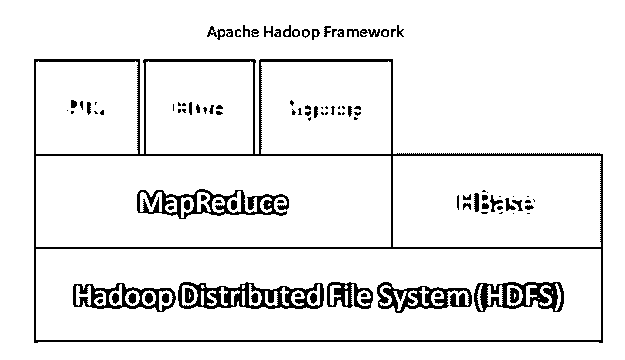
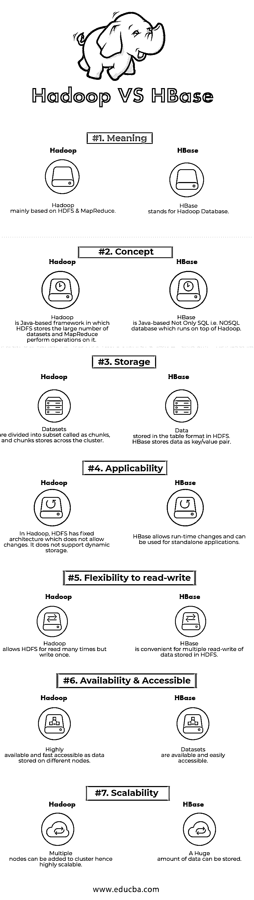

# Hadoop vs HBase

> 原文：<https://www.educba.com/hadoop-vs-hbase/>

## Hadoop 和 HBase 的区别

Hadoop 是一个开源的 Java 框架，用于管理和处理大量的结构化和非结构化数据。Hadoop 可大规模扩展，因此用于处理大数据工作负载。大数据在可靠且可扩展的集群上存储、访问和处理。HBase (Hadoop 数据库)是一个非关系型而非唯一的 SQL，即 NoSQL 数据库，作为一个分布式和可扩展的大数据存储运行在 Hadoop 之上。它是一个开源数据库，数据以行和列的形式存储，单元格是行和列的交集。

**以下是 Hadoop 架构的核心组件:**

<small>Hadoop、数据科学、统计学&其他</small>

*   **Hadoop 分布式文件系统(HDFS):** Hadoop 包含一个分布式存储系统，即 Hadoop 分布式文件系统(HDFS)。HDFS 是主-从架构，在集群中存储数据。数据由主节点以块的形式分布在几个从节点上。主节点称为 Namenode，从节点称为 Datanode。HDFS 很容易扩展，可以在 Datanodes 上存储大量数据。HDFS 有一个可配置的复制因子，默认值为 3，可以编辑。

*   MapReduce: MapReduce 是一种编程范式，通过网络对大量数据集进行并行处理。MapReduce 涉及两个不同的任务:映射输入数据，其中数据被划分为称为元组的数据子集 reduce 任务从映射中获取这些元组作为输入，并组合以形成原始数据的输出。

*   Yarn: YARN 代表另一种资源导航器，它管理 CPU 和内存等计算资源，并调度资源请求。

图 Apache Hadoop 框架

区域服务器为读/写操作提供数据。所有的 HBase 数据都存储在 HDFS 文件中。HDFS Datanode 存储区域服务器管理的数据。HDFS 命名节点保存组成文件的所有物理数据块的元数据信息。

版本控制用于跟踪单元格的更改，从而跟踪内容版本。从中可以检索任何版本的内容。每个单元值包括相对于时间戳的“版本”属性，以检索单元。映射中的每个值都是一个不间断的字节数组。该映射由行键、列键和时间戳索引。HBase 的架构是高度可伸缩的、稀疏的、分布式的、持久的和多维排序的映射。

### Hadoop 和 HBase 的面对面比较(信息图)

### Hadoop 与 HBase 的主要区别

以下几点解释了 Hadoop 和 HBase 之间的区别:

1.  Hadoop 不适合在线分析处理(OLAP ), h base 是 Hadoop 生态系统的一部分，它提供对 Hadoop 文件系统中数据的随机实时访问(读/写)。
2.  Hadoop 框架通过设计实现了容错，即使在系统出现故障时也支持节点之间的快速数据传输。HBase 是一个运行在 Hadoop 之上的非关系和开源的非 SQL 数据库。HBase 属于 CP 类型的 CAP(一致性、可用性和分区容差)定理。
3.  Hadoop 最适合执行批量分析。然而，它最大的缺点之一是不能进行实时分析，这是 IT 行业的趋势要求。另一方面，HBase 可以处理大型数据集，不适合批量分析。相反，它用于实时从 Hadoop 中写入/读取数据。
4.  Hadoop 和 HBase 都能够处理结构化、半结构化以及非结构化数据。在 Hadoop 中，HDFS 缺少一个减缓数据分析过程的内存处理引擎；因为它使用的是普通的 MapReduce。相反，HBase 拥有一个内存处理引擎，可以大幅提高读写速度。
5.  Hadoop 在执行数据分析时非常透明。另一方面，HBase 是一个表格格式的 NoSQL 数据库，它通过在不同的键值下对值进行排序来获取值。

### Hadoop 与 HBase 对照表

下面是对比。

| **比较的基础** | **Hadoop** | **HBase** |
| 意义 | Hadoop 主要基于 HDFS 和 MapReduce。 | HBase 代表 Hadoop 数据库。 |
| 概念 | Hadoop 是一个基于 Java 的框架，其中 HDFS 存储大量数据集，MapReduce 在其上执行操作。 | HBase 不仅基于 SQL，也基于 Java，即运行在 Hadoop 之上的 NoSQL 数据库。 |
| 储存；储备 | 数据集被划分为称为块的子集，块存储在集群中。 | 数据以表格格式存储在 HDFS。HBase 将数据存储为键/值对。 |
| 适应性 | 在 Hadoop 中，HDFS 有固定的架构，不允许改变。它不支持动态存储。 | HBase 允许运行时更改，可用于独立的应用程序。 |
| 读写灵活性 | Hadoop 允许 HDFS 多次读取，但只写一次。 | HBase 方便对 HDFS 存储的数据进行多次读写 |
| 可用性和可访问性 | 作为存储在不同节点上的数据，具有高可用性和快速可访问性。 | 数据集可用且易于获取 |
| 可量测性 | 多个节点可以添加到集群，因此具有高度的可扩展性。 | 可以存储大量的数据。 |

### 结论

Hadoop 架构主要基于 HDFS 和 MapReduce。HBase 是 Hadoop 系统中的支撑组件。HBase 能够托管巨大的表，并提供对可用数据的快速随机访问，而 HDFS 则适合存储大文件。Hadoop 和 HBase 都提供对数据的快速访问，但使用 HBase 可以执行读/写操作，而对于 HDFS，可以执行多次读取和一次写入。本文描述了对 Hadoop 和 HBase 的理解，简要强调了特性，并进行了明智的比较。

### 推荐文章

1.  [Hadoop 与 Hive–找出最佳差异](https://www.educba.com/hadoop-vs-hive/)
2.  [h base vs Cassandra——哪个更好(资料图)](https://www.educba.com/hbase-vs-cassandra/)
3.  [Hadoop vs Spark:有什么特点](https://www.educba.com/hadoop-vs-spark/)

