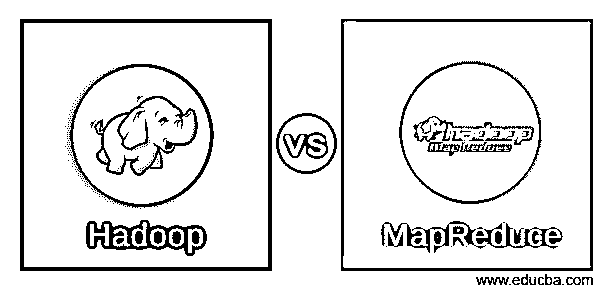
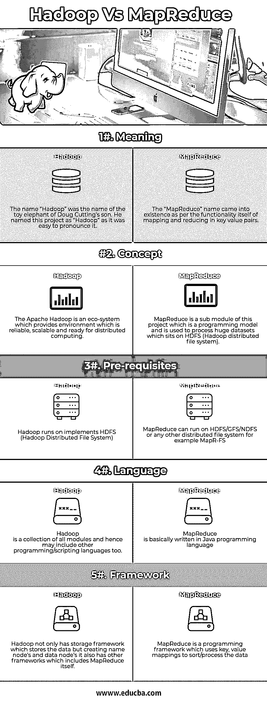
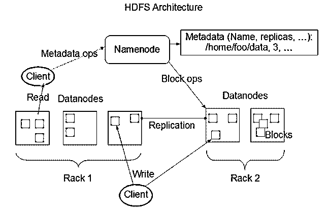
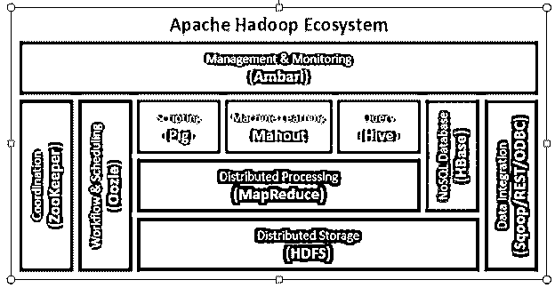
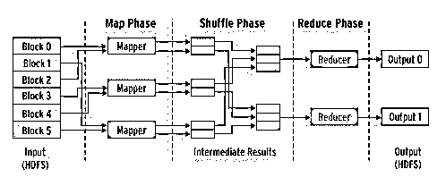

# Hadoop 与 MapReduce

> 原文：<https://www.educba.com/hadoop-vs-mapreduce/>

## Hadoop 和 MapReduce 的区别

Hadoop 的根源可以追溯到 2002 年，当时 Dough Cutting 正在从事一个名为 Nutch 的开源项目(该项目用于索引网页，并使用索引网页进行搜索，与 Google 的做法相同)。他面临着存储和计算方面的可扩展性问题。2003 年谷歌发布了 GFS(谷歌文件系统)，2004 年 Nutch 创建了 NDFS (Nutch 分布式文件系统)。在谷歌宣布 MapReduce 作为排序算法背后的计算大脑后，Dough 能够在 NDFS 上运行 Nutch，并在 2005 年和 2006 年 Hadoop 诞生时使用 MapReduce。

Hadoop 和 MapReduce！Hadoop 是 Hadoop Common、Hadoop 分布式文件系统(HDFS)、Hadoop YARN、Hadoop MapReduce 等开源项目的生态系统。Hadoop 本身是一个用于存储和处理大型数据集的开源框架。存储由 HDFS 完成，处理由 MapReduce 负责。另一方面，MapReduce 是一个编程模型，它允许你处理存储在 Hadoop 中的大量数据。

<small>Hadoop、数据科学、统计学&其他</small>

### Hadoop 和 MapReduce 的面对面比较(信息图表)

以下是 Hadoop 与 MapReduce 之间的前五大比较

### Hadoop 和 MapReduce 的主要区别

以下是 Hadoop 和 MapReduce 的区别

*   如果我们想用外行人的话来区分 Hadoop 和 MapReduce，我们可以说，Hadoop 就像一辆汽车，其中有旅行所需的一切，但 MapReduce 就像汽车的引擎，因此没有汽车，引擎就无法存在，但汽车的外观可能会改变(其他 DFS(分布式文件系统))。
*   Hadoop 背后的基本思想是数据必须可靠且可扩展，可靠是因为在发生灾难或网络故障时，数据必须始终可用，这是通过 Hadoop 的框架使用名称节点和数据节点实现的。
*   数据节点和命名节点的一些基本概念

*   数据节点和名称节点架构背后的基本思想是主/从架构，其中一个存储数据的位置(名称节点)，另一个存储数据本身(数据节点)。数据被分割成 64mb 的块并保存在数据块中，这些块的注册表在名称节点上维护。为保证可靠性，默认情况下数据会复制三次。谈到可扩展性，硬件可以随时增加，这有助于增加存储，使系统具有可扩展性。
*   现在，MapReduce 分为三个阶段
    1.  地图阶段
    2.  洗牌阶段
    3.  减少阶段

让我们举个例子来更好地理解它。作为一个编程框架，MapReduce 也有一个 hello world 程序，但它在 MapReduce 中被称为字数统计程序。

单词计数程序为我们提供单词的键值对以及它在段落/文章或任何数据源中的出现频率。为了便于理解，让我们以下面的数据为例。

在数据集中，我们可以看到我们有三个词公共汽车，汽车和火车。名为 Input 的列包含我们在 dataset 中拥有的数据，而 Output 列包含处于中间阶段的数据，在此阶段将进行洗牌。

这里我们把分割线当做逗号(，)来分割单词。分割线可以是逗号、空格或换行符等。

| **输入** | 数据 | 汽车，汽车，汽车，公共汽车，火车，公共汽车，火车，公共汽车，火车，公共汽车，公共汽车，汽车，公共汽车，汽车，火车，汽车，汽车 |
| **输出** | Convert into another set of data(键，值) | (Bus,1), (Car,1), (bus,1), (car,1), (train,1),(汽车，1)，(公共汽车，1)，(汽车，1)，(火车，1)，(公共汽车，1)，(火车，1)，(公共汽车，1)，(公共汽车，1)，(汽车，1)，(汽车，1)，(汽车，1)，(公共汽车，1)，(火车，1) |

上面中间阶段的输出给了减速器，下面是程序的最终输出。

| **Input****(地图功能输出)** | 元组集 | (Bus,1), (Car,1), (bus,1), (car,1), (train,1),

(汽车，1)，(公共汽车，1)，(汽车，1)，(火车，1)，(公共汽车，1)，

(火车，1)，(公共汽车，1)，(公共汽车，1)，(汽车，1)，(汽车，1)，

(汽车，1)，(公共汽车，1)，(火车，1)

 |
| **输出** | 转换成更小的元组集 | (BUS,7),(车，7)，(火车，4) |

*   Hadoop 与其他大数据处理框架的一个关键区别是，Hadoop 将代码(MapReduce 代码)发送到存储数据的集群，而不是将数据发送到代码，因为数据集以 TB 为单位，有时以 PB 为单位，这将是一项繁琐的任务。

### hadoop 与 mapreduce 对比表

以下是主要的比较

| **比较依据** | **Hadoop** | **MapReduce** |
|  意义 | “Hadoop”这个名字是道格·卡丁的儿子的玩具大象的名字。他将这个项目命名为“Hadoop ”,因为它很容易发音。 | “MapReduce”这个名字是根据键-值对中映射和化简的功能本身而产生的。 |
|  概念 | Apache Hadoop 是一个生态系统，它为分布式计算提供了一个可靠、可扩展且准备就绪的环境。 | MapReduce 是这个项目的一个子模块，这个项目是一个编程模型，用于处理位于 HDFS (Hadoop 分布式文件系统)上的巨大数据集。 |
|  先决条件 | Hadoop 运行在实现 HDFS (Hadoop 分布式文件系统)上 | MapReduce 可以在 HDFS/GFS/NDFS 或任何其他分布式文件系统上运行，例如 MapR-FS |
|  

语言

 | Hadoop 是所有模块的集合，因此也可能包括其他编程/脚本语言 | MapReduce 基本上是用 Java 编程语言编写的 |
|  结构 | Hadoop 不仅有存储数据的存储框架，还创建名称节点和数据节点，它还有其他框架，包括 MapReduce 本身。 | MapReduce 是一个编程框架，它使用键、值映射来排序/处理数据 |

下图将有助于区分 MapReduce 和 Hadoop。

MapReduce 框架

*   从上图可以看出，MapReduce 是一个分布式处理框架，而 Hadoop 是所有框架的集合。

### 结论

Hadoop 是开源的，因为可以免费使用而广受欢迎，程序员可以根据自己的需要修改代码。在过去的几年中，Hadoop 生态系统被不断开发，以使生态系统尽可能无 bug。

随着世界需求的不断变化，技术也在快速变化，很难跟踪这些变化。当您阅读本文时，一个月内生成的数据正在翻倍或翻三番，对更快处理数据集的需求导致了许多其他编程框架，如 MapReduce 2、Spark 等。

### 推荐文章

这是 Hadoop 与 MapReduce 的指南，包括它们的含义、直接比较、主要差异、比较表和结论。您也可以阅读以下文章，了解更多信息——

1.  [Hadoop 与红移的区别](https://www.educba.com/hadoop-vs-redshift/)
2.  [找出 Apache Hadoop 与 Apache Storm 的 6 大区别](https://www.educba.com/apache-hadoop-vs-apache-storm/)
3.  [Hadoop 与 SQL 的比较](https://www.educba.com/hadoop-vs-sql/)
4.  [了解 MapReduce vs Spark](https://www.educba.com/mapreduce-vs-spark/)
5.  [Hadoop vs Spark:函数](https://www.educba.com/hadoop-vs-spark/)
6.  [Laravel vs Codeigniter:功能](https://www.educba.com/laravel-vs-codeigniter/)

