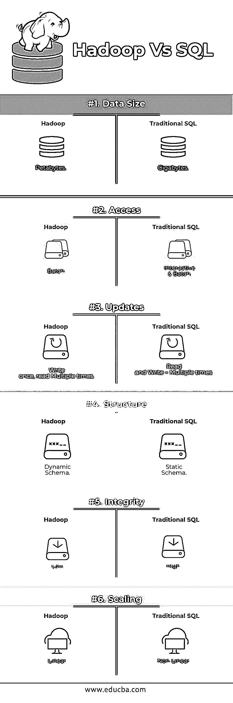

# Hadoop 与 SQL

> 原文：<https://www.educba.com/hadoop-vs-sql/>

## Hadoop 与 SQL 的区别

每秒钟通过脸书、推特和 Instagram 等社交媒体产生的大量数据为 Hadoop/ [大数据](https://www.educba.com/big-data-vs-data-science/)生态系统的发展铺平了道路。术语“3V”指的是容量、速度和准确性，它定义了 Hadoop 处理流数据的重要性。如今，数据是从多个来源生成的，出于各种目的，如报告、[、数据分析](https://www.educba.com/data-analysis-techniques/)和研究以及数据的集中存储，需要对这些来源的数据进行整合。当我们这样做时，传统方法会出现许多问题，如空间、访问、完整性、结构和带宽。为了处理所有这些问题，Hadoop 提供了一个框架，能够处理海量数据，提供易访问性、高可用性和动态加载数据。它有一个用于存储数据的分布式文件系统框架(HDFS ),以及一个名为“Map Reduce”的内置查询处理器，用于分析和处理存储在 HDFS 的数据。

### Hadoop 和 SQL 之间的直接比较(信息图表)

以下是 Hadoop 和 SQL 之间的 6 大区别:

<small>Hadoop、数据科学、统计学&其他</small>

### Hadoop 和 SQL 的主要区别

下面是 Hadoop 和 SQL 的区别如下:

1.  **写入模式与读取模式**

通常，在传统数据库中，在从一个数据库到另一个数据库的数据加载/迁移期间，它遵循模式写入方法。这使得数据加载过程变得兴奋/中止，并由于源表和目标表的结构不同而导致记录被拒绝，而在 Hadoop 系统中，所有数据都存储在 HDFS 中，并且数据是集中的。

Hadoop 框架主要用于数据分析过程。因此，它支持所有三类数据，即[结构化](https://www.educba.com/what-is-structured-finance/)、半结构化和非结构化数据，并支持阅读方法上的模式。

*   结构化数据有明确的格式。g.: XML 文件。
*   半结构化数据较为松散；它可能有也可能没有模式。g .:电子表格
*   非结构化数据没有特定的结构或模式。例如:纯文本或图像。

Hadoop 能够高效地处理非结构化数据，因为它能够在处理过程中解释数据。

| **接近** | **优势** | **缺点** |
| 写入时模式 | ·         Pre-defined Structures读得更快。例如:传统的 RDBMS。 | Slow Data Load高延迟 |
| 读取模式 | ·         Dynamic Structure快速读写。例如:Hadoop | Fast Data load

低延迟

 |

**表**:写模式与读模式。

2.  **可扩展性&成本**

[Hadoop 框架](https://www.educba.com/hadoop-framework/)旨在处理大量数据。每当数据的大小增加时，与传统的静态内存分配方法相比，可以非常容易地向集群添加一些额外的资源，如数据节点。实施它们所需的时间和预算相对较少，而且 Hadoop 还提供了数据局部性，数据在执行作业的节点上可用。

3.  **容错**

在传统的 RDBMS 中，当数据由于损坏或任何网络问题而丢失时，需要花费更多的时间、成本和资源来找回丢失的数据。但是，Hadoop 有一种机制，对于存储在 HDFS 的数据，该机制具有至少三个级别的复制因子。如果保存数据的一个数据节点出现故障，可以很容易地从其他具有高数据可用性的数据节点中提取数据。因此，无论发生任何故障，用户都可以很容易地获得数据。

4.  **功能编程**

Hadoop 支持用 java、scala 和 python 等语言编写函数式编程。对于任何需要额外功能的应用程序，可以通过在 HDFS 注册 UDF 用户定义功能来实现。在 RDBMS 中，不可能编写 UDF，这增加了编写 SQL 的复杂性。此外，存储在 HDFS 的数据可以由 Hadoop 的所有生态系统访问，如 Hive、Pig、Sqoop 和 HBase。因此，如果编写了 UDF，它就可以被上述任何应用程序使用。它提高了系统的性能和可支持性。

5.  **优化**

Hadoop 将数据存储在 HDFS，并通过巨大的优化技术处理 Map Reduce。用于处理数据的最流行的技术是对存储的数据进行分区和分桶。分区是一种在 HDFS 中存储数据的方法，它基于提到的用于分区的列来拆分数据。当数据被注入或加载到 HDFS 时，它会识别分区列并将数据推入相关的分区目录。因此，查询通过直接从分区目录获取数据来获取结果集。这减少了整个表的扫描，改善了响应时间并避免了延迟。

另一种方法称为数据分桶。这使分析师能够轻松地在数据节点之间分发数据。所有节点将分配相同数量的数据。选择分桶列的方式是使它具有最少的基数。

这些方法在传统的 SQL 方法中是不可用的。

6.  **数据类型**

在传统方法中，支持的数据类型非常有限。它只支持结构化数据。因此，清理和格式化数据模式本身将花费更多的时间。但是，Hadoop 支持复杂的数据类型，如数组、结构和映射。这鼓励使用不同种类的数据集进行数据加载。例如:可以通过用包含复杂数据类型的 XML 元素定义数据来加载 XML 数据。

7.  **数据压缩**

对于传统的数据库系统来说，可用的内置压缩技术非常少。但是对于 Hadoop 框架，有许多压缩技术，如 gzib、bzip2、LZO 和 snappy。默认压缩模式是 LZ4。甚至桌子也可以使用压缩技术进行压缩，如 Parquet、ORC。压缩技术有助于使表占用更少的空间，提高吞吐量和查询执行速度。

### Hadoop 与 SQL 对比表

下面是 Linux 和 Solaris 之间的比较表。

| **特性** | **传统 SQL** | **Hadoop** |
| **数据大小** | 千兆字节 | 千兆字节 |
| **访问** | 交互式和批处理 | 一批 |
| **更新** | 多次读写 | 写一次，读多次 |
| **结构** | 静态模式 | 动态模式 |
| **完整性** | 高的 | 低的 |
| **缩放** | 非线性的 | 线性的 |

**表**:传统 Hadoop 与 SQL 框架对比。

### 结论

总的来说，Hadoop 在成本、时间、性能、可靠性、可支持性和对超大规模用户群的数据可用性方面领先于传统 SQL。为了有效地处理每天产生的大量数据，Hadoop 框架有助于及时捕获、存储、处理、过滤并最终存储在一个集中的地方。

### 推荐文章

这是 Hadoop 与 SQL 之间差异的指南。在这里，我们讨论了 Hadoop 与 SQL 的直接比较、主要差异以及信息图和比较表。您也可以阅读以下文章，了解更多信息——

1.  [Hadoop 与 Hive–找出最佳差异](https://www.educba.com/hadoop-vs-hive/)
2.  [了解 Hadoop 与 Redshift 之间的 10 个有用差异](https://www.educba.com/hadoop-vs-redshift/)
3.  [HADOOP 与 RDBMS |了解 12 个有用的区别](https://www.educba.com/hadoop-vs-rdbms/)
4.  [Hadoop vs Spark:特点](https://www.educba.com/hadoop-vs-spark/)

