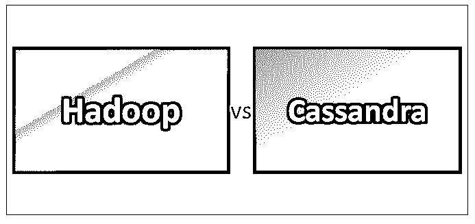
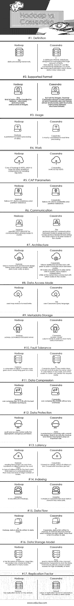

# Hadoop vs Cassandra

> 原文：<https://www.educba.com/hadoop-vs-cassandra/>

## Hadoop 和 Cassandra 的区别

Hadoop 是一款开源软件，旨在处理并行处理，主要用作海量数据的[数据仓库](https://www.educba.com/data-warehouse-interview-questions/)。Hadoop 的一个核心是基于 [Map-reduce](https://www.educba.com/mapreduce-vs-spark/) 的 HDFS (Hadoop 分布式文件系统)。通过 Map-reduce，可以在多个 CPU 节点上并行处理数据。这意味着运行繁重的应用程序不再是一个挑战，因为它可以在集群中的多个节点上运行。让我们来探索地图-减少。其实，这是两个不同的任务:
**1。Map:** 这是一个任务，它获取输入数据并将其分解成一个键-值对，我们称之为元组。
**2。减少:**地图任务完成工作后。然后进行 reduce，以执行更小的元组集。
减少总是在地图任务之后执行。对于每个集群节点，map-reduce 框架由一个主 JobTracker 和一个从 TaskTracker 组成。HDFS 由一个 NameNode 和一个或多个从节点组成，前者管理文件系统元数据，后者称为 DataNodes，负责存储实际数据。

[Cassandra 是 NoSQL](https://www.educba.com/what-is-cassandra/) 数据库，专为高速在线交易数据而设计。Cassandra 的特殊之处在于，它工作时不会出现单点故障。
Cassandra 使用 gossip 协议，来保持集群中周围节点的更新状态。如果一个节点发生故障，另一个节点将接管其职责，直到故障节点恢复正常。所有的八卦消息都有一个相关的版本，所以当节点交换八卦消息时，旧的信息会被新版本的八卦消息覆盖。
Cassandra 以灵活的模式支持非结构化数据。

<small>Hadoop、数据科学、统计学&其他</small>

### Hadoop 与 Cassandra 的面对面比较(信息图)

以下是 Hadoop 和 Cassandra 的 17 大区别:

### Hadoop 和 Cassandra 的主要区别

以下是要点列表，描述了 Hadoop 和 Cassandra 之间的主要区别:

1.Hadoop 拥有分布式文件系统，专为并行数据处理而设计，而 [Cassandra 是 NoSQL 数据库](https://www.educba.com/is-cassandra-nosql/)，用于快速在线事务。
2。 [Hadoop 的](https://www.educba.com/what-is-hadoop/)是海量数据批处理的首选，而 Cassandra 是实时处理的首选。
3。Hadoop 基于主从架构，而 Cassandra 基于对等通信。

### Hadoop 与 Cassandra 对比表

下面是 Hadoop 和 Cassandra 的重点对比。

| **比较的基础** | **Hadoop** | 卡桑德拉 |
| **定义** | [大数据](https://www.educba.com/big-data-vs-data-science/)处理框架。 | 它是分布式 NoSQL 数据库，专为管理海量数据而设计。这里 NoSQL 的意思是它不像一个传统的数据库。它更像是以键值对的形式存储数据的 hashmap /hashtable。 |
| **支持的格式** | Hadoop 可以处理任何类型的数据——结构化、半结构化、非结构化或图像。 | Cassandra 还可以处理几乎所有的结构化、半结构化、非结构化数据集，但不能处理图像。然而，众所周知，Cassandra 在半结构化数据集上表现最佳。 |
| **用途** | Hadoop 是批量处理数据的首选。 | Cassandra 主要考虑实时处理。 |
| **工作** | Hadoop 的核心是 HDFS，它是处理大数据的其他分析组件的基础。 | 卡桑德拉在 HDFS 山顶工作。 |
| **CAP 参数** | Hadoop 遵循 CP，那就是一致性和分区容忍度。 | Cassandra 遵循 AP，即可用性和分区容忍度。 |
| **通信** | Hadoop 使用 RPC/TCP 和 UDP 在集群中的节点之间进行通信。 | 用于节点间通信的协议是 gossip 协议。Gossip 协议不断向集群中的对等节点广播节点状态。 |
| **架构** | Hadoop 遵循主从架构设计。名称节点作为主机工作，而数据节点作为从机工作。 | Cassandra 遵循分布式架构，节点之间进行对等通信。所有节点都被设计为在集群中扮演相同的角色。每个节点都是独立的，同时又与群集中的其他节点相连接。 |
| **数据访问模式** | 它使用 map-reduce 进行读/写。 | 这个[用的是 Cassandra 查询语言。](https://www.educba.com/cassandra-query-language/) |
| **元数据存储** | Hadoop 拥有集中式元数据服务器。 | Cassandra 拥有“inode”列族，以便存储元数据信息 |
| **容错** | Hadoop 很容易失败。如果主节点出现故障，一切都会变得一团糟。 | 因为 Cassandra 没有主从概念，所有节点都具有相同的值。如果任何节点出现故障，集群中的其余节点可以轻松处理请求。 |
| **数据压缩** | 利用现有的最佳技术，Hadoop 可以将文件压缩 10-15 %。 | Cassandra 可以压缩文件到 80%,没有任何开销。 |
| **数据保护** | 数据审计和访问控制验证适当的用户/组权限。 | Cassandra 通过提交日志设计来保护数据。像备份和恢复机制这样的内置安全机制起着重要的作用。 |
| **等待时间** | Hadoop 读取时间范围可以从几百毫秒(最坏的情况)到几十毫秒(最好的情况)不等。由于有大量节点，写入延迟相对小于读取延迟。 | 卡珊德拉是基于 [NoSQL](https://www.educba.com/software-development/courses/sql-training-certification/) 的，因此它的延迟较小。它的读/写功能很快。 |
| **索引** | 在 Hadoop 中索引是非常困难的。 | Cassandra 中的索引很简单，因为数据存储在键值对中。 |
| **数据流** | 在 Hadoop 中，数据直接写入数据节点。 | 在 Cassandra 中，数据首先以称为 mem-table 的内存结构格式写入内存。一旦写满，就会被写入磁盘。 |
| **数据存储模式** | HDFS 是 Hadoop 中的文件系统。大型文件被分成块，然后复制到许多节点。 | Keys space column family 是 Cassandra 用来存储数据的概念。它引入了主索引和辅助索引来实现数据的高可用性。 |
| **复制因子** | 默认情况下，Hadoop 的复制系数为 3。 | Cassandra 中复制因子的默认值是数据中心的节点数。 |

### 结论

[Cassandra 是在不影响性能的情况下实现可扩展性、高可用性、低延迟的正确选择](https://www.educba.com/install-cassandra/)。
然而， [Hadoop](https://www.educba.com/hadoop-vs-hive/) 在需要对海量数据进行数据存储、数据搜索、数据分析和数据报告时是一个很好的选择。Hadoop 不适合实时分析。Hadoop 和 Cassandra 是并行执行两个活动的好技术:
1。分析通过网络、手机等产生的数据。
2。即时满足在线请求。
这可以用更少的时间更快更深入地提取洞察力。大数据将持续增长，因此 Hadoop、Cassandra 等技术将不断更新并统治这个大数据世界。

### 推荐文章

这是 Hadoop 和 Cassandra 之间区别的指南。在这里，我们讨论了 Hadoop 与 Cassandra 的直接比较、关键差异以及信息图和比较表。您也可以阅读以下文章，了解更多信息——

1.  [找出塔伦德和 SSIS 之间的 8 个惊人差异](https://www.educba.com/talend-vs-ssis/)
2.  [数据科学 vs 人工智能——9 个牛逼的对比](https://www.educba.com/data-science-vs-artificial-intelligence/)
3.  [监督学习与非监督学习的 7 个最佳区别](https://www.educba.com/supervised-learning-vs-unsupervised-learning/)
4.  [文本挖掘与文本分析——哪个更好](https://www.educba.com/text-mining-vs-text-analytics/)
5.  [Hadoop vs Spark:差异](https://www.educba.com/hadoop-vs-spark/)
6.  [用户数据报协议介绍](https://www.educba.com/user-datagram-protocol/)

