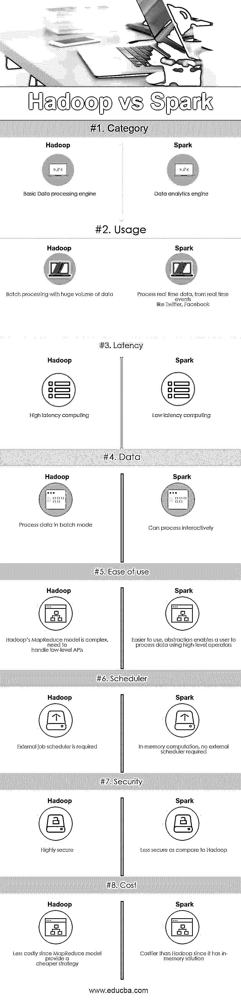

# Hadoop vs Spark

> 原文：<https://www.educba.com/hadoop-vs-spark/>

## Hadoop 与 Spark 的区别

Hadoop 是一个开源框架，允许在跨计算机集群的分布式环境中存储和处理大数据。Hadoop 旨在从单个服务器扩展到数千台机器，其中每台机器都提供本地计算和存储。Spark 是为快速计算而设计的开源集群计算。它提供了一个接口，用于通过隐式数据并行性和容错对整个集群进行编程。Spark 的主要特性是内存集群计算，可以提高应用程序的速度。

### Hadoop

*   Hadoop 是 Apache 软件基金会的注册商标。它利用简单的编程模型在集群之间执行所需的操作。Hadoop 中的所有模块都是基于一个基本假设设计的，即硬件故障是经常发生的，应该由框架来处理。
*   它使用 MapReduce 算法运行应用程序，在不同的 CPU 节点上并行处理数据。换句话说，[Hadoop 框架](https://www.educba.com/hadoop-framework/)有足够的能力开发应用程序，这些应用程序能够在计算机集群上运行，并且可以对大量数据进行完整的统计分析。
*   Hadoop 的核心由存储部分(称为 Hadoop 分布式文件系统)和处理部分(称为 MapReduce 编程模型)组成。Hadoop 基本上是将文件分割成大块，然后分布在集群中，将包代码转移到节点中，以并行处理数据。
*   这种方法可以更快、更有效地处理数据集。其他 Hadoop 模块是 Hadoop common，是 Hadoop 模块返回的一堆 Java 库和实用程序。这些库提供了文件系统和操作系统级别的抽象，还包含启动 Hadoop 所需的 Java 文件和脚本。Hadoop Yarn 也是一个模块，用于作业调度和集群资源管理。

### 火花

*   Spark 建立在 Hadoop MapReduce 模块之上，它扩展了 MapReduce 模型，以有效地使用更多类型的计算，包括交互式查询和流处理。Spark 是由 Apache 软件基金会推出的，旨在加速 Hadoop 计算软件进程。
*   Spark 有自己的集群管理，不是 Hadoop 的修改版。Spark 以两种方式利用 Hadoop，一是存储，二是处理。由于集群管理来自 Spark 本身，因此它仅将 Hadoop 用于存储目的。
*   Spark 是 Hadoop 的子项目之一，于 2009 年开发，后来在 BSD 许可下成为开源项目。通过修改某些模块和合并新的模块，它有许多精彩的特性。它有助于在 [Hadoop 集群中运行应用程序，在内存中的速度要快](https://www.educba.com/what-is-hadoop-cluster/)数倍。
*   这是通过减少对磁盘的读/写操作来实现的。它将中间处理数据存储在内存中，节省了读/写操作。Spark 还提供 Java、 [Python 或者 Scala](https://www.educba.com/python-vs-scala/) 的内置 API。因此，可以用多种方式编写应用程序。Spark 不仅提供 Map 和 Reduce 策略，还支持 SQL 查询、流数据、机器学习和图形算法。

### Hadoop 与 Spark 的直接对比(信息图)

以下是 Hadoop 和 Spark 的 8 大区别:

<small>Hadoop、数据科学、统计学&其他</small>

### Hadoop 和 Spark 的主要区别

Hadoop vs Spark 都是市场上的热门选择；让我们讨论一下 Hadoop 和 Spark 之间的一些主要区别:

1.  Hadoop 是一个使用 MapReduce 算法的开源框架，而 Spark 是一种闪电般快速的集群计算技术，它扩展了 MapReduce 模型以有效地用于更多类型的计算。
2.  Hadoop 的 MapReduce 模型从磁盘读取和写入，因此降低了处理速度，而 Spark 减少了对磁盘的读取/写入周期数，并将中间数据存储在内存中，因此提高了处理速度。
3.  Hadoop 要求开发人员手工编写每一项操作的代码，而 Spark 使用 RDD 弹性分布式数据集很容易编程。
4.  Hadoop MapReduce 模型提供了一个批处理引擎，因此其他需求依赖于不同的引擎，而 Spark 在同一个集群中执行批处理、交互式、机器学习和流式传输。
5.  Hadoop 旨在高效处理批处理，而 Spark 旨在高效处理实时数据。
6.  Hadoop 是一个高延迟计算框架，它没有交互模式，而 Spark 是一个低延迟计算，可以交互地处理数据。
7.  使用 Hadoop MapReduce，开发人员只能以批处理模式处理数据，而 Spark 可以通过 Spark 流处理实时数据[。](https://www.educba.com/spark-streaming/)
8.  Hadoop 旨在处理故障和失败，它天生具有故障恢复能力，因此是一个高度容错的系统，而使用 Spark，RDD 允许在故障节点上恢复分区。
9.  例如，Hadoop 需要一个外部作业调度器——oo zie 调度复杂的流，而 Spark 有内存计算，所以它有自己的流调度器。
10.  就成本而言，Hadoop 是一个更便宜的选择，而 Spark 需要大量 RAM 在内存中运行，因此增加了集群，从而增加了成本。

### Hadoop 和 Spark 对照表

下面讨论 Hadoop 和 Spark 之间的主要比较

| **Hadoop 与 Spark 的对比基础** | **Hadoop** | **火花** |
| **类别** | 基本数据处理引擎 | 数据分析引擎 |
| **用途** | 大量数据的批处理 | 处理来自实时事件的实时数据，如推特、脸书 |
| **等待时间** | 高延迟计算 | 低延迟计算 |
| **数据** | 以批处理模式处理数据 | 可以交互处理 |
| **易用性** | Hadoop 的 MapReduce 模型很复杂，需要处理底层 API | 更容易使用，抽象使用户能够使用高级操作符处理数据 |
| **调度器** | 需要外部作业调度程序 | 内存计算，不需要外部调度程序 |
| **安全** | 高度安全 | 与 Hadoop 相比安全性较低 |
| **成本** | 成本较低，因为 MapReduce 模型提供了一种更便宜的策略 | 比 Hadoop 贵，因为它有内存解决方案 |

### 结论

Hadoop MapReduce 允许并行处理大量数据。它将一个大数据块分解成多个小数据块，分别在不同的数据节点上处理，并自动收集多个节点的结果，返回一个结果。如果结果数据集大于可用 RAM，Hadoop MapReduce 可能会优于 Spark。

另一方面，Spark 比 Hadoop 更容易使用，因为它为 Scala(其本地语言)、Java、Python 和 Spark SQL 提供了用户友好的 API。由于 Spark 提供了一种在同一个集群中执行流、批处理和机器学习的方法，用户发现简化他们的数据处理基础设施很容易。

选择 Hadoop 还是 Spark 的最终决定取决于基本参数——需求。Apache Spark 是比 Hadoop 的 MapReduce 更高级的集群计算引擎，因为它可以处理任何类型的需求，如批处理、交互、迭代、流等。而 Hadoop 仅限于批处理。与此同时，Spark 的内存特性比 Hadoop 更昂贵，最终需要大量内存。归根结底，这完全取决于企业的预算和功能需求。我希望现在你已经对 Hadoop 和 Spark 有了更公平的认识。

### 推荐文章

这是 Hadoop 与 Spark 之间最大差异的指南。在这里，我们还将讨论 Hadoop 与 Spark 的直接比较、主要差异以及信息图和比较表。您也可以看看下面的 Hadoop vs Spark 文章来了解更多信息。

1.  [数据仓库 vs Hadoop](https://www.educba.com/data-warehouse-vs-hadoop/)
2.  [Splunk vs Spark](https://www.educba.com/splunk-vs-spark/)
3.  [Hadoop vs Cassandra–17 个惊人的差异](https://www.educba.com/hadoop-vs-cassandra/)
4.  [Pig vs Spark——哪个更好](https://www.educba.com/pig-vs-spark/)
5.  [Hadoop 与 SQL 性能:差异](https://www.educba.com/sql-vs-hadoop/)

