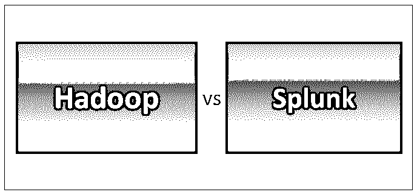
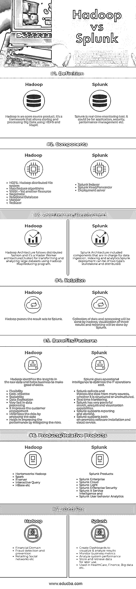

# Hadoop vs Splunk

> 原文：<https://www.educba.com/hadoop-vs-splunk/>

## Hadoop 与 Splunk 简介

简单来说，Hadoop[是一个用于](https://www.educba.com/what-is-hadoop/)处理[大数据](https://www.educba.com/big-data-vs-data-science/)的框架。Hadoop 使用分布式文件系统和 map-reduce 算法来处理数据负载。

Splunk 是一款监控工具。它为日志分析提供了一个平台，它分析日志数据并从中创建可视化效果。Splunk 通过一个基于 web 的界面，方便软件对机器数据进行索引、搜索、监控和分析。

<small>Hadoop、数据科学、统计学&其他</small>

### Hadoop 和 Splunk 之间的直接比较(信息图表)

以下是 Hadoop 和 Splunk 的 7 项比较:

### Hadoop 和 Splunk 的主要区别

下面是 Hadoop 和 Splunk 之间的区别:

*   [Hadoop](https://www.educba.com/hadoop-vs-rdbms/) 通过处理和分析来自各种来源的[大数据](https://www.educba.com/big-data-vs-data-warehouse/)，如[网络应用](https://www.educba.com/how-to-build-web-applications-using-mongodb/)、远程信息处理数据等，提供洞察力和隐藏模式。
*   在 Hadoop [集群](https://www.educba.com/cluster-analysis-vs-factor-analysis/)中，至关重要的组件是 Hadoop 分布式文件系统- [HDFS](https://www.educba.com/hdfs-vs-hbase/) ，Hadoop MapReduce，以及另一个资源协商器。Hadoop 设置包括名称节点/主节点和数据节点/工作节点，它们是 Hadoop 集群的主干
*   **名称节点**:名称节点是后台进程，运行在 Hadoop 主节点/头节点上。名称节点保存 Hadoop 集群中所有工作节点的所有元数据，如文件路径、文件名、数据块 id、数据块位置等。
*   **DataNode:** DataNode 是一个后台进程，运行在 Hadoop 集群中的工作/从节点上。在 Hadoop 中，在处理输入文件时会将其分解成更小的块，这些块将存储在 DataNode 中。DataNode 存储实际数据；这就是数据节点应该有更多磁盘空间的原因。DataNode 负责对磁盘的读/写操作。
*   Splunk 工作可分为三个阶段:**阶段 1:** 根据需要从尽可能多的来源收集数据。**第二阶段:**将数据转化为解决方案。 **Phase3:** 以视觉形式表现答案；报告、交互式图表或图形等
*   [Splunk 从索引](https://www.educba.com/what-is-splunk/)开始，它只不过是从所有来源收集数据并将其组合成集中的索引。
*   索引有助于 Splunk 快速搜索所有服务器的日志。Splunk 将索引和相关的实时数据存储到可搜索的 repo 中，从中可以创建和生成[图](https://www.educba.com/excel-charts-graphs/)、报告、警报、可视化和仪表板。
*   MapReduce 是一款软件，它提供了一个平台来编写代码/应用程序，以便在非常大的集群上并行处理大量数据。MapR 包括两个不同的任务；映射任务和减少任务
*   **Map 任务:** Mapper 负责将输入数据转换成数据集，其中各个数据元素被分解成键值对(元组)。
*   **Reduce Task:** Reducer 将 Mapper 的输出作为输入，并将这些结果数据元组组合成一个更小的元组集。减速器将在映射器后工作。
*   MapR 框架的其他组件是作业跟踪器和任务跟踪器。它由单个主任务跟踪器和每个集群节点一个从任务跟踪器组成，主任务跟踪器负责监控资源、跟踪和调度从任务。任务跟踪器将按照主节点的指示执行任务，并定期向主节点提供任务状态信息
*   而在 Splunk 中，索引是分析日志的主要过程。Splunk 可以轻松地索引来自许多来源的数据，例如文件和目录、网络流量、机器数据等等。Splunk 也可以处理时序数据。
*   Splunk 使用标准 API 连接应用程序和设备以获取源数据。而对于数据库，Splunk 有 DB Connect 来连接许多关系数据库。用户可以使用它来导入结构化数据，并执行强大的索引、分析、仪表板和可视化。

### Hadoop 和 Splunk 对照表

下面是 Hadoop 和 Splunk 的对比表。

| **比较的基础** | **Hadoop** | **Splunk** |
| **定义** | Hadoop 是一个开源产品。这是一个允许使用 HDFS 和 MapR 存储和处理大数据的框架。 | Splunk 是[实时](https://www.educba.com/real-time-analytics/)监控工具。它可以用于应用程序、安全性、性能管理等。 |
| **组件** | 

*   HDFS- Hadoop distributed file system
*   mapreduce 算法
*   YARN-Another resource negotiator
*   [relational database](https://www.educba.com/relational-database/)
*   制图人
*   还原剂

 | 

*   Splunk indexer

 |
| **架构/部署** | [Hadoop 架构遵循](https://www.educba.com/hadoop-architecture/)分布式方式，是一种主-工架构(集群),用于使用 Hadoop MapReduce 程序转换和分析大型数据集 | Splunk 架构包括负责数据接收、索引和分析的组件。
Splunk 部署有两种类型:独立部署和分布式部署。 |
| **关系** | Hadoop 将结果集传递给 Splunk | 数据收集和处理将由 Hadoop 完成，这些结果的可视化和报告将由 Splunk 完成。 |
| **优势/特点** | Hadoop 识别原始数据中的洞察力，并帮助企业做出明智的选择。

*   flexibility
*   Economical and efficient
*   expandability
*   data reproduction
*   The data processing speed is very fast.
*   It improves customer participation.
*   Minimize risk by analyzing data
*   Help improve performance by reducing risk

 | Splunk 提供运营智能来优化 IT 运营成本。

*   Splunk collects and indexes data from many sources, both structured and unstructured.
*   Real-time monitoring.
*   Splunk has very powerful search, analysis and visualization functions.
*   Splunk supports reports and alerts.
*   Splunk supports internal software installation and [cloud services.](https://www.educba.com/types-of-cloud-services/)

 |
| **产品/相关产品** | 

*   Hortonworks Hadoop
*   [火花](https://www.educba.com/apache-spark/)
*   保留
*   Interactive query
*   [h 基](https://www.educba.com/hbase-vs-cassandra/)等

 | Splunk 产品:

*   Splunk 企业
*   Splunk 云
*   Splunk 光
*   Splunk enterprise security
*   Splunk It service intelligence and
*   Splunk user behavior analysis

 |
| **用于** | 

*   Financial sector
*   [Fraud detection](https://www.educba.com/fraud-detection-analytics/) and prevention
*   retail
*   Social networks, etc

 | 

*   Create dashboards to visualize & analyze results
*   Monitoring business indicators
*   Analyze system performance
*   And store and retrieve data for later use.
*   Used in medical care, finance, big data, etc.

 |

### 结论

Hadoop 与 Splunk 都有助于从大数据中快速获取洞察。如上所述，Hadoop 将结果传递给 Splunk，利用该信息 [Splunk 可以创建可视化效果](https://www.educba.com/splunk-commands/)并通过基于 web 的界面显示。

### 推荐文章

这是 Hadoop 与 Splunk 的对比指南。在这里，我们讨论了 Hadoop 与 Splunk 的直接比较、主要差异以及信息图表和比较表。您也可以阅读以下文章，了解更多信息——

1.  [Hadoop 与 elastic search——哪个更有用](https://www.educba.com/hadoop-vs-elasticsearch/)
2.  [Hadoop 与红移的有用区别](https://www.educba.com/hadoop-vs-redshift/)
3.  [Hadoop 与 Hive–找出最佳差异](https://www.educba.com/hadoop-vs-hive/)
4.  [Hadoop 与 HBase 的 7 大区别](https://www.educba.com/hadoop-vs-hbase/)
5.  [Splunk vs Nagios 惊人的差异](https://www.educba.com/splunk-vs-nagios/)
6.  [Hadoop vs Spark:优势](https://www.educba.com/hadoop-vs-spark/)

