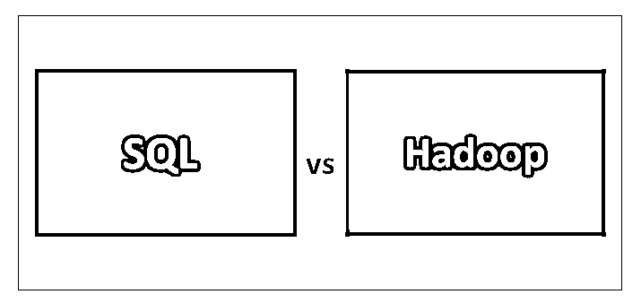
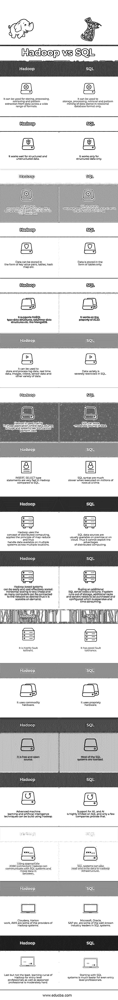

# Hadoop 与 SQL 性能对比

> 原文：<https://www.educba.com/sql-vs-hadoop/>

## SQL 与 Hadoop 的区别

Hadoop 是一个大数据生态系统，用于存储、处理和挖掘数据模式。Hadoop 可用于解决广泛的问题。它本身就是一个完整的技术堆栈。Hadoop 之上还有许多其他框架和平台，可以解决这样或那样的技术问题，如数据收集、数据存储、数据处理、日志维护、高级分析等。SQL 是一种查询语言，用于从存储在关系数据库中的数据中存储、处理和提取模式。这里数据是以表格的形式存储的。它只适用于结构化数据。

### SQL 与 Hadoop 的面对面比较(信息图表)

以下是 SQL 和 Hadoop 之间的 17 大区别:

<small>Hadoop、数据科学、统计学&其他</small>

### SQL 和 Hadoop 的主要区别

SQL vs Hadoop 都是市场上的热门选择；让我们讨论一下 SQL 和 Hadoop 之间的一些主要区别:

*   上面，我们看到了 SQL 和 Hadoop 之间的关键比较。通过这些陈述，我们可以理解这两个是为特定需求设计的两个独特的系统，它们用于独特的目的。
*   虽然 Hadoop 提供了大量的功能和应用，但 SQL 更多的是对 Hadoop 的补充，而不是与之竞争。例如，作为 Hadoop 的独立组件的 HIVE 与 SQL 非常相似。使用 HIVE，可以编写类似 SQL 的语法来进行数据操作，但是 Hive 的设计、功能和意图在原则上不同于 SQL。
*   要理解 SQL 与 Hadoop 之间最重要的区别是，SQL 只能处理非常有限的数据类型，即关系数据，当同时处理数百万条记录时，它的处理速度会变得非常慢，而 Hadoop 是专为解决这一问题而设计的。
*   Hadoop 中有大量的支持和研究，每隔一天就会有新的技术堆栈出现在这个前院，人们正在从传统的关系数据库系统迁移到基于 Hadoop 的大数据基础架构。这些进步只是为 Hadoop 的未来铺平了一条更光明的道路，现在只有少数人在沿着这条道路前进。

### SQL 和 Hadoop 对照表

SQL 与 Hadoop 之间的主要比较如下:

| **Hadoop** | **SQL** |
| 它可用于存储、处理、检索和从各种格式的数据中提取模式。 | 它只能用于以关系数据库格式存储的数据的存储、处理、检索和模式挖掘。 |
| 它适用于结构化和非结构化数据。 | 它只适用于结构化数据。 |
| 它可以在它的基础上建立许多技术栈，每个技术栈执行一个特定的任务，如 HDFS、AVRO、Pig、HBase 等。 | SQL 是一种查询语言，具有特定的语法和解决问题的方案。 |
| 数据可以以键值对、表格、散列图等形式存储。 | 数据仅以表格的形式存储。 |
| 它支持 NoSQL 类型的数据结构，列数据结构等。比如 MongoDB | 它利用了酸的特性。 |
| 它可以用来存储和处理日志数据、实时数据、图像、视频、传感器数据和其他各种数据。 | 数据多样性在 SQL 中受到严格限制。 |
| Hadoop 主要用于那些数据量巨大，SQL 之类的系统无法很好执行的应用。 | SQL 可以存储适量的数据。 |
| 与 SQL 相比，Hadoop 中的 INSERT、SELECT 类型语句非常快 | 当一次对数百万行执行时，SQL 语法要慢得多。 |
| Hadoop 使用分布式计算的概念，应用 map-reduce 原理，从而处理跨多个位置的多个系统上的可用数据。 | SQL 数据源通常在内部或云上可用。因此，它不能利用分布式计算的优势。 |
| 基于 Hadoop 的系统可以轻松且经济高效地进行扩展。水平扩展非常便宜，并且可以根据需要将任意多的计算机连接到网络，因此可以按需扩展。 | 购买一台额外的 SQL server 需要一大笔钱。如果系统存储耗尽，则需要购买和配置额外的机架和服务器，这既昂贵又耗时。 |
| 它是高度容错的。 | 它具有良好的容错性。 |
| 它使用商用硬件。 | 它使用专有硬件。 |
| 这是一个免费的开源软件。 | 大多数 SQL 系统都是经过许可的。 |
| 使用 Hadoop 可以构建先进的机器学习和人工智能技术。 | SQL 对 ML 和 AI 的支持非常有限，只有少数公司提供这种支持。 |
| 使用适当的 JDBC 连接器，Hadoop 可以与 SQL 系统通信，并在它们之间移动数据。 | SQL 系统也可以向 Hadoop 基础设施读写数据。 |
| Cloudera、Horton work、AWS 都是 Hadoop 系统的部分提供商。 | 微软、甲骨文、思爱普等。是 SQL 系统领域一些著名的行业领导者。 |
| 最后但同样重要的是，对于入门级专业人员以及经验丰富的专业人员来说，Hadoop 的学习曲线相当困难。 | 即使是初级专业人员，从 SQL 系统开始也要容易得多。 |

### 结论

SQL 更传统，而 Hadoop 才是未来。大数据是一个充满希望的未来，但目前，行业采用率和客户信心都不是很强。它将在多大程度上主宰久而久之，还有待观察。AWS 当然是一股值得考虑的力量，但仍然需要大量的开发和支持，才能使 Hadoop 技术面向真正的未来。SQL 已经存在了几十年，几乎在任何地方都被使用。今天，它是一切数据的支柱。在不久的将来，SQL 也将出现，它将在更多方面补充 Hadoop，而不仅仅是完成 Hadoop。学习和利用 Hadoop 的优势对个人来说非常有前途，无论是刚开始职业生涯的人还是已经成为软件开发人员的人，对在信息技术领域开发产品和解决方案的行业和组织来说也是如此，他们显然应该考虑在他们的产品中使用大数据堆栈，最后，客户和合作伙伴也应该在他们的场所实施基于 Hadoop 的解决方案，以充分利用它。

### 推荐文章

这是 SQL 与 Hadoop 之间主要差异的指南。在这里，我们讨论了 SQL 与 Hadoop 的直接比较、关键差异以及信息图和比较表。你也可以看看下面的文章来了解更多

1.  [云计算 vs Hadoop](https://www.educba.com/cloud-computing-vs-hadoop/)
2.  [PostgreSQL](https://www.educba.com/oracle-vs-postgresql/)T2】vs 甲骨文
3.  [Apache Spark](https://www.educba.com/hadoop-vs-apache-spark/)[vs Hadoop](https://www.educba.com/hadoop-vs-apache-spark/)
4.  [Spark SQL vs Prest](https://www.educba.com/spark-sql-vs-presto/)

