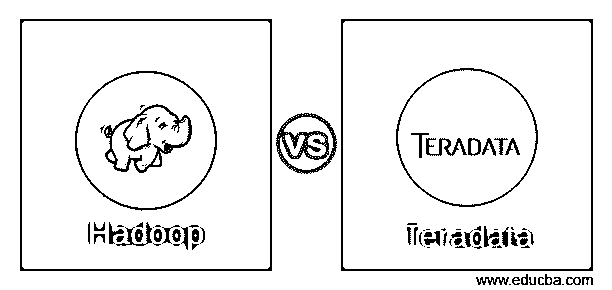
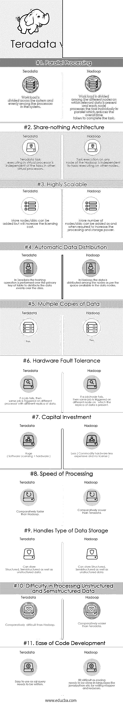

# Hadoop 与 Teradata

> 原文：<https://www.educba.com/hadoop-vs-teradata/>

## Hadoop 与 Teradata 之间的差异

**Hadoop**

[Hadoop 是一个](https://www.educba.com/what-is-hadoop/)开源的 Apache 项目，它提供了存储、处理和分析大量数据的框架。Hadoop 的核心组件是处理数据的 Java 编程模型和以分布式方式存储数据的 [HDFS](https://www.educba.com/hdfs-vs-hbase/) (Hadoop 分布式文件系统)。数据被分成区块，分布在同一集群中的多个节点上。

<small>Hadoop、数据科学、统计学&其他</small>

[Hadoop 集群](https://www.educba.com/what-is-hadoop-cluster/)由 1 吨(可根据需求变化)数量的[商品](https://www.educba.com/commodity-trading-basic/)(较便宜)硬件节点组成，任务在存在数据的相同节点上执行，如果假设数据分布在 10 个不同的节点上，则相同的作业将在所有 10 个节点上运行。

Hadoop 的工作原理是，如果一个节点(计算机)将在 10 小时内完成一项任务，那么 10 个节点应该在 1 小时内完成该任务。

Hadoop 不会增加任务的处理量，而是将任务分配给多个节点，所有节点并行工作以在更短的时间内完成任务，一旦所有任务完成，来自每个节点的数据将被收集并组合回输出。

默认情况下，Hadoop 在每个不同的节点上的 HDFS 中创建原始数据的 3 个副本，由于它使用商用硬件，硬件故障非常常见，如果某个节点在处理数据时出现故障，则总会有另外两个节点处理相同的数据。

**Teradata**

Teradata 群岛

| 程序设计语言 |

Teradata 公司的产品，是众所周知的 RDMS(关系数据库管理系统)之一，最适合处理大量数据的数据库仓库应用程序。Teradata 像任何其他传统数据库一样由表组成，可以使用类似于传统数据库的查询语言进行查询。

Teradata 拥有安装在 Teradata 硬件组件上的专利软件 PDE(并行数据库扩展),该 PDE 将系统的处理器划分为多个虚拟软件处理器，其中每个虚拟处理器充当一个单独的处理器，能够独立执行所有任务。以类似的方式，Teradata 的硬件磁盘组件也被划分为对应于每个虚拟处理器的多个虚拟磁盘。

现在，每当查询数据时，每个处理器将只在它对应的虚拟内存中寻找数据，并且所有虚拟处理器将并行工作，在它们对应的虚拟内存中搜索数据。由于该过程是并行执行的，因此被称为拥有大规模并行处理(MPP)架构。由于并行处理，Teradata 与传统数据库相比速度更快，有很大的优势。

### Hadoop 和 Teradata 之间的直接比较(信息图表)

以下是 Hadoop 和 Teradata 的 11 大对比:

### Hadoop 和 Teradata 之间的主要区别

以下是 Hadoop 和 Teradata 之间的主要区别:

**技术差异:**
Hadoop 是一种[大数据技术](https://www.educba.com/big-data-techniques/)，用于在节点间以分布式方式存储非常大量的数据，而 Teradata 是在单个 RDBMS 中实现的关系数据库仓库，充当中心存储库。

**成本因素:**
Hadoop 是一个开源框架，没有许可成本，可以免费获得，而且 Hadoop 生态系统中使用的硬件是商用硬件，因此[Hadoop 生态系统的总体成本非常低](https://www.educba.com/hadoop-ecosystem/)，另一方面，Teradata 有许可成本，使用的硬件也相对昂贵，这使得 Teradata 比 Hadoop 更贵。

**数据类型:**
Hadoop 可以通过使用多个开源的[专为 Hadoop 生态系统设计的 BigData 工具](https://www.educba.com/big-data-analytics-tools/)来存储和处理任意类型的数据。Hadoop 有非常多的工具来处理结构化、半结构化和非结构化数据，而 Teradata 主要处理结构化表格格式的数据，它也可以存储和处理非结构化和半结构化数据，但处理非结构化和半结构化数据并不容易，因为数据必须使用查询语言来处理。

**多语言支持:**
Hadoop 不像 Teradata 使用查询语言对数据进行操作，Hadoop 支持在 Hadoop 生态系统中并行执行多种编程语言。

**性能:**
Hadoop 有自己的[数据仓库](https://www.educba.com/career-in-data-warehousing/)工具 hive，用于查询分布式文件系统中平面文件中的结构化数据，但相对比 Teradata 慢。Hive 也没有任何主键的概念，而 [Teradata 在这里获得了优势](https://www.educba.com/career-in-teradata/)，因为它支持主键，这也提高了使用 Teradata 查询数据的性能。

**延迟:**
与 Hadoop 相比，Teradata 延迟较低，提供结果的速度更快，由于 Teradata 延迟较低，因此在时间是主要需求因素的情况下使用。

**数据安全性:**
与 Hadoop 相比，Teradata 更加安全。

**模式:**
在将数据加载到 Teradata 之前，需要一个定义良好的模式，而在 Hadoop 中则不需要这样的考虑。

### Hadoop 和 Teradata 之间的比较表

以下是要点列表，描述了 Hadoop 和 Teradata 之间的差异:

| **比较的基础** | **Teradata** | **Hadoop** |
| **并行处理** | Workload is divided across the system and evenly among the processors in the system. | 工作负载在存在相关数据的不同节点之间划分，每个节点单独并行处理任务，从而减少了完成任务所需的总时间。 |
| **无共享架构** | Teradata task executing in a virtual processor is independent of the tasks in other virtual processors. | Hadoop 的任何节点上的任务执行都独立于其他节点上执行的任务。 |
| **高度可扩展** | 可以添加更多节点/磁盘，但这会增加许可成本。 | 可以根据需要添加更多的节点/磁盘，以提高处理和存储能力。 |
| **自动数据分发** | 在 Teradata 中，散列操作是在表的主键上执行的，以便将数据均匀地分布在磁盘上。 | 在 Hadoop 中，数据根据数据节点中的可用空间分布在节点中。 |
| **数据的多个副本** | 是 | 是 |
| **硬件容错** | If a job fails, then the same job is triggered on a different processor with a different replica of data. | 如果某个作业/节点出现故障，则会在数据复制副本所在的不同节点上触发相同的作业。 |
| **资本投入** | Huge( Software Licensing + hardware ) | 更少(商用硬件(更便宜)且无许可证)。 |
| **加工速度** | 相对比 Hadoop 更快。 | 相对比 Teradata 慢。 |
| **处理数据存储类型** | Can store Structured, Semistructured as well as unstructured data. | 可以存储结构化、半结构化以及非结构化数据。 |
| **处理非结构化和半结构化数据的难度** | 比 Hadoop 相对困难。 | 相对比 Teradata 容易。 |
| **代码开发的简易性** | 易于使用，因为 SQL 查询需要编写。 | 有点困难，因为需要用 Java/python 等语言编写映射器和还原器。 |

### 结论

因此，现在我们可以根据三个主要因素，即投资成本、执行时间和要处理的数据类型，来决定是否应该选择 Hadoop 还是 Teradata。

如果更少的投资成本是主要因素，并且用户可以牺牲执行时间，那么人们必须选择 Hadoop 而不是 Teradata。

如果用户优先考虑快速执行，并且可以投资 Teradata 的许可成本，那么就必须选择 Teradata。

如果用户必须处理非结构化或半结构化数据，那么 Hadoop 是首选，因为由于 Hadoop 有多种工具可用，处理非结构化和半结构化数据相对容易。

### 推荐文章

这是 Hadoop 与 Teradata 的对比指南。在这里，我们讨论了 Hadoop 与 Teradata 的直接比较、主要差异以及信息图和比较表。您也可以阅读以下文章，了解更多信息——

1.  [找出 Hadoop 与 SQL 的 6 个最佳对比](https://www.educba.com/hadoop-vs-sql/)
2.  [了解 Hadoop 与 Redshift 之间的 10 个有用差异](https://www.educba.com/hadoop-vs-redshift/)
3.  [Hadoop vs Spark:有什么区别](https://www.educba.com/hadoop-vs-spark/)
4.  [Laravel vs Codeigniter:有什么好处](https://www.educba.com/laravel-vs-codeigniter/)

