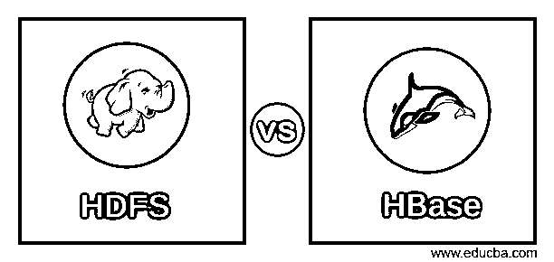
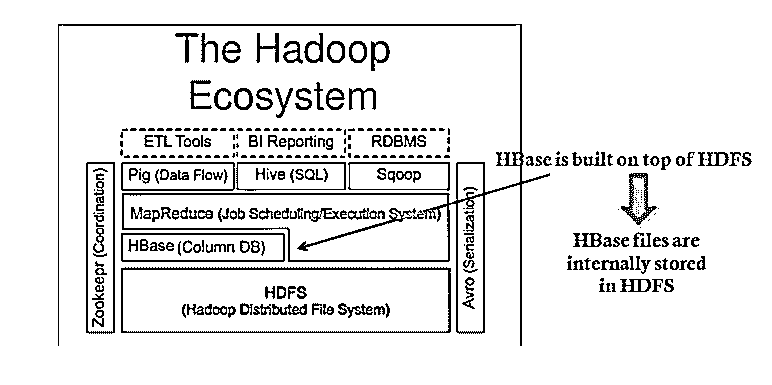
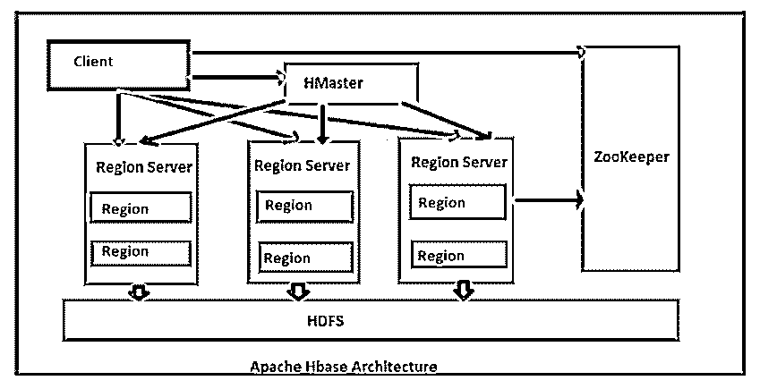
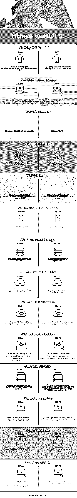

# HDFS vs HBase

> 原文：<https://www.educba.com/hdfs-vs-hbase/>

## HDFS 和 HBase 的区别

在文章《HBase 与 HDFS》中，数据量每天都在增加，存储和处理如此巨大的数据量对组织来说至关重要。HBase 和 HDFS 是 [Hadoop 生态系统](https://www.educba.com/hadoop-ecosystem/)的重要组成部分之一，有助于存储和处理庞大的数据集。数据可能是结构化的、半结构化的或非结构化的，但可以用 HDFS 和 HBase 很好地处理。HDFS 代表 Hadoop 分布式文件系统，它管理机器网络上的数据存储，使用 MapReduce 处理巨大的数据集[。HDFS 适用于存储具有流访问模式的数据的大型文件，即将数据写入文件一次，然后根据需要读取多次。在 Hadoop 中，HBase 是运行在 HDFS 之上的](https://www.educba.com/what-is-mapreduce/) [NoSQL 数据库。HBase 以面向列的形式存储数据，被称为 Hadoop 数据库。HBase 提供一致的实时读写和水平可扩展性。](https://www.educba.com/what-is-nosql-database/)

**HDFS (Hadoop 分布式文件系统)** HDFS 允许你以分布式和冗余的方式存储海量数据，这些数据运行在商用硬件上。 **HBase (Hadoop 的数据库)**是一个运行在您的 Hadoop 集群之上的 NoSQL 数据库

<small>Hadoop、数据科学、统计学&其他</small>

**让我们分别看看 HDFS 和 HBase 的组件和架构:**

#### HDFS 的组成部分

*   NameNode
*   DataNode

**NameNode:** NameNode 可以认为是系统的主节点。它维护文件系统树以及系统中所有文件和目录的元数据。两个文件“命名空间图像”和“编辑日志”用于存储元数据信息。Namenode 知道包含给定文件的数据块的所有数据节点，但是它不会永久存储数据块位置。每次系统启动时，都会从数据节点重新构建此信息。

**DataNode:**DataNode 是驻留在集群中每台机器上的从节点，提供实际的存储。它负责为客户端提供服务、读取和写入请求。

**HDFS 建筑:-**T2】

**h base 的组成:-**

*   Hbase 主机
*   区域服务器
*   地区
*   动物园管理员

**h Master**:h base 架构中的主服务器。它是监控所有区域服务器的监控代理，也是所有元数据更改的接口。它在 NameNode 上运行。

**Regions Servers:** 当 Region Server 从客户机接收到读写请求时，它会将请求分配给实际列族所在的特定区域。但是，客户端可以直接与区域服务器联系，不需要 HMaster 强制许可客户端与区域服务器进行通信。当需要与元数据和模式更改相关的操作时，客户端需要 HMaster 帮助。

**区域:**区域是 HBase 集群的基本构建元素，由表的分布和列族组成。它包含多个存储，每个列族一个存储。它主要由两个组件组成，Memstore 和 Hfile。

**ZooKeeper:** 在 Hbase 中，ZooKeeper 是一个集中式的监控服务器，维护配置信息，提供分布式同步。分布式同步是访问跨集群运行的分布式应用程序，负责提供节点间的协调服务。如果客户机想要与区域通信，服务器的客户机必须首先接近 ZooKeeper。

**HBase 架构:-** HBase 是 Hadoop 生态系统的一部分。

**深入模式:-** **

** 

### HDFS 和 HBase 的面对面比较(信息图)

以下是 HDFS 与 HBase 的 14 强对比:

### HDFS 和 HBase 的主要区别

以下是 HDFS 与 HBase 的区别:

1.  HDFS 是一个分布式文件系统，非常适合存储大型文件。但是另一方面，HBase 建立在 HDFS 之上，为大型表提供快速的记录查找(和更新)。
2.  HDFS 拥有基于 GFS 的文件系统。但是 HBase 是分布式的——使用 HDFS 进行存储、面向列、多维(版本)和存储系统
3.  HDFS 使用 HIVE 作为其 quire 语言(HIVE Query Language，HQL)的组件之一，但 Hbase 不是 SQL 数据库，这意味着:-没有连接，没有查询引擎，没有数据类型，没有(该死的)SQL，没有模式，也不需要 DBA。
4.  由于 HDFS 是一个分布式存储单元，因此除了使用 UNIX 风格的命令之外，没有特定的语言，例如:- Hadoop dfs -mkdir /foodir
5.  Hadoop DFS-cat/foodir/my file . txt
6.  hadoop dfs -rm /foodir/myfile.txt

但另一方面，Hbase 有自己的接口，其形式为 Hbase Shell，例如:-

1.  hbase(main):003:0 >创建“测试”，“cf”

1.2200 秒内 0 行

1.  hbase(main):004:0 >输入“测试”、“行 1”、“cf:a”、“值 1”

0 行在 0.0560 秒内

1.  hbase(main):005:0 >输入“测试”、“行 2”、“cf:b”、“值 2”

0 行在 0.0370 秒内

1.  hbase(main):006:0 >输入“测试”、“行 3”、“cf:c”、“值 3”

0 行在 0.0450 秒内

1.  hbase(main):007:0 >扫描“测试”

行列+单元格

row1 column=cf:a，时间戳=1288380727188，值=value1

row2 column=cf:b，时间戳=1288380738440，值=value2

行 3 列=cf:c，时间戳=1288380747365，值=值 3

0.0590 秒内 3 行

### hdfs 和 hbase 对照表

以下是 HDFS 和 HBase 之间的比较表

| **比较依据** | **HDFS** | **HBase** |
| **我们为什么需要它们** | 需要在大型计算机集群上处理庞大的数据集 | HBase 是构建在 HDFS 之上的分布式面向列的数据存储 |
| **每天都有节点失效** | a)故障是预期的，而不是异常的
b)群集中的节点数量不是恒定的 | HBase 是一个 Apache 开源项目，其目标是为 Hadoop 分布式计算提供存储 |
| **写入模式** | 仅追加 | 随机写入，批量增量 |
| **读取模式** | 全表扫描、分区表扫描 | 随机读取、小范围扫描或表格扫描 |
| **W/R 模式** | HDFS 非常适合一次写入多次读取的用例 | HBase 非常适合随机读写存储在 HDFS 中的数据。 |
| **Hive(SQL)性能** | 相对非常好 | 慢 4-5 倍 |
| **结构化存储** | 自己动手还是 TSV 还是序列文件 | 稀疏列族数据模型 |
| **最大数据量** | 通常可以储存大约 30 PB | 大约 1 PB |
| **动态变化** | HDFS 有一个僵化的架构，不允许改变。它不便于动态存储。 | HBase 允许动态更改，可用于独立的应用程序。 |
| **数据分布** | 数据以分布式方式存储在集群中的节点上。数据被分成块，然后存储在 HDFS 集群中的节点上。 | 表通过区域分布在集群上，随着数据的增长，区域会自动拆分和重新分布 |
| **数据存储** | 所有数据都以小文件的形式存储，所有文件的典型大小为 64 MB(在新版本中为 128 MB) | 所有数据都以表格、行和列的形式存储 |
| **数据建模** | 在 HDFS，我们使用 Map Reduce 技术，将文件分成键值对 | HBase 基于 Google 的 Bigtable 模型，该模型也使用键值对 |
| **操作** | 它具有高延迟操作 | 它具有低延迟操作 |
| **可访问性** | 它主要通过 MR (Map Reduce)作业来访问 | 它可以通过 shell 命令、Java 中的客户端 API、REST、Avro 或 Thrift 来访问 |

### 结论

总的来说，HDFS 和 HBase 都有自己出色的技术。HDFS 和 HBase 都是为了存储大数据并使访问和计算变得简单而创建的。HDFS 和 HBase 并驾齐驱，一个 HDFS 存储数据，另一个 HBase 在数据上放置一个模式，说明如何存储和检索数据以供客户端使用。

Hbase 是 apache foundation 中可用的 NoSql 面向列的分布式数据库之一。与 Hadoop 或 Hive 相比，HBase 在检索更少的记录方面提供了更高的性能。搜索给定的任何输入值非常容易，因为它支持索引、事务和更新。

我们可以使用与 Hadoop 生态系统集成的 Hbase 执行在线实时分析。它有一个自动和可配置的数据集或表的分片，并提供 restful API 来执行 MapReduce 作业。

### 推荐文章

这是 HDFS vs HBase 的指南。在这里，我们介绍了 HDFS 与 HBase 的直接比较、主要差异以及信息图和比较表。您也可以阅读以下文章，了解更多信息——

1.  [h base vs Cassandra——哪个更好(资料图)](https://www.educba.com/hbase-vs-cassandra/)
2.  [找出 Hadoop 与 HBase 的 7 个最佳区别](https://www.educba.com/hadoop-vs-hbase/)

