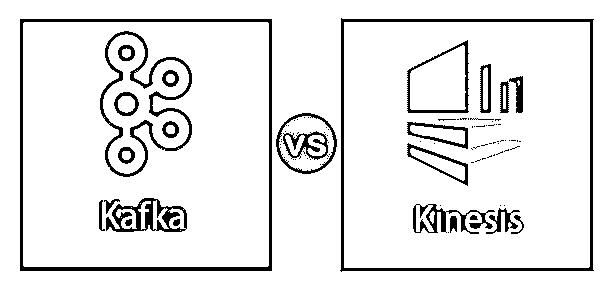
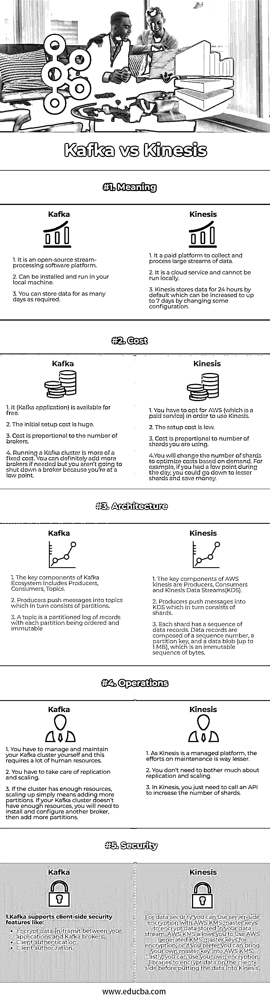

# 卡夫卡 vs Kinesis

> 原文：<https://www.educba.com/kafka-vs-kinesis/>

## 卡夫卡与克瑞斯的区别

Apache Kafka 是 LinkedIn 开发的开源流处理软件(后来捐赠给了 Apache ),用于有效管理他们不断增长的数据，并从批处理切换到实时处理。它是用 Scala 和 Java 编写的，基于消息传递的发布-订阅模型。Kinesis 是亚马逊开发的一个托管平台，用于实时收集和处理大量数据记录。它是仿照阿帕奇卡夫卡的。众所周知，它非常快速、可靠且易于操作。卡夫卡 Vs Kinesis 都是非常惊人的。

### 卡夫卡和 Kinesis 的正面比较(资料图)

以下是卡夫卡和 Kinesis 的五大区别:

<small>Hadoop、数据科学、统计学&其他</small>

### 卡夫卡和 Kinesis 的主要区别

卡夫卡和 Kinesis 的主要区别如下:

*   Kafka 是一个开源的分布式消息解决方案，而 Kinesis 是亚马逊提供的一个托管平台。在 Kafka 中，您负责安装和管理集群，还负责确保高可用性、持久性和故障恢复。如果你正在使用 Kinesis，你不必担心托管软件和资源。你可以通过在你的本地系统中安装 Kafka 来轻松地学习它，但是对于 Kinesis 来说就不一样了。
*   Kinesis 的价格取决于你使用的碎片数量。如果你打算将信息保存更长时间，你还需要支付额外的费用。以 Kafka 为例，成本主要取决于你使用的经纪人数量。此外，Kafka】还需要 DevOps 团队进行维护，这有时会很昂贵。但是有了 Kafka，只要你没有用完存储空间，你就可以把你的信息保存更长的时间，而不需要额外付费。
*   尽管 Kafka 和 Kinesis 都由生产者组成，Kafka 生产者为一个主题写消息，而 Kinesis 生产者为 KDS 写数据。Kinesis 还对消息大小和消息消耗率进行了一定的限制。Kinesis 中的最大消息大小是 1 MB，而 Kafka 消息可以更大。在 Kinesis 中，每秒可以消耗 5 次，每个碎片最多 2 MB，反过来每秒只能写 1000 条记录。Kafka 没有施加任何隐含的限制，因此费率由底层硬件决定。
*   在安全方面，Kafka 提供了许多客户端安全功能，如数据加密、客户端身份验证和客户端授权，而 Kinesis 提供了服务器端加密，使用 AWS KMS 主密钥来加密存储在数据流中的数据。服务器端加密具有以下优势:

1.  很难实施客户端加密。
2.  服务器端加密在客户端加密的基础上提供了第二层安全性。

### 卡夫卡 vs Kinesis 对比表

让我们讨论一下卡夫卡和 Kinesis 的五大区别:

| **比较的基础** | **卡夫卡** | **驱动力** |
| **意为** | 1.它是一个开源的流处理软件平台。
2。它可以在您的本地机器上安装和运行。
3。您可以根据需要存储任意多天的数据。 | 1.它是一个收集和处理大量数据流的付费平台。
2。它是云服务，不能在本地运行。
3。Kinesis 默认存储数据 24 小时，通过更改一些配置可以增加到 7 天。 |
| **成本** | 1.它(Kafka 应用程序)是免费的。
2。初始安装成本巨大。
3。成本与经纪人的数量成正比。
4。运行 Kafka 集群更多的是固定成本。如果需要的话，你当然可以增加更多的经纪人，但你不会因为处于低谷而关闭一个经纪人。 | 1.你必须选择 AWS(这是一项付费服务)才能使用 Kinesis。
2。安装成本低。
3。成本与你使用的碎片数量成正比。
4。您将根据需求更改碎片数量以优化成本。例如，如果你在一天中情绪低落，你可以选择更少的份额来省钱。 |
| **架构** | 1.卡夫卡生态系统的关键组成部分包括生产者、消费者和主题。
2。生产者将消息推入主题，主题又由分区组成。
3。主题是记录的分区日志，每个分区都是有序的和不可变的。 | 1.AWS kinesis 的关键组成部分是生产者、消费者和 kinesis 数据流(KDS)。
2。生产者将信息推入 KDS，而后者又由碎片组成。
3。每个碎片都有一系列数据记录。数据记录由一个序列号、一个分区键和一个数据 blob(最大为 1 MB)组成，后者是一个不可变的字节序列。 |
| **操作** | 1.你必须自己管理和维护你的 Kafka 集群，这需要大量的人力资源。
2。你必须注意复制和扩展。
3。如果集群有足够的资源，向上扩展就意味着添加更多的分区。如果您的 Kafka 集群没有足够的资源，您将需要安装和配置另一个代理，然后添加更多的分区。 | 1.由于 Kinesis 是一个托管平台，维护工作要少得多。
2。您不需要为复制和扩展而费心。
3。在 Kinesis 中，你只需要调用一个 API 来增加碎片的数量。 |
| **安全** | 1.Kafka 支持客户端安全特性，例如:
加密您的应用程序和 Kafka 代理之间传输的数据。
客户端认证。
客户授权。 | 1.为了数据安全，您可以使用带有 AWS KMS 主密钥的服务器端加密来加密存储在数据流中的数据。AWS KMS 允许您使用 AWS 生成的 KMS 主密钥进行加密，或者如果您愿意，您可以将自己的主密钥带入 AWS KMS。最后，在将数据放入 Kinesis 之前，您可以使用自己的加密库在客户端加密数据。 |

### 结论

Kafka 和 Kinesis 都为实时数据处理提供了良好的平台，这取决于组织更喜欢哪一个。如果一个组织没有足够的 Apache Kafka 专家/人力资源，那么它应该考虑 Kinesis。但如果希望将信息保存在集群内并持续更长时间，它将选择卡夫卡。

### 推荐文章

这是一本卡夫卡 vs Kinesis 的指南。在这里，我们讨论了卡夫卡和 Kinesis 之间的区别，以及关键的区别，信息图和比较表。您也可以浏览我们的其他相关文章，了解更多信息——

1.  [数据 vs 信息](https://www.educba.com/data-vs-information/)
2.  [数据科学家 vs 大数据](https://www.educba.com/data-scientist-vs-big-data/)
3.  [卡夫卡 vs 火花](https://www.educba.com/kafka-vs-spark/)
4.  [信息学与数据阶段](https://www.educba.com/informatica-vs-datastage/)

