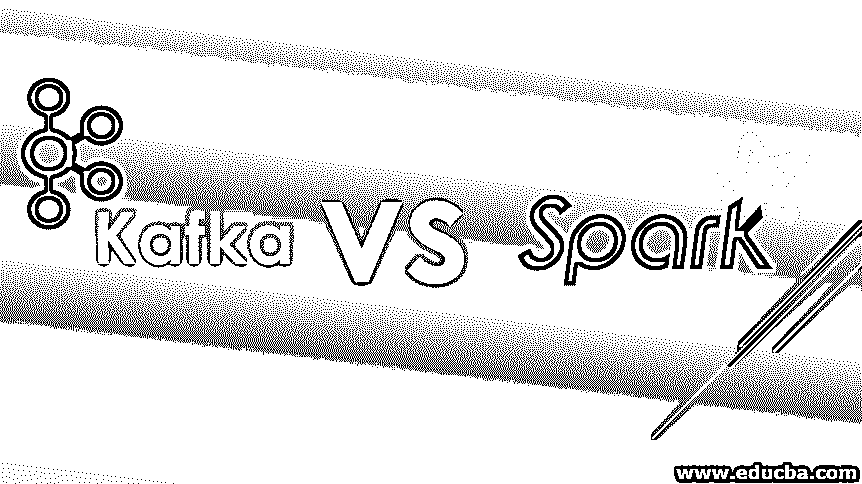
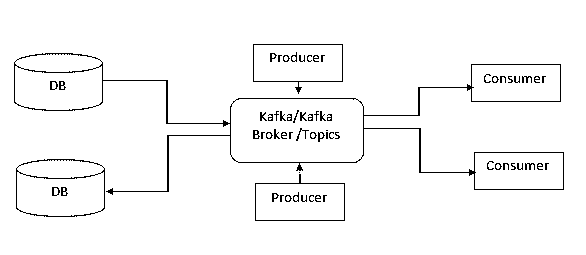
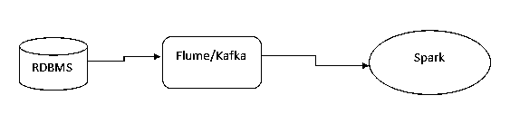
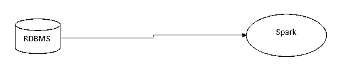
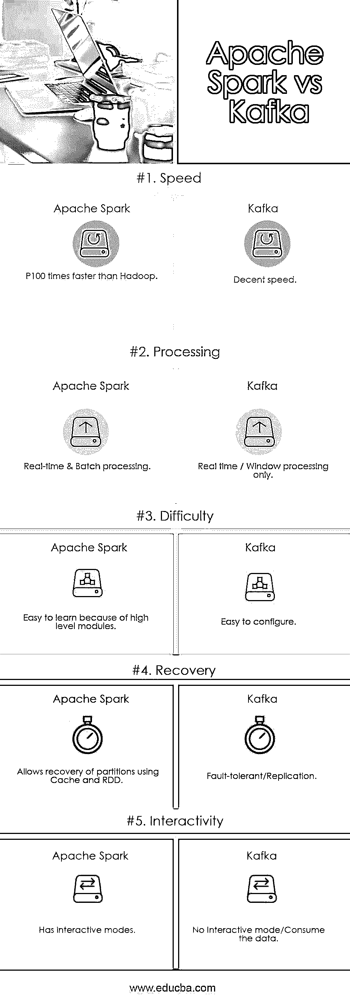

# 卡夫卡 vs 火花

> 原文：<https://www.educba.com/kafka-vs-spark/>

## 卡夫卡与火花的区别

Kafka vs Spark 是与大数据处理相关的两种流行技术的比较，这两种技术以快速和实时或流数据处理能力而闻名。Kafka 是一个开源工具，通常与发布-订阅模型一起工作，并被用作流数据管道的中间媒介。Spark 是大数据领域的一个已知框架，以高容量和快速非结构化数据分析而闻名。Kafka 中的基本存储组件被称为生产者和消费者事件的主题。而 Spark 使用弹性分布式数据集结构(RDD)和数据帧来处理数据集。

### 卡夫卡

Kafka 是由 Apache 开发的开源流处理平台。它是实时流过程的源和目标之间的中介，我们可以在特定的时间段内保存数据。Kafka 是一个分布式信息系统。在这里我们可以将持久数据用于实时流程。它作为一项服务在一台或多台服务器上运行。Kafka 将记录流存储在称为主题的类别中。每个流记录由键、值和时间戳组成。

<small>Hadoop、数据科学、统计学&其他</small>

要启动 Kafka 服务器

`>bin/Kafka-server-start.sh config/server.properties`

**以下是卡夫卡的主要组成部分**

**源:**当源端发生新的 CDC(变更数据捕获)或新的插入时，将触发此事件。为此，我们必须定义一个键列来标识变更。

**Broker:** 负责持有数据。每个经纪人持有一定数量的分区。

**题目:**对数据进行分类。Kafka 中的主题总是由订阅写入其中的数据的多个消费者订阅。

要创建主题

`> bin/kafka-topics.sh --create --zookeeper localhost:2181 --replication-factor 1 --partitions 1 --topic test`

并查看主题列表

`> bin/kafka-topics.sh --list --zookeeper localhost:2181`

**分区:**主题被进一步分割成分区进行并行处理。

**生产者:**生产者负责发布数据。它会将数据推送到他们选择的主题。生产者将选择将哪个记录分配给主题中的哪个分区。

卡夫卡曾命令对一个主题产生一个信息。

`> bin/Kafka-console-producer.sh --broker-list localhost:9092 --topic test`

嗨，早上好。

这是一条测试消息。

**消费者:**消费者会从话题中消费数据。一个消费者将是其消费群体的一个标签。如果同一个主题有来自不同消费者组的多个消费者，那么每个副本已经被发送到每个消费者组。

您可以使用多个数据源来保存数据。卡夫卡曾命令消费一个主题的信息。

`> bin/Kafka-console-consumer.sh --bootstrap-server localhost:9092 --topic test --from-beginning`

嗨，早上好。

这是一条测试消息。

**水槽:**我们可以用水槽卡夫卡水槽。其中，只要有任何 CDC(更改数据捕获)或新的 insert flume 就会触发记录并将数据推送到 Kafka 主题。为此，我们必须设置频道。

与水槽卡夫卡水槽一样，我们可以有 HDFS，JDBC 源，和水槽。

Kafka 具有更高的吞吐量，并具有内置分区、复制和容错等特性，这使其成为大规模消息或流处理应用程序的最佳解决方案

### 火花

Apache Spark 是一个开源集群计算框架。Spark 代码库最初由加州大学伯克利分校的 Amp 实验室开发，后来捐赠给了 Apache 软件基金会。Spark 提供了一个接口，通过隐式数据并行和容错对整个集群进行编程。

当 Hadoop 被引入时，Map-Reduce 是任何作业任务的基本执行引擎。在 Map-Reduce 执行(读写)过程发生在实际的硬盘驱动器上。这就是执行时时间和空间消耗较多的原因。

Apache Spark 是一个开源平台。比 Map-Reduce 过程提高了执行质量。这是一个开放的平台，您可以使用多种编程语言，如 Java、Python、Scala、r。Spark 提供比 MapReduce 快 100 倍的内存执行。这使用了 RDD 定义。RDD 是一个强大的分布式数据集，允许您以透明的方式将数据存储在内存中，并仅在需要时将其保留在磁盘上。这是从内存而不是磁盘访问数据的时间。

Spark 是一个平台，我们可以在这个平台上将数据保存在数据框架中并对其进行处理。应用程序开发人员、数据科学家和数据分析师可以使用 Spark 在最短的时间内处理大量数据。我们可以在 Spark 中使用数据的交互、迭代分析等功能。

Spark streaming 是我们可以实时处理数据的另一个功能。银行领域需要跟踪实时交易以向客户提供最佳交易，跟踪可疑交易。Spark 流在年轻一代的 Hadoop 中最受欢迎。Spark 是一个易于开发的轻量级 API，它将帮助开发人员快速处理流项目。Spark streaming 将轻松恢复丢失的数据，并能够在架构就绪后准确交付。无需任何额外的编码工作，我们可以同时处理实时火花流和历史批量数据(Lambda 架构)。

在 Spark streaming 中，我们可以使用多种工具，如 flume、Kafka、RDBMS 作为源或汇。

或者我们可以直接从 RDBMS 传输到 Spark。

不管有没有 HDFS，我们都可以在 HDFS 上运行火花。这就是为什么每个人都在谈论它对 Hadoop 的替代。HDFS 是 Hadoop 的基础文件系统。我们可以把 HDFS 作为一个来源或目的地。

使用 Spark SQL 使用基本的 SQL 查询来处理数据。这个 spark 为数据科学家提供了更好的功能，如 Mlib(机器学习库)来进行预测。

### 卡夫卡与火花的对决(资料图)

以下是卡夫卡和火花的 5 大对比:

### **卡夫卡与火花的主要区别**

让我们讨论一下卡夫卡和斯帕克之间的一些主要区别:

*   卡夫卡是一个信息经纪人。Spark 是开源平台。
*   卡夫卡有生产者、消费者、主题来处理数据。Spark 提供平台，从源到目标提取、保存、处理和推送数据。
*   Kafka 提供实时流，窗口进程。其中 Spark 允许实时流和批处理。
*   在卡夫卡那里，我们无法进行转化。在 Spark 中，我们在哪里执行 ETL
*   Kafka 不支持任何编程语言来转换数据。其中 spark 支持多种编程语言和库。
*   因此 Kafka 被用于实时流，作为源和目标之间的通道或中介。其中 Spark 还用于实时流、批处理和 ETL。

### **卡夫卡 vs 火花**的特点

下面列出了一些关键特性。

1.  **数据流:** Kafka vs Spark 提供从源到目标的实时数据流。卡夫卡只是把数据流向主题，火花是程序性的数据流。
2.  **数据处理:**我们不能对 Spark 可以转换的数据执行任何转换。
3.  **数据持久化:** Kafka 将数据持久化到配置中定义的某个时间。我们必须使用数据框或数据集对象来保存数据。
4.  **ETL 转换:**使用 Spark 我们可以进行 ETL，而 Kafka 不提供 ETL。
5.  **内存管理:** Spark 使用 RDD 以分布式方式(即缓存、本地空间)存储数据，而 Kafka 将数据存储在主题中，即缓冲存储器中。

### 卡夫卡与火花对照表

下面是卡夫卡和斯帕克最上面的比较。

| **特征标准** | **阿帕奇火花** | **卡夫卡** |
| **速度** | 比 Hadoop 快 100 倍 | 相当快的速度 |
| **处理** | 实时和批处理 | 仅实时/窗口处理 |
| **难度** | 因为有高级模块，所以容易学习 | 易于配置 |
| **恢复** | 允许使用缓存和 RDD 恢复分区 | 容错/复制 |
| **交互性** | 有互动模式 | 无交互模式/消耗数据 |

### 结论

我们可以用卡夫卡作为消息代理人。它可以将数据保存一段特定的时间。使用 Kafka，我们可以执行实时窗口操作。但是我们不能在卡夫卡中进行 ETL 转换。使用 Spark，我们可以将数据持久化到数据对象中，并执行端到端的 ETL 转换。

所以如果我们使用 Kafka 作为 Spark 的实时流媒体平台，这是最好的解决方案。

### 推荐文章

这是卡夫卡和火花之间最大区别的指南。在这里，我们讨论了 Kafka 与 Spark 的直接比较、关键差异以及信息图和比较表。您也可以阅读以下文章，了解更多信息——

1.  [阿帕奇卡夫卡与 Flume 的区别](https://www.educba.com/apache-kafka-vs-flume/)
2.  [阿帕奇风暴 vs 卡夫卡](https://www.educba.com/apache-storm-vs-kafka/)
3.  [谷歌云 vs AWS](https://www.educba.com/google-cloud-vs-aws/)
4.  [卡夫卡 vs Kinesis |五大差异](https://www.educba.com/kafka-vs-kinesis/)
5.  [了解雷迪斯与卡夫卡的 7 大有用差异](https://www.educba.com/redis-vs-kafka/)
6.  [rabbit MQ 与 Kafka 的区别](https://www.educba.com/rabbitmq-vs-kafka/)
7.  [rabbit MQ 与 MQTT 的比较](https://www.educba.com/rabbitmq-vs-mqtt/)

