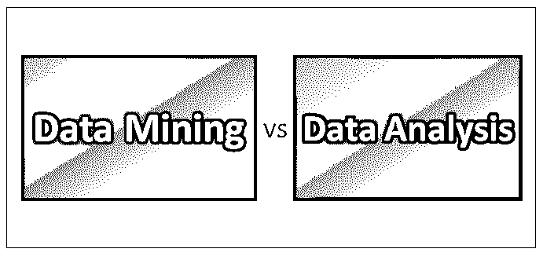
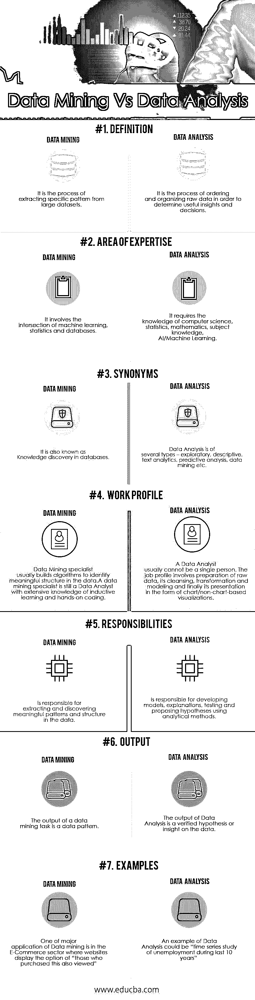

# 数据挖掘与数据分析

> 原文：<https://www.educba.com/data-mining-vs-data-analysis/>

## 数据挖掘和数据分析的区别

数据量的指数级增长引发了一场信息和知识革命。现在，从现有数据中收集有意义的信息和见解是研究和战略制定的一个关键方面。所有这些信息都存储在数据仓库中，然后用于商业智能目的。

有几种定义和观点，但都同意数据分析和数据挖掘是商业智能的两个子集。

<small>Hadoop、数据科学、统计学&其他</small>

**数据挖掘**–数据挖掘是一个在大型数据集中识别和发现隐藏模式和信息的系统和有序的过程。它也被称为数据库中的知识发现。自 20 世纪 90 年代以来，它一直是一个热门词汇

**数据分析**–另一方面，数据分析是数据挖掘的超集，涉及数据的提取、清理、转换、建模和可视化，旨在发现有意义和有用的信息，帮助得出结论和做出决策。数据分析作为一个过程从 20 世纪 60 年代就已经存在了。

让我们在这篇文章中找出两者之间的最佳区别。

### 数据挖掘和数据分析的直接比较

下面是数据挖掘和数据分析之间的 7 大比较:

### 

### 数据挖掘和数据分析的主要区别

数据挖掘和数据分析是两个不同的名称和过程，但在一些观点中，人们可以互换使用它们。这也取决于承担此类任务的组织或项目团队，在这种情况下，这种区别没有被特别标记。为了建立他们独特的身份，我们强调他们之间的主要区别如下:

1.  数据挖掘识别并发现大型数据集中隐藏的模式。数据分析从数据集中提供见解或测试假设或模型。
2.  数据挖掘是数据分析的活动之一。数据分析是一整套活动，负责数据的收集、准备和建模，以提取有意义的见解或知识。有时两者都被包含在商业智能的子集里。
3.  数据挖掘研究主要是针对结构化数据的。可以对结构化、半结构化或非结构化数据进行数据分析。
4.  数据挖掘的目标是让数据更有用，同时[数据分析帮助](https://www.educba.com/what-is-data-analysis/)证明假设或做出[商业决策](https://www.educba.com/)。
5.  数据挖掘不需要任何先入为主的假设来识别数据中的模式或趋势。另一方面，数据分析测试一个给定的假设。
6.  数据挖掘基于数学和科学方法来识别模式或趋势，而数据分析则使用商业智能和分析模型。
7.  数据挖掘一般不涉及可视化工具，数据分析总是伴随着结果的[可视化](https://www.educba.com/data-visualization-with-tableau/)。

### 数据挖掘和数据分析对照表

下面给出的是数据挖掘和数据分析之间的比较表。

| **比较依据** | **数据挖掘** | **数据分析** |
| **定义** | 它是从大型数据集中提取特定模式的过程 | 它是对原始数据进行排序和组织以确定有用的见解和决策的过程。 |
| **专业领域** | 它涉及机器学习、统计学和数据库的交叉。 | 它需要[计算机科学](https://www.educba.com/computer-science-interview-questions/)的知识，统计学，数学，学科知识，AI/机器学习 |
| **同义字** | 它也被称为数据库中的知识发现 | 数据分析有几种类型——探索性的、描述性的、文本分析、[预测性分析](https://www.educba.com/predictive-analysis-vs-forecasting/)、数据挖掘等。 |
| **工作简介** | Data Mining specialist usually builds [algorithms](https://www.educba.com/learning-algorithms/) to identify meaningful structure in the data.

数据挖掘专家仍然是数据分析师，拥有归纳学习和动手编程的丰富知识

 | 数据分析师通常不是一个人。工作简介涉及原始数据的准备、清理、转换和建模，以及最终以图表/非图表形式呈现。 |
| **职责** | 负责提取和发现数据中有意义的模式和结构 | 负责使用分析方法开发模型、解释、测试和提出假设 |
| **输出** | 数据挖掘任务的输出是数据模式 | 数据分析的输出是经过验证的假设或对数据的洞察 |
| **例题** | 数据挖掘的一个主要应用是在电子商务领域，其中网站显示“那些购买了这个的人也看过”的选项 | 数据分析的一个例子是“过去 10 年失业时间序列研究” |

### 结论

数据挖掘和数据分析这个术语已经存在了大约二十年(或者更久)。一些用户群交替使用它们，而一些用户群在这两种活动中进行了明确区分。数据挖掘通常是数据分析的一部分，其目的或意图仍然是仅从数据集中发现或识别模式。另一方面，数据分析是一个完整的软件包，用于从数据中获取意义，可能涉及也可能不涉及数据挖掘。两者都需要不同的技能和专业知识，在接下来的几年里，这两个领域都将出现对数据、资源和工作的高需求。

### 推荐文章

这是数据挖掘和数据分析的指南。在这里，我们讨论了数据挖掘与数据分析的直接比较、关键差异以及信息图和比较表。您也可以阅读以下文章，了解更多信息——

1.  [有用的数据挖掘技术](https://www.educba.com/data-mining-techniques/)
2.  [Awesome 4 数据仓库 VS 数据挖掘](https://www.educba.com/data-warehousing-vs-data-mining/)
3.  [品牌实力的数据分析技术](https://www.educba.com/data-analysis-techniques/) 
4.  [数据挖掘架构的主要组件](https://www.educba.com/data-mining-architecture/)

