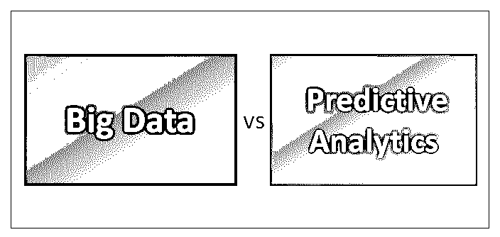
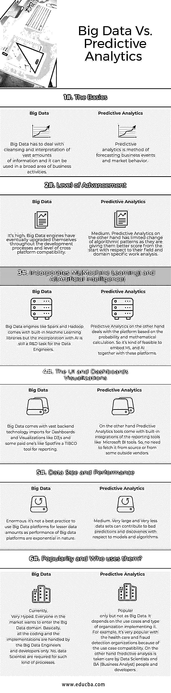

# 大数据与预测分析

> 原文：<https://www.educba.com/big-data-vs-predictive-analytics/>

## 大数据和预测分析的区别

作为当今市场上最“炒作”的术语之一，对于如何定义大数据和预测分析，人们并没有达成共识。

[大数据是](https://www.educba.com/what-is-big-data/)高容量、高速度和/或高多样性的信息资产，需要经济高效、创新的信息处理形式来增强洞察力、[决策制定](https://www.educba.com/career-making-decisions/)和流程自动化。大数据已成为从业者和学者感兴趣的重要学习和研究领域。互联网和数字设备的指数级增长推动了数据的指数级增长。科技的进步使得存储和分析大量数据变得经济可行。大数据包括来自各种来源的结构化、半结构化和非结构化[实时](https://www.educba.com/real-time-analytics/)数据。

<small>Hadoop、数据科学、统计学&其他</small>

[预测分析包含](https://www.educba.com/what-is-predictive-analytics/)从建模、机器学习到[数据挖掘的各种统计技术](https://www.educba.com/data-mining-techniques/)，分析当前和历史事实，对未来或未知事件做出预测。预测分析提供了一种从大型数据集中挖掘智能的方法。许多有远见的公司，如谷歌、亚马逊等。已经意识到[大数据和分析](https://www.educba.com/big-data-analytics-techniques/)在获得竞争优势方面的潜力。这些技术提供了一些机会，如发现模式或更好的优化算法。管理和分析大数据也构成了一些挑战，即数据的大小、质量、可靠性和完整性。

### 大数据和预测分析之间的直接比较(信息图表)

以下是大数据和预测分析之间的六大对比:

### 大数据和预测分析的主要区别

以下几点描述了大数据和预测分析之间的主要区别:

1.  **架构**

大数据与数据量有关，通常在 0.5 TB 或更大的范围内，在这种情况下，关系数据库系统的容量开始下降，因此对基于云的管道(如 AWS 和[数据仓库](https://www.educba.com/business-intelligence-vs-data-warehouse/))的需求是当务之急。另一方面，预测分析必须将统计模型应用于现有数据，以预测搅动数据源的可能结果。

2.  **目标问题**

“大数据”描述的是数据本身以及管理数据的挑战，而“预测分析”描述的是数据的一类应用，不考虑数量。所以，它们都代表互斥的实体。

3.  **社交媒体使用案例**

社交媒体已被证明是大数据和预测分析的最佳用途。但两者都是一个连续的链条。由于社交媒体数据来自多个来源，但最终会进入 MDM(主数据管理), MDM 可以通过[大数据](https://www.educba.com/big-data-vs-data-science/)技术构建，只有在此基础上，预测分析和其他算法才能产生结果。这种新型的数据管理解决方案具有高度可伸缩、大规模并行和经济高效的特点。

4.  **大数据和预测分析领域的技术生态系统**

例如，大数据平台和预测分析的最佳时机是处理已经结构化的高价值交易数据，这些数据需要支持大量用户和应用程序，这些用户和应用程序会对已知数据提出重复的问题(固定的模式和优化会带来回报)，并具有企业级的安全性和性能保证。因此，为了应对它们，我们有不同的工具和技术。

对于大数据来说，

AWS，阿帕奇 [HDFS](https://www.educba.com/hdfs-vs-hbase/) ，[地图还原](https://www.educba.com/mapreduce-vs-spark/) /Spark，[卡珊德拉](https://www.educba.com/hbase-vs-cassandra/) / [HBase](https://www.educba.com/hdfs-vs-hbase/) 。

对于预测分析，

r、统计方法、预测、回归分析、[数据挖掘](https://www.educba.com/data-mining-techniques/)、[数据仓库](https://www.educba.com/business-intelligence-vs-data-warehouse/)。

### 大数据和预测分析对照表

以下是大数据和预测分析的对比表。

| **比较的基础** | **大数据** | **预测分析** |
| **基础知识** | 大数据必须处理大量信息的清理和解释，它可以用于商业活动的广泛领域。 |  Predictive analytics is a method of forecasting business events and market behavior. |
| **进步程度** | 很高。大数据引擎最终在整个开发流程和跨平台兼容性水平上实现了自我升级。 | 中等。另一方面，预测分析对算法模式的改变有限，因为他们从一开始就在他们的领域和特定领域的工作分析方面给他们更好的分数。 |
| **融合了 ML(机器学习)和 AI(人工智能)** | 像 Spark 和 Hadoop 这样的大数据引擎带有[内置的机器学习库](https://www.educba.com/machine-learning-libraries/)，但与人工智能的结合仍然是数据工程师的一项研发任务。 | 另一方面，预测分析处理基于概率和数学计算的平台。因此，将 ML 和 AI 嵌入这些平台是可行的。 |
| **用户界面和仪表盘可视化** | 大数据伴随着大量用于仪表板和可视化的后端技术进口，如 D3js 和一些付费技术，如 TIBCO 报告工具 Spotfire。 | On the other hand, Predictive Analytics tools come with built-in integrations of the reporting tools like Microsoft BI tools. So, no need to fetch it from source or from some outside vendors. |
| **数据大小和性能** | Enormous. It’s not a best practice to use Big Data platforms for lesser data amounts as a performance of Big data platforms are exponential in nature. | 中等。就模型和算法而言，非常大和非常小的数据集可能导致糟糕的预测和发现。 |
| **受欢迎程度和谁使用它们？** | 目前，非常炒作。市场上的每个人都想进入大数据领域。基本上，所有的编码和实现都由大数据工程师和开发人员来处理。不，这类流程需要数据科学家。 | 仅受欢迎，但不是大数据。这取决于用例以及实现它的组织的类型。例如，由于用例兼容性，它非常受医疗保健和欺诈检测组织的欢迎。另一方面，预测分析由数据科学家和 BA(业务分析师)人员和开发人员负责 |

### 结论

大数据 vs 预测分析，两者都在这里，而且会一直存在下去。尽管大肆宣传，大数据与预测性分析确实为组织提供了切实的业务优势。它增强了洞察力、决策能力和流程自动化。在分析焦点方面也有所谓的范式转变。这是从描述性分析到预测性分析的转变。大数据和预测分析在所有领域的结合具有巨大的潜力，可以积极影响决策支持和运营，如成本管理系统和资源分配。

### 推荐文章

这是大数据与预测分析的指南。在这里，我们讨论了大数据与预测分析的直接比较、主要差异以及信息图表和比较表。您也可以阅读以下文章，了解更多信息——

1.  [13 个最重要的预测分析工具(有帮助)](https://www.educba.com/predictive-analytics-tool/)
2.  商业分析与商业智能——它们有什么不同？
3.  [大数据与数据科学——它们有什么不同？](https://www.educba.com/big-data-vs-data-science/)
4.  [预测分析与数据科学——了解 8 个有用的对比](https://www.educba.com/predictive-analytics-vs-data-science/)
5.  [大数据与机器学习的 5 个最佳区别](https://www.educba.com/big-data-vs-machine-learning/)
6.  [7 商业分析与预测分析之间最有用的对比](https://www.educba.com/business-analytics-vs-predictive-analytics/)

