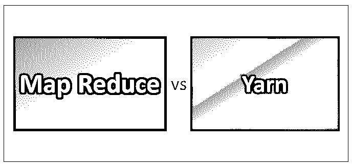
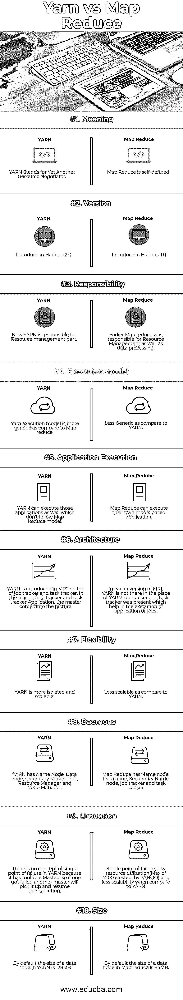
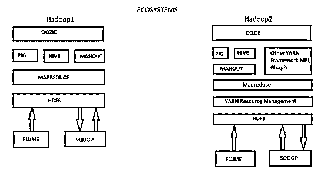

# MapReduce 与 Yarn

> 原文：<https://www.educba.com/mapreduce-vs-yarn/>

## Map Reduce 和纱线之间的差异

Yarn 代表又一个资源协商者，它是管理资源(内存和 CPU)的新框架。它帮助我们开发任何类型的分布式应用程序，它为我们提供了必要的守护进程和 API。YARN 的另一个重要特性是，它处理和调度来自应用程序的资源请求，并帮助进程执行请求。YARN 是运行任何分布式应用的通用平台，map reduce 版本 2 是运行在 YARN 之上的分布式应用，而 Map Reduce 是 Hadoop 组件的处理单元，它在分布式环境中并行处理数据。所以基本上 map-reduce 工作是在巨大的数据组件上进行的，它处理数据并以一种比传统存储更容易检索的方式存储在 HDFS。

### MapReduce 和 Yarn 之间的直接比较(信息图表)

下面是 MapReduce 与 Yarn 之间的十大比较

<small>Hadoop、数据科学、统计学&其他</small>

### MapReduce 和 Yarn 的主要区别

1.  在 Hadoop 1 中，它有两个组件，第一个是 HDFS (Hadoop 分布式文件系统)，第二个是 Map Reduce。而在 Hadoop 2 中，它也有两个组件 HDFS 和 YARN/MRv2(我们通常称 YARN 为 Map reduce 版本 2)。
2.  在 Map Reduce 中，当 Map-reduce 停止工作时，它的所有从节点将自动停止工作。这是一种作业执行可能中断的情况，它被称为单点故障。YARN 由于其体系结构而克服了这个问题，YARN 具有活动名称节点以及备用名称节点的概念。当主动节点停止工作一段时间后，被动节点开始作为主动节点工作并继续执行。
3.  Map reduce 具有单主多从架构，如果主从发生故障，则整个从将停止工作这是 HADOOP1 中的单点故障，而基于 YARN 架构的 HADOOP2 具有多主多从的概念，如果一个主发生故障，则另一个主将恢复其进程并继续执行。
4.  正如我们在下图中看到的，生态系统 HADOOP1 和 HADOOP2 的差异。组件式纱线资源管理与 Map-reduce 和 HDFS 交互。

因此，基本上，YARN 负责资源管理，也就是说，由 YARN 决定哪个系统执行哪个作业，而 map reduce 是负责如何执行特定作业的编程框架，因此，基本上，map-reduce 有两个组件映射器和缩减器来执行程序。

5.  在 Map reduce 中，每个数据节点单独运行，而在 Yarn 中，每个数据节点由一个节点管理器运行。
6.  Map reduce 使用作业追踪器创建任务并将其分配给任务追踪器，因为数据资源的管理并不令人印象深刻，因为一些数据节点将保持空闲并且没有用处，而在 YARN 中，每个集群都有一个资源管理器，并且每个数据节点都运行一个节点管理器。对于每个作业，一个从节点将充当应用程序主节点，监视资源/任务。

### MapReduce 与纱线对比表

下面是 MapReduce 和 Yarn 之间的比较

| **比较依据** | **纱线** | **地图缩小** |
| 意义 | YARN 代表另一种资源谈判者。 | Map Reduce 是自定义的。 |
| 版本 | 在 Hadoop 2.0 中引入 | 在 Hadoop 1.0 中引入 |
| 责任 | 现在 YARN 负责资源管理部分。 | 早期的 Map reduce 负责资源管理和数据处理 |
| 执行模型 | 与 Map reduce 相比，纱线执行模型更通用 | 与纱线相比不太普通。 |
| 应用程序执行 | YARN 也可以执行那些不遵循 Map Reduce 模型的应用程序 | Map Reduce 可以执行它们自己基于模型的应用程序。 |
| 体系结构 | 纱线被引入 MR2 的作业跟踪器和任务跟踪器之上。在作业跟踪器和任务跟踪器应用程序的地方，主程序进入了画面。 | 在 MR1 的早期版本中，没有 YARN 来代替 YARN 作业跟踪器，而任务跟踪器则帮助执行应用程序或作业 |
| 灵活性 | YARN 更加孤立和可扩展 | 与纱线相比伸缩性较差。 |
| 守护进程 | YARN 有名称节点、数据节点、二级名称节点、资源管理器和节点管理器。 | Map Reduce 具有名称节点、数据节点、二级名称节点、作业跟踪器和任务跟踪器。 |
| 限制 | 在 YARN 中没有单点故障的概念，因为它有多个主控器，所以如果一个主控器失败了，另一个主控器会捡起它并继续执行。 | 与 YARN 相比，单点故障、低资源利用率(YAHOO 最多 4200 个集群)和较低的可伸缩性 |
| 大小 | 默认情况下，YARN 中数据节点的大小是 128MB | 默认情况下，Map reduce 中数据节点的大小为 64MB。 |

### 结论

在基于 Map Reduce 的 Hadoop 1 中，有几个问题是用 Yarn 在 Hadoop 2 中克服的。像在 Hadoop 1 中一样，作业跟踪器负责资源管理，但是 YARN 有资源管理器和节点管理器的概念，节点管理器将负责资源管理。Map reduce 有一个单点故障，即作业跟踪器，如果作业跟踪器停止工作，那么我们必须重新启动整个集群，并从初始位置再次执行我们的作业。在真实场景中，没有一个组织不想承担这种风险，尤其是在银行防御部门。这种致力于简化数据的组织不会承担这种风险。为了几分钟的时间，他们将丢失他们的数据，并可能产生一些关键的业务影响。所以 YARN 比 Map-reduce 有更好的效果。

### 推荐文章

这是一个关于 MapReduce vs Yarn 的指南，包括它们的含义、直接比较、主要区别、比较表和结论。您也可以阅读以下文章，了解更多信息——

1.  [关于 MapReduce 与 Spark 的 15 件事](https://www.educba.com/mapreduce-vs-spark/)
2.  [Hadoop 与 MapReduce 的 5 大区别](https://www.educba.com/hadoop-vs-mapreduce/)
3.  [10 Hadoop 与红移的有用区别](https://www.educba.com/hadoop-vs-redshift/)
4.  【MapReduce 如何工作？

