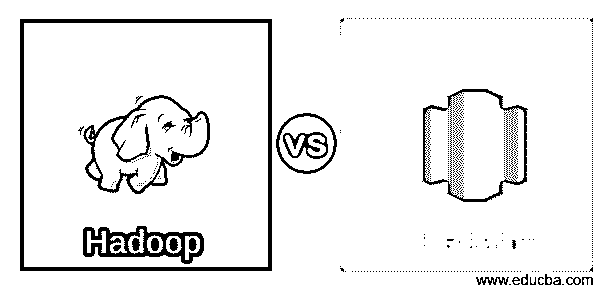
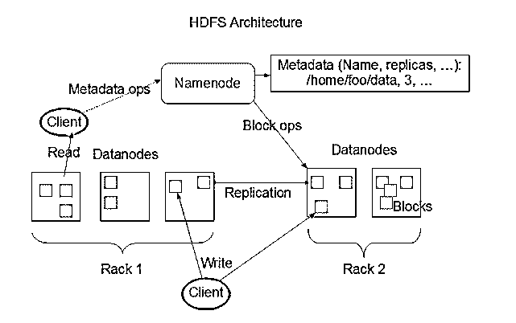
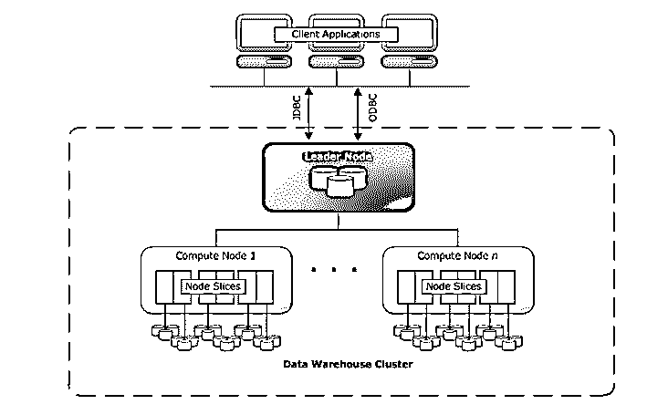
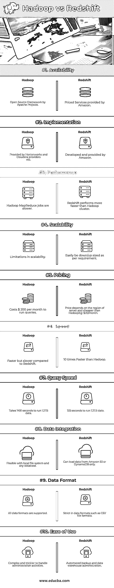

# Hadoop vs 红移

> 原文：<https://www.educba.com/hadoop-vs-redshift/>

## Hadoop 和红移的区别

Hadoop 是由 Apache Software*Foundation*开发的开源框架，其主要优点是可伸缩性、可靠性和分布式计算。数据处理、存储、访问和安全性是 Hadoop 生态系统中可用的几种功能。HDFS 具有高吞吐量，这意味着能够以并行处理能力处理大量数据。Redshift 是由 Amazon.com 公司内的亚马逊网络服务部门开发的云托管网络服务，在亚马逊提供的现有服务之外。它用于设计云中的大规模数据仓库。Redshift 是一个 Pb 级的数据仓库服务，它是完全托管的，并且在大型数据集上运行是经济高效的。

**让我们详细研究一下 Hadoop 和红移:**

<small>Hadoop、数据科学、统计学&其他</small>

Hadoop HDFS 具有很高的容错能力，旨在低成本硬件系统上运行。Hadoop 可以在其系统中处理最小类型大小为 TB 到 GB 的文件。HDFS 是由名称节点和数据节点组成的主从架构，其中名称节点包含元数据，数据节点包含要处理或操作的真实数据。

RedShift 使用不同的数据加载技术，如 BI(商业智能)报告、分析工具和数据挖掘。Redshift 提供了一个控制台来创建和管理 Amazon 红移集群。红移数据仓库的核心组件是一个集群。

图片来源:Apache.org

**红移架构:**

**Image Source: Amazon.com**

### Hadoop 和 Redshift 之间的直接对比(信息图):

以下是 Hadoop 和 Redshift 的 10 大对比。

### Hadoop 与红移的主要区别

以下是 Hadoop 与 Redshift 之间的主要区别

1.Hadoop HDFS (Hadoop 分布式文件系统)架构有名称节点和数据节点，而 Redshift 有领导节点和计算节点，其中计算节点将被分区为片。

2.Hadoop 提供了一个命令行界面来与文件系统交互，而 RedShift 有一个管理控制台来与亚马逊存储服务(如 S3、DynamoDB 等)交互。,

3.数据库操作将由开发人员配置。Redshift 通过解析执行计划来自动化数据库操作。

4.Hadoop 有几个第三方工具支持，可以轻松集成，而 Redshift 只支持亚马逊在其云中开发的产品。

5.就 Hadoop 架构设计而言，网络、存储、安全性和性能被视为主要元素，而在 Redshift 中，这些元素可以使用 Amazon 云管理控制台轻松灵活地进行配置。

6.Hadoop 是基于 Java 应用编程接口(API)的文件系统架构，而 Redshift 是基于关系模型数据库管理系统(RDBMS)。

7.Hadoop 可以与不同的供应商集成，在这种情况下，Redshift 不支持亚马逊是他们唯一的供应商。如果用户对服务不满意怎么办？在这种情况下，Hadoop 是一个优势。

8.大多数现有公司仍在使用 Hadoop，而新客户正在选择 RedShift。

9.就性能而言，Hadoop 总是落后，而在对大量数据执行查询的情况下，Redshift 总是胜出。

10.Hadoop 使用 Map Reduce 编程模型来运行作业。亚马逊红移使用亚马逊的弹性贴图 Reduce。

11.Hadoop 使用 Map Reduce 编程模型来运行作业。亚马逊红移使用亚马逊的弹性贴图 Reduce。

12.Hadoop 更适合于每天运行批处理作业，这变得更便宜，而在许多商业智能工具背后存在的在线分析处理(OLAP)技术的情况下，Redshift 变得更便宜。

13.在运行查询时，Hadoop 比 Redshift 慢 10 倍。同样，Hadoop 的成本是 Redshift 的 10 倍，这导致 Hadoop 是 Redshift 之前最少选择的。

14.在数据加载方面，Hadoop 在系统将数据从存储加载到文件处理系统所需的时间方面也落后于 Redshift。

15.Hadoop 可用于低成本存储、数据归档、数据湖、数据仓库和数据分析，而 Redshift 属于数据仓库功能，导致多用途使用受限。

16.Hadoop 平台为各种外部厂商和自己的 Apache 项目如 Storm、Spark、Kafka、Solr 等提供支持。另一方面，Redshift 对其仅有的亚马逊产品的集成支持有限

### Hadoop 与红移对比表

| **BASIS FOR****比较** | **HADOOP** | **红移** |
| 有效性 | Apache 项目的开源框架 | 亚马逊提供的定价服务 |
| 履行 | 由 Hortonworks 和 Cloudera 提供商等提供。, | 由亚马逊开发和提供 |
| 表演 | Hadoop MapReduce 作业速度较慢 | 红移的执行速度比 Hadoop 集群更快 |
| 可量测性 | 可扩展性的限制 | 根据需要轻松缩小/扩大 |
| 定价 | 运行查询每月花费 200 美元 | The price depends on the region of the server and is cheaper than Hadoop例如:每月 20 美元 |
| 速度 | 与红移相比更快但更慢 | 比 Hadoop 快 10 倍 |
| 查询速度 | 运行 1.2TB 的数据需要 1491 秒 | 运行 1.2TB 数据需要 155 秒 |
| 数据集成 | 灵活使用本地文件系统和任何数据库 | 只能从亚马逊 S3 或 DynamoDB 加载数据 |
| 数据格式 | 支持所有数据格式 | 对数据格式要求严格，如 CSV 文件格式 |
| 易用性 | 处理管理活动更加复杂和棘手 | 自动化备份和数据仓库管理 |

### 结论

总结此次比较中的大赢家的最后一句话是，Redshift 在操作、维护和工作效率方面胜出，而 Hadoop 在性能可扩展性和服务成本方面欠缺，唯一的优势是可以轻松集成第三方工具和产品。由于 Redshift 的高可用性和比 Hadoop 更低的运营成本，使其越来越受欢迎，因此它最近得到了快速发展，并被许多客户和客户接受。但是，到目前为止，大多数现有的财富 1000 强公司都在其架构中使用 Hadoop 平台来管理客户数据。

在大多数情况下，RedShift 是任何客户或顾客出于业务目的考虑的最佳选择，以便以更高的数据完整性和安全性处理任何金融机构或公共信息的大量敏感数据。

除此之外，Hadoop 作为一个开源项目有其自身的优势，并且已经存在多年，这也导致现有系统被替换，这是一个产生成本的过程。最终应该根据需求和灵活性来选择产品，而不是根据受驱动的业务需求来决定价格或受欢迎程度。

### 推荐文章:

这是 Hadoop 与红移、它们的意义、直接比较、主要差异、对照表和结论的指南。您也可以阅读以下文章，了解更多信息——

1.  [Hadoop 与 Hive–找出最佳差异](https://www.educba.com/hadoop-vs-hive/)
2.  [HADOOP 与 RDBMS |了解 12 个有用的区别](https://www.educba.com/hadoop-vs-rdbms/)
3.  [大数据与数据科学——它们有什么不同？](https://www.educba.com/big-data-vs-data-science/)
4.  [Hadoop vs Spark 指南](https://www.educba.com/hadoop-vs-spark/)
5.  [四大云托管提供商特色](https://www.educba.com/cloud-hosting-providers/)

