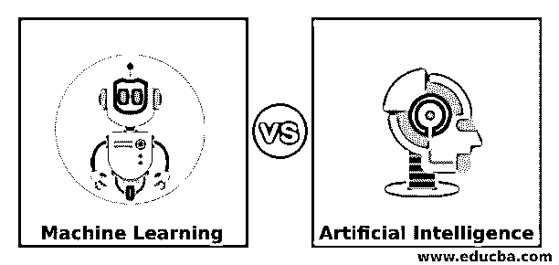
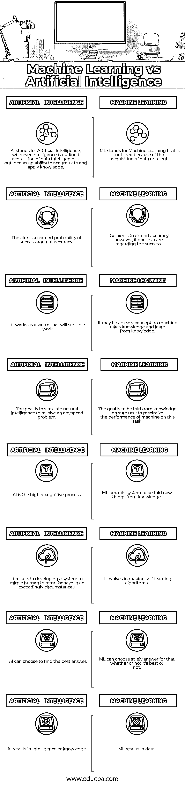

# 机器学习 vs 人工智能

> 原文：<https://www.educba.com/machine-learning-vs-artificial-intelligence/>

## 机器学习和人工智能的区别

机器学习和人工智能是两个备受推崇的时髦词，有时似乎可以互换使用。它们是几乎不变的因素，然而，这种感觉通常会引起一些混乱。因此，我认为这将是价格写了一大块，以澄清区别。

一旦主题是庞大的知识、分析，以及席卷我们世界的更广泛的技术改造浪潮，机器学习和人工智能就非常频繁地发生。

<small>Hadoop、数据科学、统计学&其他</small>

简而言之，最有效的答案是:

人工智能是机器的广义概念，它有能力以一种我们认为非常“聪明”的方式完成任务。

我们都习惯了“人工智能”这个术语最后，它也是电影《灭虫者》、《黑客帝国》和《前任玛奇纳》(我个人最喜欢的一部)中广受欢迎的焦点。然而，你最近会听到一些替代术语，如“机器学习”和“深度学习”，通常与人工智能互换使用。因此，人工智能、机器学习和深度学习之间的区别往往非常模糊。

我将首先快速澄清机器学习和人工智能的真正含义以及它们完全不同的方式。然后，我将分享人工智能，因此物联网是不可分割的，许多技术进步都直接连接到人工智能和物联网爆炸的灵感线上。

### 机器学习和人工智能(信息图表)

以下是机器学习与人工智能之间的 8 大区别

### 机器学习和人工智能的主要区别

两者都是市场上的热门选择；让我们讨论一些主要差异:

*   人工智能分为“狭义人工智能”，旨在执行网站内的特定任务，以及“通用人工智能”，可以在任何地方学习和执行任务。机器学习是因为工程科学中最新的基于统计的算法和模型的发展被表述为“狭义 AI”。
*   因此，人工智能涉及过程统计、应用计算和数学优化，而人工智能吸引了几门科学和技术:工程科学、数学、心理学、语言学、哲学、神经生物学、自然哲学、工程学等。
*   人工智能是关于制造智能系统[将理解，学习，推理，计划，感知，语言交流方法，行动]，包括机器智能，人工意识和智能社区。ML 是简单的机器控制的特征工程、特征学习或知识图解学习，以从信息或真实世界的知识如图片、视频和设备知识中机械地发现特征检测或分类所需的表示。
*   最强大的人工智能系统，如沃森(……)使用深度学习等技术，只是非常复杂的技术组合的一部分，从贝叶斯推理的应用数学技术到抽象思维。“鉴于对 ML 系统的技术不信任，将 ML 应用于致命自主武器系统(法律)会引起特殊的巨大考虑。
*   人工智能包括任何能使计算机像人类一样运转的东西。如果你在手机上与 Siri 对话并得到回答，你就已经很接近了。机器学习是人工智能的子集，处理从数据集中提取模式。这意味着机器可以找到最佳行为的规则，也可以适应世界的变化。
*   总之，人工智能很少试图与真正的人工智能，或一般的人工智能，具有清晰的逻辑，高安全性，安全性，透明性和可回答性，对开发人们信任的人工智能网络至关重要。

### 机器学习 vs 人工智能对照表

下面列出了一些要点，描述了机器学习和人工智能之间的比较

| **人工智能** | **机器学习** |
| AI 代表人工智能，无论哪里提到智能，数据智能的获取都被描述为积累和应用知识的能力。 | ML stands for Machine Learning that is outlined because of the acquisition of data or talent |
| 目标是扩大成功的可能性，而不是准确性 | The aim is to extend accuracy, however, it doesn’t care regarding the success |
| 它的工作方式就像一条会理智工作的虫子 | It may be an easy conception machine takes knowledge and learn from knowledge. |
| 目标是模拟自然智能来解决高级问题 | The goal is to be told from knowledge on sure task to maximize the performance of the machine on this task. |
| AI 是一个更高级的认知过程。 | ML 允许系统被告知来自知识的新事物。 |
| 其结果是开发了一个系统来模仿人类在极端情况下的反应行为。 | It involves making self-learning algorithms. |
| AI 可以选择找到最佳答案。 | ML can choose solely answer for that whether or not it’s best or not. |
| 人工智能产生智力或知识。 | ML 产生数据。 |

### 结论

人工智能——尤其是现在，ML 实际上包含了一个堆来提供。凭借其自动化日常任务以及提供创造性见解的承诺，从银行业到注意力和生产等各个领域的行业都从中受益。因此，机器学习和人工智能是另外一回事，这一点很有必要跟上时代的步伐……它们是|它们是}被系统地、幸运地超额认购的商品。

机器学习实际上已经被营销人员当成了一个机会。一旦人工智能已经存在了这么长时间，它的潜力就开始被视为一件“过时”的事情，甚至在它的潜力实际实现之前。在通往“人工智能革命”的道路上有许多错误的开端，因此，机器学习这个术语实际上为营销人员提供了一种新的、闪亮的、重要的、牢牢扎根于此时此地的东西。

事实上，我们最终将开发出类似人类的人工智能，这通常被技术专家视为必然的事情。当然，这些天我们有一种比以往任何时候都更接近的趋势，我们正以越来越快的速度朝着那个目标前进。近年来，我们所看到的大量令人兴奋的进展是因为我们倾向于通过人工智能操作的精神行为来创造的基本变化，这些变化是由人工智能导致的。

在机器学习和人工智能的区别的最后，我只想提到这两种技术都有很好的未来，都有很多需要改进的地方。

### 推荐文章

这是机器学习与人工智能之间最大差异的指南。在这里，我们还讨论了各自的信息图和比较表的主要差异。您也可以看看以下文章，了解更多信息–

1.  [机器学习 vs 预测建模](https://www.educba.com/machine-learning-vs-predictive-modelling/)
2.  [数据科学家 vs 机器学习](https://www.educba.com/data-scientist-vs-machine-learning/)
3.  [数据科学 vs 人工智能](https://www.educba.com/data-science-vs-artificial-intelligence/)
4.  [人工智能 vs 商业智能](https://www.educba.com/artificial-intelligence-vs-business-intelligence/)

