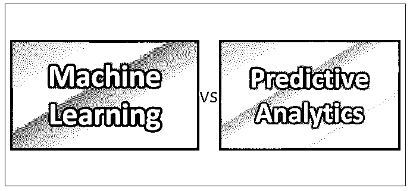
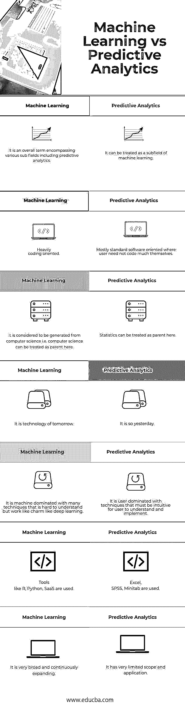

# 机器学习与预测分析

> 原文：<https://www.educba.com/machine-learning-vs-predictive-analytics/>

## 机器学习和预测分析的区别

机器学习是人工智能的一个领域，它使用统计学、计算机科学和数学的基础来构建算法的逻辑，以执行预测和分类等任务，而在预测分析中，问题的目标变得狭窄，即尽管有决策树、[随机森林](https://www.educba.com/random-forest-algorithm/)、逻辑回归等常见技术，但它的目的是计算特定变量在未来某个时间点的值。两者在编码取向、起源、范围、工具等方面都是不同的。

### 机器学习

机器学习在内部使用统计学、数学和计算机科学基础知识来为[算法](https://www.educba.com/learning-algorithms/)构建逻辑，这些算法可以在实时和批处理模式下进行分类、预测和优化。分类和回归是机器学习中一个问题的两个主要类别。让我们详细了解机器学习和预测分析。

<small>Hadoop、数据科学、统计学&其他</small>

**分类**

在这些问题的范畴下，我们倾向于根据一个对象的各种属性将其分为一个或多个类别。例如，根据银行客户的信用历史，将他/她分类为是否有资格获得住房贷款。通常，我们会有客户的交易数据，如他的年龄、收入、教育背景、工作经历、工作行业、受抚养人人数、每月支出、以前的贷款(如果有)、消费模式、信用记录等。根据这些信息，我们倾向于计算是否应该给他贷款。

有许多标准的机器学习算法用于解决分类问题。逻辑回归就是这样一种方法，可能是最广泛使用和最广为人知的，也是最古老的。除此之外，我们还有一些最先进和复杂的模型，从决策树到随机森林、AdaBoost、XP boost、支持向量机、天真的白泽和神经网络。自从过去几年以来，深度学习一直处于前沿。通常使用神经网络和深度学习来对图像进行分类。如果有几十万张猫和狗的图像，而你想写一个代码，可以自动分离猫和狗的图像，你可能想去深度学习方法，如[卷积神经网络](https://www.educba.com/convolutional-neural-networks/)。火炬，咖啡馆，传感器流量等。是 python 中一些流行的做深度学习的库。

为了测量回归模型的准确性，度量标准包括假阳性率、假阴性率、灵敏度等。被使用。

**回归**

[回归是](https://www.educba.com/what-is-regression/)机器学习中的另一类问题，与分类问题不同，我们试图预测变量的连续值，而不是类别。回归技术通常用于预测股票的股价、房屋或汽车的销售价格、对某种商品的需求等。当时间序列属性也开始发挥作用时，回归问题变得非常有趣。普通最小二乘线性回归是该领域中经典的机器学习算法之一。对于基于时间序列的模式，使用 ARIMA、指数移动平均、加权移动平均和简单移动平均。

为了测量回归模型的准确性，度量标准包括均方误差、绝对均方误差、均方根误差等。被使用。

### 预测分析

机器学习和预测分析之间有一些重叠的领域。虽然像逻辑和线性回归这样的常见技术都属于机器学习和预测分析，但像决策树、随机森林等高级算法。本质上是机器学习。在预测分析中，问题的目标仍然非常狭窄，其目的是计算特定变量在未来某个时间点的值。预测分析大量加载统计数据，而机器学习则更多地融合了统计、编程和数学。一个典型的预测分析师花时间计算 t 平方、f 统计、Innova、卡方或普通最小二乘法。像数据是正态分布还是偏态分布，应该使用学生的 t 分布还是贝尔曲线，阿尔法值应该取 5%还是 10%这样的问题一直困扰着他们。他们在细节中寻找魔鬼。机器学习工程师不会为这些问题费心。他们的头痛是完全不同的，他们发现自己被困在准确性提高，假阳性率最小化，异常值处理，范围标准化或 k 倍验证。

预测分析师大多使用像 excel 这样的工具。情景或目标搜索是他们的最爱。他们偶尔使用 VBA 或微软，几乎不写任何冗长的代码。一个机器学习工程师把所有的时间都花在编写超出一般理解的复杂代码上，他使用像 R、Python、 [Saas](https://www.educba.com/what-is-software-as-a-service-saas/) 这样的工具。编程是他们的主要工作，修复 bug 和测试不同的场景是他们的日常工作。

这些差异也带来了他们需求和薪资的重大差异。虽然预测分析师是昨日黄花，但机器学习是未来。就此而言，一名典型的机器学习工程师或数据科学家(目前大多数人都这么称呼)的薪酬比一名典型的[软件工程师](https://www.educba.com/data-science-vs-software-engineering/)或预测分析师高出 60-80%，他们是当今科技世界的关键驱动力。优步、亚马逊和现在的自动驾驶汽车也因为它们而成为可能。

### 机器学习和预测分析之间的直接比较(信息图表)

以下是机器学习和预测分析之间的 7 大对比:

### 机器学习和预测分析对照表

下面是机器学习和预测分析的详细解释。

| **机器学习** | **预测分析** |
| 它是一个包含各种子领域的术语，包括预测分析。 | 它可以被视为机器学习的一个子领域。 |
| 高度面向编码。 | 大多数是面向标准软件的，用户不需要自己编写太多代码 |
| 它被认为是从计算机科学中产生的，即计算机科学在这里可以被视为母体。 | 统计在这里可以当家长。 |
| 这是未来的技术。 | 昨天就是这样。 |
| 它是一台由许多难以理解但像深度学习这样的魅力一样工作的技术主导的机器。 | 它是用户主导的技术，必须让用户直观地理解和实现。 |
| 使用的工具有 R，Python，SaaS。 | 使用 Excel，SPSS， [Minitab](https://www.educba.com/what-is-minitab/) 。 |
| 它非常广泛，并不断扩大。 | 它的范围和应用非常有限。 |

### 结论

从以上关于机器学习与预测分析的讨论中，很明显预测分析基本上是机器学习的一个子领域。机器学习更加通用，能够解决广泛的问题。

### 推荐文章

这是机器学习与预测分析的指南。在这里，我们讨论了机器学习与预测分析的直接比较、关键差异以及信息图表和比较表。您也可以阅读以下文章，了解更多信息——

1.  [学习大数据 Vs 机器学习](https://www.educba.com/big-data-vs-machine-learning/)
2.  [数据科学与机器学习的区别](https://www.educba.com/data-science-vs-machine-learning/)
3.  [预测分析与数据科学的比较](https://www.educba.com/predictive-analytics-vs-data-science/)
4.  [数据分析与预测分析——哪个有用](https://www.educba.com/data-analytics-vs-predictive-analytics/)

