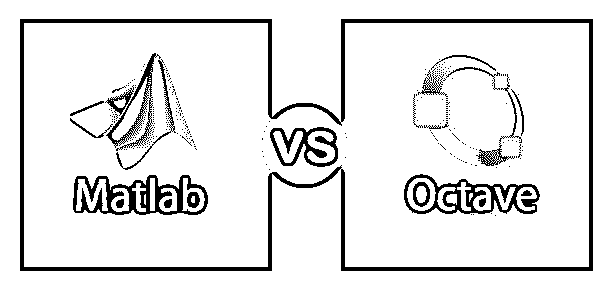
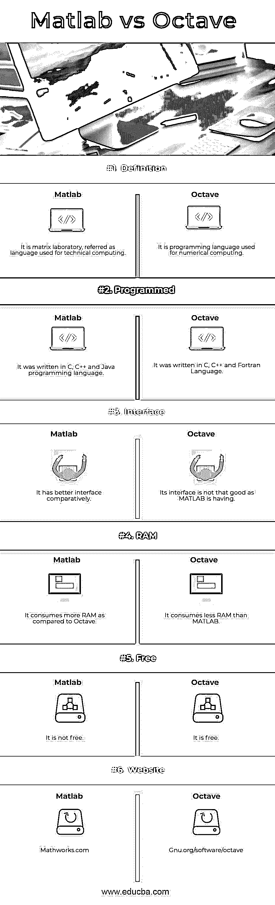

# Matlab vs Octave

> 原文：<https://www.educba.com/matlab-vs-octave/>

## Matlab 和 Octave 的区别

MatLab 一般被称为矩阵实验室。它是一种用于技术计算的高性能语言。它是一种多范例编程语言，支持函数式、命令式、过程式和面向对象的语言。它是由克里夫·莫勒设计的。它是由 Math Works 开发的。八度也被称为 GNU 八度。它有大约 19 种语言版本。它主要用于数值求解线性和非线性问题，对于执行数值实验，它主要与 MATLAB 兼容。它是 Matlab 的免费替代品之一。Octave 也被称为结构化编程语言，它支持常见的 C 标准库函数，也支持某些 UNIX 系统调用和函数。

### Matlab

*   Matlab 正被用于各种方面，如数学和计算、算法开发、数据分析、探索和可视化、建模、模拟和原型制作、包括用户界面构建在内的应用程序开发。最初开发它是为了方便访问 matrix 软件。Matlab 最初发布于 1984 年。它是用 C、C++和 Java 编写的。它支持多操作系统，如 Windows、Mac OS 和 Linux。它主要是基于数值计算类型。
*   在 Matlab 中，有五个组成部分，它们是 Matlab 语言，因为这是一种高级矩阵/数组语言，具有控制流语句、函数、数据结构、I/O 和面向对象的功能。另一个是 Matlab 环境，因为这是一套与用户或程序员一起工作的工具和设施。处理图形，包括用于二维和三维数据可视化、图像处理、动画和呈现图形的高级命令。MatLab 函数库和 MatLab API 提供了大量的计算算法和库，允许您编写与 MatLab 交互的 C 和 Fortran 程序。

### 八度音阶

*   Octave 主要是可扩展的，因为它使用动态可加载模块。它使用一个解释器来执行 octave 脚本语言。其解释器具有基于 Open GL 的图形，用于创建绘图、图形、图表，并保存和打印这些图形。除了传统的命令行界面之外，它还包括图形用户界面。它是一种高级编程语言，主要用于计算数值。它是由约翰·w·伊顿开发的。它最初发布于 1980 年。它是用 C、C++和 Fortran 编写的。
*   它主要由函数调用或脚本组成。它的语法主要是基于矩阵的，为矩阵运算提供了各种函数。Octave 确实支持各种数据结构和面向对象的编程。它有很好的特性，并与其他语言兼容，如 MATLAB 的语法和功能兼容性。它还具有其他特性，如内置复数支持、强大的内置数学函数、丰富的函数库以及用户自定义函数。

### **Matlab 和 Octave** 的面对面比较(信息图)

下面是 Matlab 和 Octave 的 6 大区别

<small>Hadoop、数据科学、统计学&其他</small>

### Matlab 和 Octave 的主要区别

Matlab vs Octave web service 都是市场上的热门选择；让我们讨论一些主要的区别:

1.  MatLab 不支持 C 风格的自动递增和赋值运算符。Octave 做了 C 风格的自动递增和赋值操作符，比如 i++、++i 等等。
2.  Matlab 对布尔值的计算有不同的反应，比如语法形式，它会说这是不支持的形式。当 ans=0 时，Octave 对同一事物的反应是不同的。
3.  Matlab 可以执行从命令行调用的目录中的文件。新版本也支持这些方式，但旧版本的 octave 不支持同样的方式。
4.  在 MatLab 中”！字符串”语法用命令字符串调用 shell。但是 octave 不识别“！”作为系统调用，因为它用于逻辑运算。
5.  在 Matlab 中，允许加载空文件。在 Octave 中，它不允许加载空文件。
6.  Matlab 只支持 fprintf 作为打印到屏幕的命令。Octave 支持 printf 和 fprintf 作为打印到屏幕的命令。
7.  在 MatLab 中，转置运算符前不允许有空格。在 Octave 中，它允许空白。
8.  在 Matlab 中，它总是需要…来进行行延续。在 octave 中，没必要把它们…
9.  在 Matlab 中，可以像 a = b+1，c=a 这样赋值，在 octave 中，可以写成 c=a=b+1。
10.  在 Matlab 中，我们可以使用' ~ '，而不是'！'.在 Octave 中，它允许用户同时使用~和！带有布尔值。
11.  在 Matlab 中，它使用百分号“%”开始注释。在 Octave 中，它交替使用散列符号#和百分号%。
12.  Matlab 使用^求幂，但 octave 可以使用^或**
13.  Matlab 使用端到端块。Octave 可以使用 end 或用 endif 或指定块
14.  Matlab 有一个非常好的接口，但是在 4.0 版 octave 有了默认接口后，octave 在早期版本中缺少接口。

### Matlab 与倍频程对照表

让我们讨论 Matlab 与 Octave 之间的比较如下:

| **基本比较** | **Matlab** | **八度音阶** |
| **定义** | 这是一个矩阵实验室，被称为用于技术计算的语言。 | 它是用于数值计算的编程语言。 |
| **已编程** | 它是用 C、C++和 Java 编程语言编写的。 | 它是用 C、C++和 Fortran 语言编写的。 |
| **界面** | 它有比较好的界面。 | 它的界面没有 MATLAB 的好。 |
| **RAM** | 与 Octave 相比，它消耗更多内存。 | 它消耗的内存比 MATLAB 少。 |
| **免费** | 它不是免费的 | 它是免费的 |
| **网站** | Mathworks.com | Gnu.org/software/octave |

### 结论

MATLAB vs Octave 主要用于同样的目的。主要区别是语法和其他特性。Matlab 由不属于 Octave 的专用工具箱组成。它们并不完全兼容，也就是说，用 Matlab 编写的代码可能会在 octave 中崩溃，反之亦然。Matlab 的主要优势是有大量现成的工具。

octave 的主要目标是让用户自由选择使用哪个软件来运行他们的代码。它与 Matlab 有直接的兼容性。当交互运行时，octave 使用在内部缓冲区中键入的命令，以便可以调用和编辑它们。它对组织结构中的数据提供了有限的支持。

### 推荐文章

这是 Matlab 与 Octave 之间最大差异的指南。在这里，我们还讨论了 Matlab 与 Octave 的关键差异，包括信息图和比较表。你也可以看看下面的文章来了解更多

1.  [Python 与 Matlab 的区别](https://www.educba.com/python-vs-matlab/)
2.  [吉拉 vs 特雷罗](https://www.educba.com/jira-vs-trello/)
3.  [PowerShell vs Bash](https://www.educba.com/powershell-vs-bash/)
4.  [JSON vs AJAX——惊人的对比](https://www.educba.com/json-vs-ajax/)
5.  [JSON vs SOAP:差异](https://www.educba.com/json-vs-soap/)
6.  [PowerShell 与命令提示符的比较](https://www.educba.com/powershell-vs-command-prompt/)

