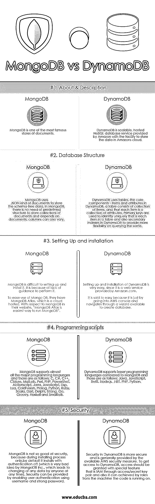

# MongoDB vs DynamoDB

> 原文：<https://www.educba.com/mongodb-vs-dynamodb/>

## **MongoDB 与 DynamoDB 的区别**

 **MongoDB 是一个用 C++编写的跨平台、免费、开源的面向 NoSQL 的数据库。MongoDB 对于大容量数据存储非常有用，它提供了高性能、高可用性以及自动伸缩。MongoDB 数据库将数据存储在一个称为集合的区域中，而不是存储在表中。这些是相当于 RDBMS 表的粗略数据。DynamoDB 提供了对键值和文档数据结构的支持，这使得性能快速且可预测，具有平滑、连续的可伸缩性。DynamoDB 在其设计原理中使用了 Dynamo 模型，这改进了它的特性。

### MongoDB

*   MongoDB 是由 MongoDB Inc(是一家美国软件公司)**设计开发的。它是在 GNU Affero 通用公共许可证和 Apache 许可证的组合和协调下发布的。MongoDB 于 2009 年 2 月发布，最新的稳定版本发布于 2018 年 6 月。**
*   通常，一个 MongoDB 服务器中有多个数据库。MongoDB 文档不支持 SQL，它支持高级的、丰富的和专门的查询语言。
*   MongoDB 是用 C++、C 和 JavaScript 编程语言编写的。MongoDB 可以方便地在以下操作系统中运行:Windows Vista 和更高版本、Linux、OS X 10.7 和更高版本、Solaris 和 FreeBSD。

### DynamoDB

*   DynamoDB 是一个完全托管的专有 NoSQL 数据库服务，该数据库服务由亚马逊作为亚马逊网络服务(AWS)的一部分提供。亚马逊 DynamoDB 也有其他的名字——例如，迪纳摩数据库或 DDB **。**
*   DynamoDB 由 Amazon.com 设计和开发，于 2012 年 1 月首次发布。它运行在跨平台的操作系统上。
*   DynamoDB 允许其用户创建能够存储和检索大量数据的数据库，并管理任意数量的流量。通过分发数据自动管理数据流量，并通过服务器动态管理每个客户的请求流量，还有助于保持和提高性能。
*   DynamoDB 最初开始管理网站的可伸缩性挑战，这些挑战是由假期负载带来的。DynamoDB 主要以其低延迟和可伸缩性而闻名。

### MongoDB 和 DynamoDB 的比较

下面是 MongoDB 和 DynamoDB 的 5 大区别:

<small>Hadoop、数据科学、统计学&其他</small>

### MongoDB 和 DynamoDB 的主要区别

让我们讨论一下 MongoDB 和 DynamoDB 之间的一些主要区别:

1.  MongoDB 是最著名的面向文档的数据库之一，而 DynamoDB 是可扩展的，由亚马逊提供的托管 NoSQL 数据库服务，具有将数据存储在亚马逊云中的功能。
2.  在 MongoDB 中，设置和安装过程比 DynamoDB 困难。据说这个过程很简单，因为只需进入 AWS 控制台，通过一个可用的向导来创建数据库。
3.  Mongo 数据库为用户定义的 Map/Reduce 方法提供了一些 API，而 Dynamo 数据库不支持 Map Reduce。
4.  服务器端脚本(即存储过程)可以在 MongoDB 中使用 JavaScript 实现，但在 DynamoDB 中不允许。
5.  Linux、OS X、Solaris 和 Windows 是支持 MongoDB 的服务器操作系统，而对于 DynamoDB，它是托管的 NoSQL 数据库服务。
6.  在 MongoDB 中，默认情况下数据是高度一致的，因为所有的读/写都是在 MongoDB 副本集中进行的，而 DynamoDB 中的数据默认情况下最终是一致的。同样，DynamoDB 用户可以配置读取操作，但这将是一项额外的费用(这几乎使读取成本翻倍，还增加了延迟。
7.  MongoDB 中包含本地文档验证特性，但是 DynamoDB 中没有数据验证特性。
8.  MongoDB 中的 MongoDB Atlas 包括连续的、可查询的备份，备份过程中提供时间点恢复。但是在 DynamoDB 中就不同了，因为它是 web 服务，他们提供基于按需和连续备份的额外收费的备份。
9.  MongoDB Atlas 的定价完全取决于 RAM、I/O 和存储的选择。但对 DynamoDB 来说，它是基于吞吐量的，这意味着价格将受到各种输入的影响。
10.  MongoDB 可以用在那些希望在数据库中支持大量用例、具有更大部署灵活性且没有平台限制的组织中。而 DynamoDB 可以用于那些正在寻找支持简单键值工作负载的数据库的组织，以及那些在 AWS 上投入大量资金并计划在未来改变其部署环境的组织。

### MongoDB 与 DynamoDB 对比表

下面是 MongoDB 和 DynamoDB 之间最上面的比较

| 【MongoDB 与 DynamoDB 的比较基础 | **MongoDB** | **DynamoDB** |
| **关于&的描述** | MongoDB 是最著名的文档存储库之一。 | DynamoDB 是一个可扩展的托管 NoSQL 数据库服务，由 Amazon 提供，可以将数据存储在 Amazon 的云中。 |
| **数据库结构** | MongoDB 使用 JSON 类型的文档来存储与模式无关的数据。在 MongoDB 中，不需要预定义的结构来存储文档集合，依赖于文档，列也可以不同。 | DynamoDB 使用表，即核心组件——项目和属性。在 DynamoDB 中，一个表由一组条目组成，每一个条目都是一组属性。主键用来唯一地标识表中的每一项，也是 DynamoDB 中的二级索引，以便在查询时提供更大的灵活性。 |
| **设置和安装** | MongoDB 很难设置和安装。这是因为缺乏执行它的指导。为了方便使用 Mongo DB，他们有 MongoDB Atlas **、**，这是一个云托管的。关于他们网站上的 MongoDB，“MongoDB Atlas 是运行 MongoDB 最简单的方法”。 | 设置和安装 DynamoDB 非常容易，因为它是由 Amazon.com 提供的网络服务。据说这很容易，因为只需进入 AWS 控制台，通过一个可用的向导进行导航，就可以创建数据库。 |
| **编程脚本** | MongoDB 支持几乎所有主要的编程语言，这些语言如下:
C、C#、C++、Clojure、MatLab、Perl、PHP、PowerShell、Actionscript、Java、JavaScript、Lisp、Lua、ColdFusion、Prolog、Python、Ruby、Scala、Dart、Delphi、Erlang、Go、Groovy、Haskell 和 Smalltalk。 | 与 MongoDB 相比，DynamoDB 支持较少的编程语言，如下所示:Java、JavaScript、Swift、Node.js。NET，PHP，Python。 |
| **安全** | MongoDB 在安全性方面不太好，因为仅在安装过程中，默认情况下它在关闭身份验证的情况下安装(这对 MongoDB Inc .来说是一个非常糟糕的想法，这会导致任何人在任何时间更改任何数据)。通过使用用户名和强密码启用用户认证，可以提供安全性。 | DynamoDB 中的安全性更安全，通常由可用的 AWS 安全措施提供。
要访问 DynamoDB，应通过访问/密钥对授予访问权限，这是 IAM 的特殊功能，也可以通过运行代码的机器上的角色来实现。 |

### 结论

在 MongoDB 和 DynamoDB 的竞争中，两者都是非常有竞争力的可靠数据库解决方案，因为 MongoDB 和 DynamoDB 数据库在一些领域各有利弊。以下是 MongoDB 和 DynamoDB 数据库中可以考虑选择的一些要点:

*   所有规模的组织都可以采用 MongoDB，因为它可以处理高度多样化的数据类型，并且可以更高效地管理这些应用程序。但是在 DynamoDB 中，这是非常有限的数据类型支持。
*   考虑到安全特性，与 MongoDB 相比，建议使用 DynamoDB。

下面是一些使用 MongoDB 与 DynamoDB 数据库的公司:

**迪纳摩数据库:** HTC、三星、亚马逊、网飞、Snapchat、纽约时报、电子艺界、AdRoll、Dropcam、Twiitch、Clubhouse、Shazam、Twilio、Localytics 等众多公司。

思科、Adobe、SAP、谷歌、UPS、易贝、博世、脸书、福布斯等众多公司。

### 推荐文章

这是 MongoDB 和 DynamoDB 之间主要区别的指南。在这里，我们讨论了 MongoDB 与 DynamoDB 的直接比较、关键差异以及信息图和比较表。您也可以看看以下文章，了解更多信息–

1.  [MongoDB 与 Oracle 的有用区别](https://www.educba.com/mongodb-vs-oracle/)
2.  [Node.js vs Java 性能](https://www.educba.com/node-js-vs-java-performance/)
3.  [MongoDB vs PostgreSQL 热门对比](https://www.educba.com/mongodb-vs-postgresql/)
4.  [MongoDB vs SQL:差异](https://www.educba.com/mongodb-vs-sql/)
5.  [Go 与 Erlang |特性，以及 Go 与 Erlang 的比较](https://www.educba.com/go-vs-erlang/)
6.  [MongoDB 与 Elasticsearch 的对比](https://www.educba.com/mongodb-vs-elasticsearch/)

**