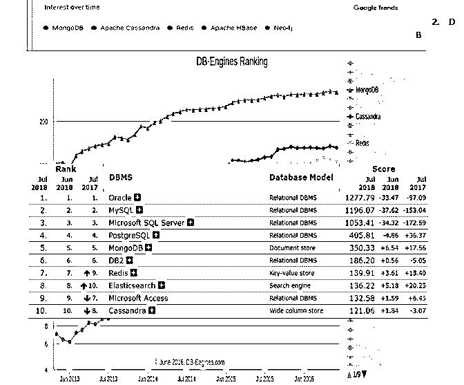
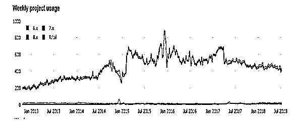
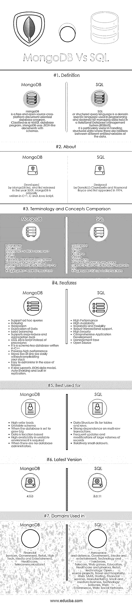

# MongoDB vs SQL

> 原文：<https://www.educba.com/mongodb-vs-sql/>

## MongoDB 与 SQL 的区别

在当今由现代企业驱动的世界中，企业不断寻找管理或存储数据的方法。这可能是为了获得客户洞察力，了解不断变化的用户期望，或者用新的应用程序和模型击败竞争对手。这导致了关系数据库早期假设的变化。主要驱动因素是

*   对更高开发效率和更快上市时间的需求。
*   需要管理新的和快速变化的数据类型的大量增加。
*   向分布式系统和云计算的大规模转移。

这就产生了像 MongoDB 这样的非表格数据库。MongoDB 是一个免费的开源跨平台面向文档的数据库程序。作为一个 NoSQL 数据库程序，MongoDB 使用类似 JSON 的文档和模式。NoSQL 数据库提供了一种存储和检索数据的机制，这种数据的建模方式不同于关系数据库中使用的表格关系。

<small>Hadoop、数据科学、统计学&其他</small>

**1。随着时间的推移，对 DB 引擎的兴趣和排名的变化**

**2。从 2013 年 1 月到 2018 年 7 月的几周内 MongoDB 的使用情况**

### MongoDB 和 SQL 之间的直接比较

下面是 MongoDB 和 SQL 的 7 大区别:

### MongoDB 和 SQL 的主要区别

让我们讨论一下 MongoDB 和 SQL 之间的一些主要区别:

*   在 MongoDB 中，数据被表示为 JSON 文档的集合，而在 MySQL 中，数据存储在表和行中。
*   说到查询，我们必须在 DB 系统解析的查询语言中放入一个字符串。查询语言被称为结构化查询语言。另一方面，MongoDB 的查询是面向对象的，这意味着您传递给 MongoDB 一个解释您正在查询的内容的文档，并且没有解析。
*   SQL 的一大好处是 Join 语句，它允许跨多个表进行查询。另一方面，MongoDB 不支持连接，而是支持文档和数组等多维数据类型。
*   在 SQL 中，我们可以将一个文档放在另一个文档中。在 MongoDB 中，我们在一个帖子中有一个评论数组和一个帖子集合。
*   SQL 支持原子事务。在一个事务中可以有多个操作，并且可以像只有一个操作一样回滚。MongoDB 不支持事务，单一操作是原子性的。
*   在 MongoDB 中，我们不需要定义模式。我们可以把文件放进去。对于 SQL，我们需要在存储之前定义表和列。
*   MongoDB 没有报告工具，即性能测试和分析并不总是可能的。在 SQL 中，我们有几个报告工具。

### MongoDB 和 SQL 比较表

下面讨论 MongoDB 和 SQL 之间的主要比较。

| 【MongoDB 与 SQL 的比较基础 | **SQL** | **MongoDB** |
| **定义** | SQL 或结构化查询语言是在编程中使用的领域特定语言，设计用于管理关系数据库管理系统(RDBMS)中保存的数据。它在处理结构化数据时特别有用，在结构化数据中，数据的不同实体/变量之间存在关系。 | MongoDB 是一个免费的开源跨平台面向文档的数据库程序。作为一个 NoSQL 数据库程序，MongoDB 使用类似 JSON 的文档和模式。 |
| **关于** | 由唐纳德设计。1974 年首次出现。 | MongoDB 由 MongoDB Inc .开发，于 2009 年首次发布，主要用 C++、C 和 Java 脚本编写。 |
| **术语和概念对比** | 

1.  database
2.  table
3.  line
4.  row
5.  index
6.  Table join
7.  Primary key-Specify any unique column or combination of columns as the primary key.
8.  [Aggregation (grouping by)
9.  trade

 | 

1.  database
2.  gather
3.  Or BSON documents.
4.  field
5.  index
6.  $ find, embed documents
7.  Primary key-In MongoDB, the primary key is automatically set as the id field.
8.  Polymerization pipeline
9.  affairs

 |
| **特性** | 

*   high-performance
*   High availability
*   Scalability and flexibility
*   Robust transaction support.
*   High security
*   Comprehensive application development
*   Ease of management
*   open-source

 | 

*   Support ad hoc query
*   index
*   copy
*   repeating data
*   load balancing
*   Support mapping reduction and aggregation tools
*   Use JavaScript instead of procedures.
*   This is a modeless database written in C++
*   Provide high performance
*   Easily store files of any size without complicating your stack.
*   Easy to manage

 |
| **最适合用于** | 

*   The data structure is suitable for tables and rows.
*   Strong reliance on multi-line transactions.
*   Frequently update and modify large-capacity records.
*   A relatively small data set.

 | 

*   High write load
*   Unstable mode
*   When the database is set to grow large
*   Data location-based
*   High availability is required in unstable environments.
*   When there is no database administrator.

 |
| **最新版本** | 8.0.11 | 4.0.0 |
| 中使用的**域** | 航空航天和国防，政府，媒体和娱乐，技术和硬件，电信，网页游戏，教育，医疗保健和制药，零售，技术:开源项目，旅游和酒店，Web: SAAS，托管，金融服务，制造业，中小型企业，技术:软件，Web:电子商务，Web:社交网络。 | 金融服务、政府、零售、高科技、媒体和娱乐、医疗保健、电信 1 |

### 结论

当在选择 MongoDB 还是 SQL 的问题上进退两难时，公司需要记住他们的数据量和需求。SQL 更适合小型数据集，而 MongoDB 能够处理大型非结构化数据集。SQL 因其高性能、灵活性、可靠的数据保护、高可用性和易管理性而得到认可。另一方面，MongoDB 是一个首选的解决方案，因为它具有开放和简单的理念以及协作和有益的社区。如果您的数据是非结构化的、复杂的，没有预先确定的模式，并且您需要处理大量数据并将其存储为文档，那么 MongoDB 可能比 SQL 更受欢迎。

### 推荐文章

这是 MongoDB 和 SQL 之间最大区别的指南。在这里，我们还将讨论 MongoDB 与 SQL 的直接差异、关键差异以及信息图和比较表。您也可以看看下面的 MongoDB vs SQL 文章来了解更多信息

1.  [MongoDB 与 Hadoop 的差异](https://www.educba.com/hadoop-vs-mongodb/)
2.  [MongoDB vs PostgreSQL](https://www.educba.com/mongodb-vs-postgresql/)
3.  [MySQL 与 NoSQL 的有益对比](https://www.educba.com/mysql-vs-nosql/)
4.  [Oracle vs PostgreSQL](https://www.educba.com/oracle-vs-postgresql/)
5.  [MySQL vs MongoDB:特点](https://www.educba.com/mysql-vs-mongodb/)
6.  [MongoDB vs elastic search 指南](https://www.educba.com/mongodb-vs-elasticsearch/)

