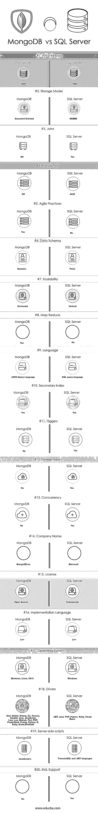

# MongoDB vs SQL server

> 原文：<https://www.educba.com/mongodb-vs-sql-server/>

## MongoDB 和 SQL Server 的区别

基本上有两种类型的数据库:SQL 和 NoSQL。SQL 数据库的例子是 MySQL，NoSQL 是 MongoDB。MongoDB 将数据存储在 JSON 类文档中，这种文档的结构可以变化，提供了一种动态、灵活的模式。MongoDB 还通过自动分片实现了高可用性和可伸缩性。SQL Server 是用于电子商务和数据仓库解决方案的数据库管理和分析系统。MongoDB 是在用于大容量数据存储的 NoSQL 数据库下兴起的几个数据库之一。MongoDB 不是使用表行作为关系数据库，而是基于集合和文档的架构。在 MongoDB 中，行(或在 MongoDB 中调用的文档)不需要预先定义模式。相反，可以动态创建字段。MongoDB 中可用的数据模型允许您更容易地表示层次关系、存储数组和其他更复杂的结构。

### MongoDB 的历史

*   MongoDB 由 Inc 开发，由 GNU Affero 通用公共许可证和 Apache 许可证发布。
*   第 10 代软件组织开始开发 MongoDB，将其作为计划中的平台即服务产品的一个组件。
*   该公司在 2009 年选择了开源开发模式，并在 2013 年成为 MongoDB.Inc。

#### MongoDB

**"** MongoDB 是用 C++编写的开源、跨平台的 NoSQL 文档数据库，提供高性能、高可用性和高可伸缩性。"

<small>Hadoop、数据科学、统计学&其他</small>

让我们讨论一下这个定义中每个术语的含义

*   **高性能-** 这意味着它提供更快的读写扫描。
*   **高可用性**-许多复制的服务器用于无延迟地提供数据的高可用性
*   **可扩展性-** 自动分片将收集的数据分布在机器上，最终，一致的读取扫描可以分布在复制的服务器上。

为什么是 NoSQL 数据库？

它是一种 NoSQL 数据库文档存储数据库**。**

MongoDB 避免了传统的基于表的关系数据库结构，而是支持带有动态模式的 JSON 类文档，使得在某些类型的应用程序中集成数据变得更加容易和快速。

**MongoDB 的特性**

MongoDB 有三个主要的重要特性使其独一无二

*   灵活性
*   可量测性
*   表演

1.  **灵活性-** 您可以在 MongoDB 中强制执行任何类型的数据。MongoDB 中的数据具有灵活的模式。集合不强制文档结构。这种灵活性为您提供了动态匹配应用程序及其性能需求(pdf、音频、视频)的数据建模选择。因此，它可以在不停机的情况下动态修改模式。
2.  **可扩展性-** 这意味着你应该能够满足数据增长的消耗。它可以被定义为“系统处理不断增长的工作量的能力”**。**随着 MongoDB 中数据量的增加，进程分片通过水平扩展解决了这个问题**。**
3.  **性能-** MongoDB 表现不错。随着查询数量的增加，SQL 需要更多的时间来执行这些查询，但是在这种情况下，MongoDB 的性能会更好。有各种因素导致了 MongoDB 的高性能，它提供了文档的嵌入**。**它避免了连接的概念，并提供了数据索引**。**

### 什么是 SQL Server？

SQL Server 是微软的关系数据库管理系统(RDBMS)。竞争对手是 Oracle DB 和 MySQL。它支持 32 位和 64 位环境。它也被称为 MSSQL 和 Microsoft SQL Server。下面给出了有关 SQL Server 的更多详细信息:

*   它的第一个版本由微软在 1989 年发布。
*   它支持 XML 数据类型支持、动态管理视图和数据库镜像。
*   它支持电子商务和数据仓库。
*   它有几个版本:企业版、标准版、网络版、商业智能版、快速版。

### MongoDB 和 SQL Server 之间的直接差异(信息图表)

以下是 MongoDB 和 SQL Server 之间的 20 大区别:

### MongoDB 和 SQL Server 之间的主要区别

MongoDB vs SQL Server 性能都是市场上的热门选择；让我们讨论一下 MongoDB 和 SQL Server 之间的一些主要区别:

*   与 SQL server 相比，MongoDB 速度更快，可伸缩性更好。
*   MongoDB 不支持连接和全局事务，但是 SQL server 支持。
*   MongoDB 支持大量数据，但 MS SQL server 不支持。
*   MongoDB 支持敏捷实践，但 MS SQL server 不支持。
*   MongoDB 模式是动态的，但 MS SQL server 模式是固定的。
*   Ms. SQL server 提供 XML 支持，但 MongoDB 不提供。

### mongodb 和 sql server 比较表

下面是 MongoDB 和 SQL Server 的对比表。

| **比较基数** | **MS SQL Server** | **MongoDB** |
| **初始发布** | One thousand nine hundred and eighty-nine | Two thousand and nine |
| **存储模式** | 关系型数据库管理系统 | 面向文档 |
| **加入** | 是 | 不 |
| **交易** | 酸 | 不 |
| **敏捷实践** | 不 | 是 |
| **数据模式** | 固定的 | 动态的 |
| **可扩展性** | 垂直的 | 水平的 |
| **地图缩小** | 不 | 是 |
| **语言** | SQL 查询语言 | JSON 查询语言 |
| **二级指标** | 是 | 是 |
| **触发器** | 是 | 不 |
| **外键** | 是 | 不 |
| **并发** | 是 | 不 |
| **公司名称** | 微软公司(全球知名的 PC 软件主要厂商) | MongoDB。股份有限公司 |
| **执照** | 商业 | 开放源码 |
| **实现语言** | C++ | C++ |
| **操作系统** | Windows 操作系统 | Windows、Linux、OS X |
| **司机** | **.**NET, Java, PHP, Python, Ruby, Visual Basic | Dart, Delphi, Erlang, Go, Groovy, Haskell, Java, JavaScript, Lisp, Lua, MatLab, Perl, PHP, PowerShell, Prolog, Python, R, Ruby, Scala, Smalltalk |
| **服务器端脚本** | Transact SQL 和。网络语言 | java 描述语言 |
| **XML 支持** | 是 | 不 |

### 结论

MongoDB 是一个 NoSQL 数据库，它更先进，能够处理更多的数据。SQL Server 是一个数据库管理系统，用于管理关系数据库系统。

### 推荐文章

这是 MongoDB 和 SQL Server 之间最大区别的指南。在这里，我们还将讨论信息图和比较表的主要区别。您也可以看看下面的 MongoDB vs SQL Server 文章来了解更多信息

1.  [MongoDB 与 Hadoop–惊人的对比](https://www.educba.com/hadoop-vs-mongodb/)
2.  [MySQL vs SQL Server](https://www.educba.com/mysql-vs-sql-server/)
3.  [Postgres](https://www.educba.com/mongodb-vs-postgres/)[vs MongoDB——最大差异](https://www.educba.com/mongodb-vs-postgres/)
4.  [SQL Server 面试问题:指南](https://www.educba.com/sql-server-interview-questions/)
5.  [DBMS 和 RDBMS 的区别](https://www.educba.com/dbms-vs-rdbms/)
6.  [Go vs Erlang | Go vs Erlang 的特点和对比](https://www.educba.com/go-vs-erlang/)
7.  [MongoDB 与 Elasticsearch 的对比](https://www.educba.com/mongodb-vs-elasticsearch/)

