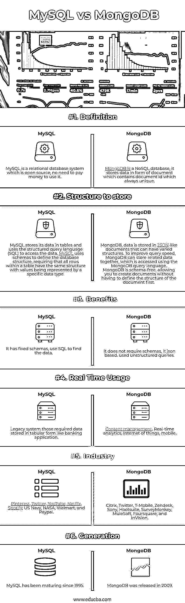

# MySQL vs MongoDB

> 原文：<https://www.educba.com/mysql-vs-mongodb/>

## MySQL 和 MongoDB 的区别

MySQL 是一个用于 Web 开发的数据库系统，MySQL 是由瑞典公司 MySQL AB 开发、销售和支持的。MySQL 非常快速，易于使用。它使用众所周知的 SQL 数据语言的标准形式。它支持大型数据库，一个表中有多达 5000 万行或更多。MongoDB 是一个 NoSQL 数据库，它是一个跨平台、面向文档的数据库，提供了高可用性、高性能和易伸缩性。MongoDB 致力于集合和文档的概念。

### 关系型数据库

*   你不用为使用它付费，因为 MySQL 是在开源许可下发布的。它可以在许多操作系统和许多语言上工作，包括 C++、JAVA、PHP、PERL、C 等等。开源 GPL 许可允许程序员修改 MySQL 软件以适应他们自己的特定环境。
*   一个表的默认文件大小限制是 4GB，我们可以将这个限制增加到理论上的 800 万 TB。它的工作速度非常快，即使在大型数据集上也能很好地工作。它处理最昂贵和最强大的数据库包的大部分功能。
*   它可以在许多平台上编译。它以联合创始人蒙蒂·维德纽斯的女儿命名:我的。数据存储在 MySQL 表中，表是相关数据的集合。表有行和列来存储数据，表通过不同的键如主键、外键等来关联。

### MongoDB

*   集合是一组 MongoDB 文档。它相当于 RDBMS 表。集合存在于单个数据库中。集合不强制架构。
*   文档是一组键值对。文档有一个动态模式。动态模式意味着同一集合中的文档不需要具有相同的字段或结构集，并且集合文档中的公共字段可以保存不同类型的数据。

MySql 在表格中存储日期，示例如下

<small>Hadoop、数据科学、统计学&其他</small>

| 身份证明 | 西方人名的第一个字 | 姓 | 年龄 | 电子邮件 |
| Three hundred and twelve | 约翰 | 罗伊 | Forty-four | john@gmail.com |

MongoDB 将数据存储在表单文档中，示例如下。

{

_id: ObjectId(7df38ad8902c)

标题:“MongoDB 测试”，

描述:“MongoDB 不是 sql DB”，

由:“由我”，

网址:' http://www.xyz.com '，

**MySQL vs MongoDB**

标签:['mongodb '，'数据库'，' NoSQL']，

喜欢:100，

评论:[

{

用户:“用户 1”，

信息:“想问问题”，

创建日期:新日期(2011 年 1 月 21 日 2 月 15 日)，

喜欢:0

},

{

用户:“用户 2”，

消息:“我们将如何使用请帮助我”，

创建日期:新日期(2011 年 1 月 27 日 7 月 45 日)，

喜欢:5

}

]

}

在上面的 documents _id 是一个 12 字节的十六进制数，它保证了每个文档的唯一性。我们可以在插入文档时提供 _id。如果我们不提供，那么 MongoDB 会为每个文档提供一个惟一的 id。这 12 个字节的前 4 个字节用于当前时间戳，接下来的 3 个字节用于机器 id，接下来的 2 个字节用于 MongoDB 服务器的进程 id，剩下的 3 个字节是简单的增量值。

### MYSQL 和 MongoDB 的正面比较(信息图)

以下是 MYSQL 和 MongoDB 之间的 6 大区别:

### MYSQL 和 MongoDB 的主要区别

让我们讨论一下 MYSQL 和 MongoDB 之间的一些主要区别:

MySQL 中的**:如果没有定义索引，数据库引擎必须扫描整个表来找到所有相关的行。**

 ****在 MongoDB** 中:如果没有找到索引，必须扫描集合中的每个文档，以选择与查询语句匹配的文档。

**从客户表中选择记录:**

**在 MySQL** 中:SELECT * FROM customer **在 MongoDB** 中:db.customer.find()

**将记录插入客户表:**

**在 MySQL** 中:插入到客户(cust_id，branch，status)值(' appl01 '，' main '，' A ')

**在 MongoDB** 中:db . customer . insert({ cust _ id:' appl 01 '，branch: 'main '，status: 'A' })

**更新客户表中的记录:**

在 MySQL 中:更新客户设置 branch =‘main’WHERE custage>2

**在 MongoDB** 中:db . customer . update({ custage:{ $ gt:2 } }，{ $set: { branch: 'main' } }，{ multi: true })

MySQL 是用 C 和 C++编写的，包含以下系统的二进制文件:微软 Windows、OS X、惠普 UX、Linux、AIX、BSDi、FreeBSD、IRIX、NetBSD 等等。

MongoDB 是用 C++、C 和 JavaScript 编写的，包含适用于以下系统的二进制文件:Linux、OS X、Solaris 和 Windows。

**MySQL** : MySQL 支持主从复制和主-主复制(从 MySQL 5.7.6 及更高版本开始)。多源复制允许您从几个主服务器并行复制。

MongoDB : MongoDB 支持内置复制、分片和自动选举。使用自动选举，您可以设置一个辅助数据库，以便在主数据库出现故障时自动接管。分片允许水平伸缩，这在 MySQL 中很难实现。

### MYSQL 和 MongoDB 对照表

下面是 MYSQL 和 MongoDB 的对比表。

| **比较的基础** | **MYSQL** 的实现 | **MongoDB** |
| **定义** | MySQL 是一个关系数据库系统，它是开源的，使用它不需要付费。 | MongoDB 是一个 NoSQL 数据库，它以文档的形式存储数据，其中包含一个唯一的文档 id。 |
| **存储结构** | MySQL 将其数据存储在表中，并使用结构化查询语言(SQL)来访问数据。MySQL 使用模式来定义数据库结构，要求表中的所有行都具有相同的结构，值由特定的数据类型表示。 | MongoDB，数据存储在类似 JSON 的文档中，这些文档可以有不同的结构。为了提高查询速度，MongoDB 可以将相关数据存储在一起，使用 MongoDB 查询语言访问这些数据。MongoDB 是无模式的，允许您创建文档，而不必首先定义文档的结构。 |
|  **好处** | 它有固定的模式，使用 SQL 查找数据 | 它不需要模式，它基于 json。使用非结构化查询。 |
| **实时使用量** | 遗留系统是指那些以表格形式存储的所需数据，如银行应用程序。 | 内容管理，实时分析，物联网，移动。 |
| **行业** | Pinterest、Twitter、YouTube、网飞、Spotify、美国海军、NASA、沃尔玛和 Paypal | Citrix、Twitter、T-Mobile、Zendesk、索尼、Hootsuite、SurveyMonkey、MuleSoft、Foursquare 和 InVision |
| **代** | MySQL 从 1995 年开始走向成熟。 | MongoDB 发布于 2009 年。 |

### 结论

MySQL vs MongoDB 各有利弊。哪一个必须使用完全取决于我们的项目要求。如果我们处理维护用户交易的银行系统或遗留系统，在这些情况下，MySQL 选择将是最佳选择，而在物联网、移动、内容管理、分析的情况下，MongoDB 将是最佳选择。

### 推荐文章

这是 MYSQL 和 MongoDB 之间最大区别的指南。在这里，我们还将讨论 MYSQL 和 MongoDB 的主要区别，以及信息图和比较表。你也可以看看下面的 MYSQL vs MongoDB 文章来了解更多信息

1.  [MySQL vs MSSQL](https://www.educba.com/mysql-vs-mssql/)
2.  [MongoDB vs 甲骨文](https://www.educba.com/mongodb-vs-oracle/)
3.  [SQL Server](https://www.educba.com/mysql-vs-sql-server/) [vs MySQL](https://www.educba.com/mysql-vs-sql-server/)
4.  [数据库管理系统和关系数据库管理系统](https://www.educba.com/dbms-vs-rdbms/)

**