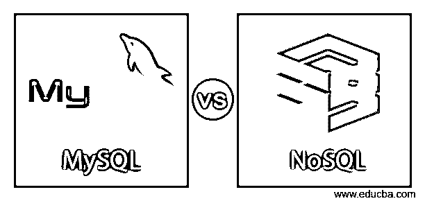
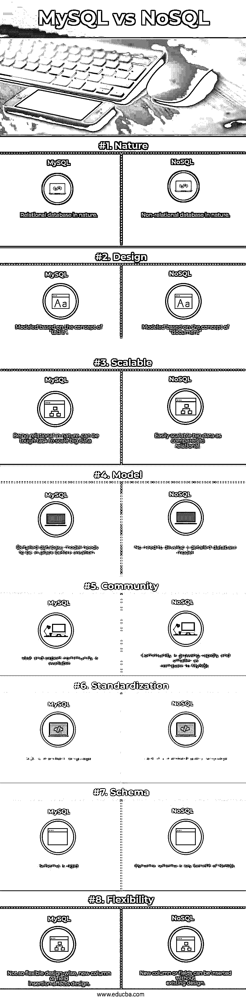

# MySQL vs NoSQL

> 原文：<https://www.educba.com/mysql-vs-nosql/>

## MySQL 和 NoSQL 的区别

MySQL 用于 SQL 数据库管理系统，这是微软公司的产品，在 NoSQL 是一种数据库类型，其中 SQL 是访问非关系数据库管理系统的基于文档的内容所必需的。结构化和标准化数据库对于使用 MySQL 的关系数据库至关重要。另一方面，NoSQL 允许按照用户的要求放置和操作无格式和不相关的数据。

### 关系型数据库

*   MySQL 开发项目已经根据 GNU 通用公共许可证的条款以及各种专有协议提供了其源代码。最初，MySQL 由一家名为 MySQL AB 的瑞典公司拥有和赞助，该公司现归甲骨文公司所有。
*   MySQL 本质上是关系型的，因为所有数据都存储在不同的表中，并且使用主键或其他称为外键的键来建立关系。
*   MySQL 是一种快速、易于使用的关系数据库，被大企业和小企业很好地利用。像 MySQL 这样的关系数据库的流行背后有很多原因。它本身就是一个非常强大的程序，可以处理最昂贵和最强大的数据库包的大部分功能。
*   正在使用的标准语言形式是一种众所周知的数据语言，称为 MySQL 数据库的 SQL。它可以在多种操作系统和许多语言上工作，如 C++、PHP、Java、C 等。MySQL 的一个关键优势是它是可定制的，因为开源 GPL 许可允许程序员修改 MySQL 软件以适应他们自己的特定环境。

### NoSQL

*   NoSQL 数据库使用的数据结构与关系数据库中使用的数据结构有很大不同。在 NoSQL，一些操作比关系数据库如 MySQL 更快。NoSQL 数据库使用的数据结构也可以被视为比关系数据库更加灵活和可伸缩。
*   这种不同数据结构的主要原因可能是设计的简单性、对机器集群的更简单的水平扩展以及对可用性的更多控制。
*   NoSQL 数据库主要用于大数据和实时网络应用。这些类型的数据库在 21 世纪早期获得了极大的普及。这种突然激增的主要原因可以说是由脸书、亚马逊和谷歌等公司引发的。
*   大多数 NoSQL 数据库由最终一致性驱动，这意味着数据库更改会在几毫秒内传播到所有节点，因此数据查询可能不会立即返回更新的数据，这就是所谓的过时读取问题。NoSQL 数据库的一个中心概念围绕着“文档”。
*   虽然每个面向文档的数据库实现在定义的细节上有所不同，但它们都假定文档以某种标准的编码格式封装和编码数据。
*   文档在数据库中通过代表文档的唯一键来寻址。除了由键值存储执行的键查找之外，数据库还提供了 API 或查询语言，可以根据文档的内容检索文档。

### MySQL 和 NoSQL 的正面比较(信息图)

以下是 MySQL 和 NoSQL 之间的 8 大区别

<small>Hadoop、数据科学、统计学&其他</small>

### MySQL 和 NoSQL 的主要区别

两者都是市场上的热门选择；让我们讨论一些主要的区别:

*   MySQL 是基于表格设计的关系数据库，而 NoSQL 本质上是基于文档设计的非关系数据库。
*   MySQL 已经建立了一个数据库，覆盖了巨大的 IT 市场，而 NoSQL 数据库是最新的，因此仍然在大型 IT 巨头中受到欢迎。
*   MySQL 数据库及其固定的市场包含了一个巨大的社区，而 NoSQL 数据库的社区相对较短。
*   MySQL 由于其严格的模式限制而不容易扩展，而 NoSQL 由于其动态模式特性而容易扩展。
*   在 MySQL 中创建数据库之前需要详细的数据库模型，而在 NoSQL 数据库类型的情况下不需要详细的建模。
*   MySQL 是关系数据库的一种，而 NoSQL 更多的是基于设计的数据库类型，例如 MongoDB、Couch DB 等。
*   MySQL 提供了大量的报告工具来帮助应用程序的有效性，而 NoSQL 数据库缺乏用于分析和性能测试的报告工具。
*   MySQL 是一个关系数据库，其设计限制不够灵活，而 NoSQL 本质上是非关系数据库，与 MySQL 相比，它提供了更灵活的设计。
*   MySQL 和一种叫做 SQL 的标准查询语言一起使用，而 NoSQL 类数据库缺少一种标准查询语言。
*   像关系数据库一样的 MySQL 可能会为大量数据带来性能问题，因此需要优化查询，而像 MongoDB 这样的 NoSQL 数据库即使在数据集非常大的情况下性能也很好。

### MySQL 与 NoSQL 对比表

MySQL 和 NoSQL 的主要比较如下:

| ****的基础比较**** | **MySQL** 的实现 | **NoSQL** |
| 自然 | 本质上是一种关系数据库 | 本质上是非关系数据库 |
| 设计 | 基于“表”的概念建模 | 基于“文档”的概念建模 |
| 可攀登的 | 本质上是关系型的，扩展大数据可能是一项艰巨的任务 | 与关系型数据相比，大数据易于扩展 |
| 模型 | 详细的数据库模型需要在创建之前到位 | 不需要开发详细的数据库模型 |
| 社区 | 一个庞大的专家社区是可用的 | 与 MySQL 相比，一个社区正在迅速发展，而且规模越来越小 |
| 标准化 | SQL 是标准语言 | 缺乏标准的查询语言 |
| (计划或理论的)纲要 | 模式是僵化的 | 动态模式是 NoSQL 的一个主要优点 |
| 灵活性 | 在设计方面不够灵活，新的列或字段插入会影响设计 | 可以在没有现有设计的情况下插入新的列或字段 |

### 结论

在 MySQL 和 NoSQL 的对比中，我们看到 NoSQL 数据库正在成为当今数据库领域的主要部分。它具有多重优势，如大数据级别的性能、可扩展性和设计灵活性等。因此，在即将到来的 IT 市场中，他们可以成为真正的游戏规则改变者。其他属性，如较低的成本和开源特性，使 NoSQL 成为许多寻求集成大数据的公司的一个有吸引力的选择。然而，NoSQL 仍然是一项年轻的技术，没有像 MySQL 这样的 SQL 数据库提供的标准集。

另一方面，MySQL 仍然覆盖着巨大的市场份额，因为它有一个标准的 SQL 语言，可以方便地访问和修改数据库。作为一个已建立的数据库，它有一个巨大的社区，有一个定义良好的说明和问题区域部分。因此，MySQL 数据库出现的一般问题可以通过其精通的社区轻松解决。

与任何重大业务决策一样，IT 领导也需要权衡他们的选择，从而得出两者之间的区别，即数据库中对他们来说重要的功能是什么。一些人可能认为 NoSQL 是通向未来的道路，而另一些人则担心它缺乏标准化。归根结底，选择取决于组织的复杂业务需求及其消耗的数据量。

### 推荐文章

这是 MySQL 和 NoSQL 之间最大差异的指南。在这里，我们还将讨论信息图和比较表的主要区别。您也可以看看以下 MySQL 与 NoSQL 的文章，了解更多信息——

1.  [微软 SQL vs MYSQL](https://www.educba.com/mysql-vs-mssql/)
2.  [NoSQL 面试问题](https://www.educba.com/nosql-interview-questions/)
3.  [NoSQL 技能的重要性&助力打造大数据事业](https://www.educba.com/what-is-nosql/)
4.  [MySQL 面试问题](https://www.educba.com/mysql-interview-questions/)
5.  [MySQL 与 SQL Server:有什么区别](https://www.educba.com/mysql-vs-sql-server/)
6.  [MySQL vs MongoDB:有什么好处](https://www.educba.com/mysql-vs-mongodb/)
7.  [SQL Server 面试问题:想知道有用的指南](https://www.educba.com/sql-server-interview-questions/)

