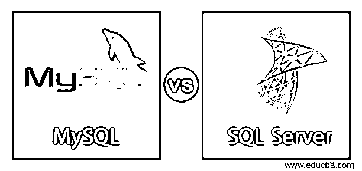
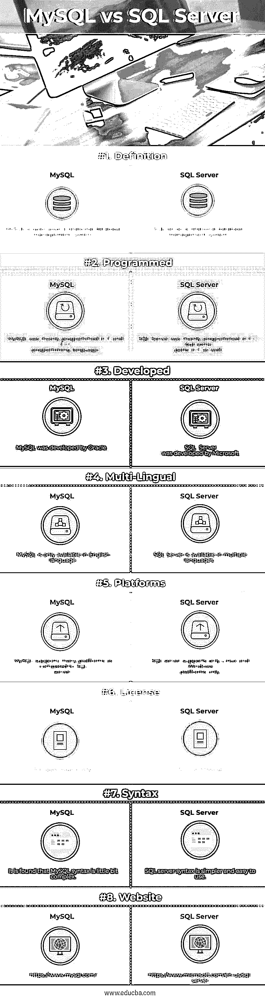

# MySQL 与 SQL Server

> 原文：<https://www.educba.com/mysql-vs-sql-server/>

## MySQL 和 SQL Server 的区别

MySQL 是数据库管理系统。它也被称为开源关系数据库管理系统(RDBMS)。它支持所有平台，如 Windows、Mac OS、Solaris、免费 BSD、Linux 等。它主要是用 C 和 C++编写的。它的类型是 RDBMS，并且只有英文版本。SQL Server 被定义为关系数据库管理系统(RDBMS)。它支持 Linux、Microsoft Windows 和 Windows server 平台。SQL Server 提供了与任何代码轻松连接的语言驱动程序。

### 关系型数据库

*   MySQL 是由瑞典公司 MySQL AB 创建的。这些特性包括跨平台支持、存储过程、触发器、游标、数据定义语言、ACID 兼容性、SSL 支持、可更新视图、分区、索引、选择、提交分组、Unicode 支持等等。
*   我的 SQL 有某些限制。在 MySQL 中，触发器被限制为每次只能执行一个动作。这意味着如果表上发生任何事件，只能在表上执行一个触发器。也不能在视图上定义触发器。另一个限制是 MySQL 不遵循完整的 SQL 标准。
*   MySQL 使用“mysqldump”备份工具，该工具支持从所有存储引擎备份数据。另一个 MySQL 备份软件程序是“XtraBackup ”,它是开源的。MySQL 可以运行在云上，也可以运行在亚马逊和微软 Azure 上。MySQL 可以作为服务使用

### SQL Server

*   SQL Server 也称为 MSSQL，意思是 Microsoft SQL Server。它是由微软开发的。它最初发布于 1989 年。它是用 C 和 C++写的。它有多种语言版本，如英语、日语、法语、西班牙语、中文等。
*   SQL Server 有许多版本，如企业版、基础版或标准版、Web 版、BI 版、工作组版和速成版。SQL Server 有许多特性，比如多个开发人员可以使用同一个数据库。数据库表模型用于存储记录或信息。语法非常简单，可以编写基本的查询，如插入、创建、更新和删除，也称为 CRUD 语句
*   SQL Server 提供了高可伸缩性，因为它既可用于大型应用程序，也可用于小型项目。它有助于处理每天数百万的交易。它在为应用程序检索数据时提供了更好的性能和更高的速度。SQL Server 也像 SSAS、SSRS、SSIS、SSNS 一样被用作服务。SQL Server 具有与 Visual studio 集成进行数据编程的功能。

### MySQL 和 SQL Server 的面对面比较(信息图表)

以下是 MySQL 和 SQL Server 的八大区别

<small>Hadoop、数据科学、统计学&其他</small>

### MySQL 与 SQL Server 的主要区别

MySQL vs SQL Server 都是市场上的热门选择；让我们讨论一下 MySQL 和 SQL Server 之间的一些主要区别:

*   MySQL 主要用于 PHP 项目或应用程序。SQL server 主要用于 the.Net 应用程序或 Windows 项目。
*   在 MySQL 中，有多个存储引擎，这使得开发人员可以更灵活地根据性能对表使用引擎。InnoDB 是最受欢迎的存储引擎之一。SQL server 只能使用一个或具有单个存储引擎。
*   在 MySQL 中，查询一旦执行，就不能中途取消。在 SQL server 中，查询可以在执行后中途取消。
*   MySQL 没有任何提供安全性的工具。SQL Server 有一个安全工具，确保数据安全等。这是 MS 基线安全分析器工具。
*   MySQL 是免费的，可以免费使用。SQL server 已获得许可，需要购买许可证才能使用和运行多个数据库。买多个许可证真的成本很高。
*   对于 MySQL，需要付费才能获得支持或协助。SQL server 拥有更广泛的社区支持或在线论坛。微软支持也为 bSQL 服务器提供支持。
*   如果 MySQL 使用 with.Net，那么需要下载第三方工具来开始使用。如果 SQL server 用于 with.Net，内置的框架类提供了兼容性，也可以从 LINQ 查询开始。
*   MySQL 使用企业管理器作为 IDE 工具。SQL server 使用 management studio 作为开发查询的 IDE。

### MySQL 与 SQL Server 对照表

MySQL 和 SQL Server 之间的主要比较如下:

| **比较的基础** | **MySQL** 的实现 | **SQL 服务器** |
| 定义 | MySQL 是一个开源的关系数据库管理系统。 | SQL Server 是一个关系数据库管理系统。 |
| 编程序 | MySQL 主要是用 C 和 C++编程语言编写的。 | SQL Server 主要是用 C++编写的，但也有一部分是用 C 编写的。 |
| 发达的 | MySQL 是 Oracle 开发的。 | SQL Server 是由微软开发的。 |
| 多语言 | MySQL 只提供英语版本。 | SQL Server 有多种语言版本。 |
| 平台 | 与 SQL server 相比，MySQL 支持许多平台。 | SQL server 仅支持 Linux 和 Windows 平台。 |
| 许可证 | 它只开放源代码。 | 这是商业性的 |
| 句法 | 我们发现 MySQL 的语法有点复杂 | SQL server 语法更简单且易于使用。 |
| 网站(全球资讯网的主机站) | https://www.mysql.com/ | https://www.microsoft.com/en-us/sql-server |

### 结论

MySQL 与 SQL server 都被用作关系数据库管理系统。MySQL 和 SQL server 数据库都提供了即时一致性。MySQL 和 SQL server 都使用 ACID 事务类型。它们还提供对类型、数据模式、XML 支持、触发器和二级索引的支持。

与 SQL server 相比，MySQL 更受欢迎，因为它是开源的，免费的，并且兼容许多平台。SQL server 的高成本付费许可使得开发人员不愿意使用像 Linux 这样的平台。如果 Linux 是平台，主要是 MySQL 在用。只有基于 Windows 的应用程序开发人员才会使用 SQL server 来集成 like.Net 等语言。

选择数据库的唯一方法取决于您的应用程序。在应用程序中，将使用哪种语言，应用程序不应该在很短的时间内迁移。数据库的选择取决于平台及其托管环境。

### 推荐文章

这是 MySQL 和 SQL Server 之间最大区别的指南。在这里，我们还讨论了 MySQL 和 SQL Server 的主要区别，包括信息图表和比较表。您也可以看看以下文章，了解更多信息–

1.  [SQL Server 上重要的数据库管理工具](https://www.educba.com/database-management-tools/)
2.  [Azure Paas vs Iaas](https://www.educba.com/azure-paas-vs-iaas/)
3.  [微软 SQL vs MYSQL](https://www.educba.com/mysql-vs-mssql/)
4.  [Spark SQL vs Presto–7 有用的比较](https://www.educba.com/spark-sql-vs-presto/)
5.  [Oracle vs PostgreSQL](https://www.educba.com/oracle-vs-postgresql/)
6.  [Apache Hive vs Apache Spark SQL](https://www.educba.com/apache-hive-vs-apache-spark-sql/)
7.  [Oracle vs MSSQL:惊人指南](https://www.educba.com/oracle-vs-mssql/)
8.  [MySQL 与 MSSQL:区别](https://www.educba.com/mysql-vs-mssql/)
9.  [Oracle vs OpenJDK:有哪些惊艳的功能](https://www.educba.com/oracle-vs-openjdk/)
10.  [MySQL vs MongoDB:有什么区别](https://www.educba.com/mysql-vs-mongodb/)

