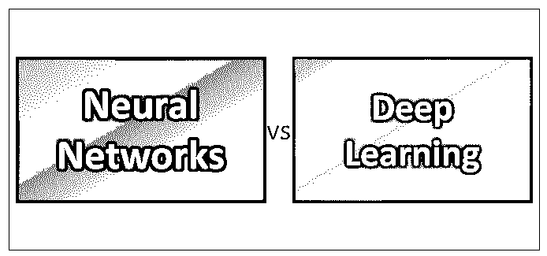
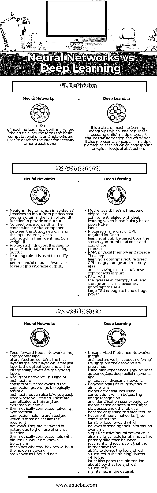

# 神经网络 vs 深度学习

> 原文：<https://www.educba.com/neural-networks-vs-deep-learning/>

## 神经网络与深度学习的区别

随着当今技术的巨大转变，转变业务需要的不仅仅是[大数据](https://www.educba.com/big-data-vs-data-science/)和 [Hadoop](https://www.educba.com/hadoop-vs-hive/) 。今天的公司正在走向人工智能，并将[机器学习](https://www.educba.com/machine-learning-vs-predictive-analytics/)作为他们的新技术。神经网络或连接主义系统是受我们的生物神经网络启发的系统。这些类型的系统被训练来根据需要学习和适应它们自己。例如，在图像识别的情况下，一旦他们被识别为有猫，他们可以很容易地使用结果集来区分有猫的图像和没有猫的图像。在这样做的时候，他们没有任何关于猫的特征的先验知识，但是他们发展了他们自己的一套独特的特征，这有助于他们的识别。与此密切相关的另一个术语是深度学习，也称为分层学习。这是基于与基于任务的算法相反的学习数据表示。它可以进一步分为[监督](https://www.educba.com/supervised-learning-vs-reinforcement-learning/)，半监督和非监督学习技术。有几种与深度学习相关的架构，如深度神经网络、信念网络和递归网络，其应用在于自然语言处理、计算机视觉、语音识别、社交网络过滤、音频识别、生物信息学、机器翻译、药物设计，等等。让我们在本帖中详细讨论一下[神经网络](https://www.educba.com/what-is-neural-networks/)和深度学习。

### 神经网络和深度学习之间的面对面比较(信息图)

以下是神经网络和深度学习之间的前 3 名比较:

<small>Hadoop、数据科学、统计学&其他</small>

### 神经网络和深度学习之间的关键区别

以下几点解释了神经网络和深度学习之间的差异:

1.  [神经网络利用](https://www.educba.com/what-is-neural-networks/)神经元以输入值和输出值的形式传输数据。它们用于通过网络或连接传输数据。另一方面，深度学习与特征的转换和提取有关，这些特征试图在刺激和大脑中存在的相关神经反应之间建立关系。
2.  神经网络的应用领域包括系统识别、自然资源管理、过程控制、车辆控制、量子化学、[决策](https://www.educba.com/how-to-make-the-right-sales-hiring-decision-process/)、游戏、人脸识别、模式识别、信号分类、序列识别、物体识别、金融、医疗诊断、[可视化](https://www.educba.com/data-mining-vs-data-visualization/)、[数据挖掘](https://www.educba.com/data-mining-vs-statistics/)、机器翻译、垃圾邮件过滤、社交网络过滤等。鉴于[深度学习的应用](https://www.educba.com/application-of-deep-learning/)包括自动语音识别、图像识别、[视觉艺术](https://www.educba.com/visual-basic-chart-with-dynamic-input/)处理、自然语言处理、药物发现和毒理学、客户关系管理、推荐引擎、移动广告、生物信息学、图像恢复等。
3.  对于[神经网络遇到的批评包括](https://www.educba.com/implementation-of-neural-networks/)那些像训练问题、理论问题、硬件问题、批评的实际反例、混合方法，而对于深度学习，它与理论、错误、网络威胁等有关。

### 神经网络和深度学习对照表

下面是神经网络和深度学习之间的一些关键比较。

| **比较依据** | **神经网络** | **深度学习** |
| **定义** | 一类机器学习算法，其中人工神经元形成基本计算单元，而[网络用于](https://www.educba.com/network-topologies/)描述彼此之间的互连性 | 它是一类机器学习算法，使用非线性处理单元的多个层进行特征变换和提取。它还以对应于不同抽象层次的多层次方式来表示概念。 |
| **组件** | **神经元:**标记为 j 的神经元通常以恒等函数的形式接收来自前一神经元的输入，以提供输出。
**连接和权重:**连接是输出神经元 I 和输入神经元 j 之间的重要组成部分，每个连接都用一个权重 ij 来标识。
**传播函数:**用于为结果输出提供一个输入。
**学习规则:**用于修改神经网络的参数，以得到一个满意的输出。 | **主板:**主板芯片组是深度学习相关的组件，特别是基于 PCI-e lanes。
**处理器**:深度学习需要的 GPU 种类要根据处理器的插座类型、内核数量和成本来决定。
**RAM、物理内存和存储:**[深度学习算法需要](https://www.educba.com/deep-learning-algorithms/)大量的 CPU 使用、存储和内存区域，因此拥有丰富的这些组件是必不可少的。
**PSU:** 随着内存、CPU 和存储区域的增加，使用足够大的 PSU 来处理巨大的功率也变得很重要。 |
| **架构** | **前馈神经网络:**最常见的架构包含第一层作为输入层，而最后一层是输出层，所有中间层都是隐藏层。
**递归网络:**这种架构由连接图中的有向循环组成。生物现实建筑也可以带你回到起点。这些训练起来很复杂，而且非常动态。
**对称连接网络:**对称连接保持架构，它或多或少类似于递归网络。由于它们使用能量函数，它们在本质上受到限制。具有隐藏网络的对称连接网络被称为 Boltzmann 机，而没有隐藏网络的网络被称为 Hopfield 网。 | **无监督的预训练网络:**在这种架构中，我们谈到没有正式的训练，但网络是使用过去的经验进行预训练的。这个[包括自动编码器](https://www.educba.com/autoencoders/)，深度信念网络和生成对抗网络。
**卷积神经网络:**它旨在使用卷积来学习高阶特征，从而改善图像识别和身份识别用户体验。使用这种架构，识别人脸、路标、鸭嘴兽和其他物体变得容易。
递归神经网络:它们来自前馈家族，相信随着时间的推移发送它们的信息。
**递归神经网络:**它也标志着变长输入。递归和递归之间的主要区别在于，前者能够设计训练数据集中的层次结构，而后者还提供有关如何在数据集中维护该层次结构的信息。 |

### 结论

人工智能是一个非常强大和有趣的领域，只会变得更加普遍和重要，必将对整个社会产生巨大的影响。这两种技术是人工智能解决复杂问题的一些非常强大的工具，并将在未来继续发展壮大，供我们利用。

### 推荐文章

这是神经网络与深度学习的指南。在这里，我们讨论了神经网络与深度学习的直接比较、关键差异以及信息图和比较表。您也可以阅读以下文章，了解更多信息——

1.  [数据挖掘与数据分析的 7 大区别](https://www.educba.com/data-mining-vs-data-analysis/)
2.  [机器学习与预测分析——7 个有用的区别](https://www.educba.com/machine-learning-vs-predictive-analytics/)
3.  [数据挖掘与数据可视化——哪个更好](https://www.educba.com/data-mining-vs-data-visualization/)
4.  [商业智能 vs 大数据——6 个惊人的对比](https://www.educba.com/business-intelligence-vs-big-data/)

