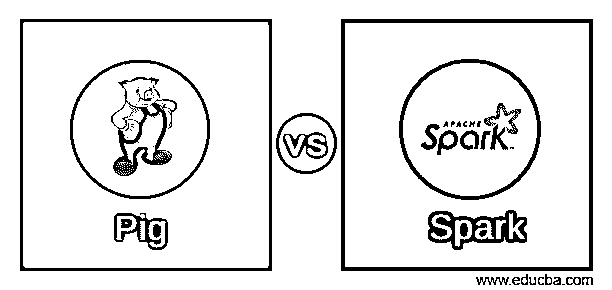
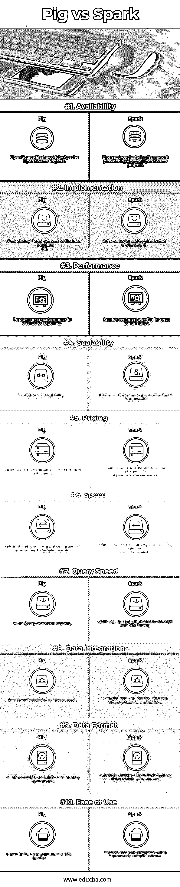

# 小猪 vs 火花

> 原文：<https://www.educba.com/pig-vs-spark/>

## Pig 与 Spark 的区别

Pig 与 Spark 是用于分析目的的大容量数据处理的技术框架之间的比较。 [Pig 是](https://www.educba.com/what-is-pig/)一款开源工具，使用 Pig 脚本在 Hadoop 框架上工作，随后隐式转换为 map-reduce 作业以进行大数据处理。鉴于 [Spark 是一个](https://www.educba.com/what-is-apache-spark/)开源框架，使用弹性分布式数据集(RDD)和 Spark SQL 来处理大数据。与 Pig 框架相比，Spark 框架效率更高，可扩展性更强。Pig Latin 脚本可以用作类似 SQL 的功能，而 Spark 支持内置功能和 API，如用于数据处理的 [PySpark](https://www.educba.com/pyspark-sql/) 。

### Pig 和 Spark 之间的直接对比(信息图)

以下是 Pig 和 Spark 的 10 大对比:

<small>Hadoop、数据科学、统计学&其他</small>

### Pig 和 Spark 的主要区别

以下是要点列表，描述 Pig 和 Spark 之间的主要区别

1.  Apache Pig 是用于大规模数据处理的通用编程和集群框架，与 Hadoop 兼容，而 Apache Pig 是用于运行 Pig 脚本以处理复杂和大规模数据集的脚本环境。
2.  Apache Pig 是一种高级数据流脚本语言，支持独立脚本并提供在 Hadoop 上执行的交互式 shell，而 Spark 是一种高级集群计算框架，可以轻松与 Hadoop 框架集成。
3.  通过运行 Pig 脚本进行数据操作。在 Spark 中，SQL 查询是通过使用 Spark SQL 模块运行的。
4.  Apache Pig 提供可扩展性、易于编程和优化特性，Apache Spark 提供高性能，运行工作负载的速度快 100 倍。
5.  就 [Pig 架构](https://www.educba.com/pig-architecture/)而言，脚本可以并行化，能够处理大型数据集，而 Spark 提供批处理和流数据操作。
6.  在 Pig 中，将有内置函数来执行一些默认操作和功能。在 Spark 中，SQL、流和复杂分析可以结合在一起，为 SQL、core、MLib 和流模块的库堆栈提供动力，可用于不同的复杂应用程序。
7.  Apache Pig 提供了 Tez 模式，以便更加关注性能和优化流程，而 Apache Spark 在流和批处理数据处理作业中提供了高性能。
8.  Apache Pig 提供了 Tez 模式，以便更加关注性能和优化流程，而 Apache Spark 在流和批处理数据处理作业中提供了高性能。Tez 模式可以通过配置明确启用。
9.  Apache Pig 被大多数现有的技术组织用来执行数据操作，而 Spark 是最近发展起来的大规模分析引擎。
10.  Apache Pig 使用惰性执行技术，pig Latin 命令可以轻松转换为 Spark 操作，而 Apache Spark 具有内置的 DAG 调度器、查询优化器和物理执行引擎，可快速处理大型数据集。
11.  Apache Pig 类似于 ETL (提取、转换和加载)等数据阶段作业[工具中的数据流执行模型，而 Apache Spark 可以在任何地方运行，并与 Hadoop 配合使用，能够以不同方式访问多个数据源。](https://www.educba.com/etl-testing-tool/)

### 清管器和火花对照表

以下是要点列表，描述 Pig 和 Spark 之间的比较。

| ****对比**的依据** | **猪** | **火花** |
| **可用性** | Apache 开源项目的开源框架 | Apache 开源项目提供的开源集群框架 |
| **实施** | 由 Hortonworks 和 Cloudera 提供商等提供。, | 用于分布式环境的框架。 |
| **性能** | 为分布式管道提供良好的性能 | Spark 比 Pig 性能更好。 |
| **可扩展性** | 可扩展性的限制 | Spark framework 有望获得更快的运行时。 |
| **定价** | 开源并依赖于脚本的效率 | 开源，并且依赖于算法实现的效率。 |
| **速度** | 与 Spark 相比更快但更慢，但对较小的脚本更有效 | 比 Pig 快许多倍，并提供更大的运行时容量。 |
| **查询速度** | 多查询执行能力。 | 通过 SQL 调优，Spark SQL 查询性能非常高。 |
| **数据整合** | 使用不同的工具快速灵活。 | 可以从不同的外部应用程序加载和操作数据。 |
| **数据格式** | 数据操作支持所有数据格式。 | 支持复杂的数据格式，如 [JSON](https://www.educba.com/what-is-json/) 、 [NoSQL](https://www.educba.com/software-development/courses/sql-training-certification/) 、parquets 等。 |
| **易用性** | 更容易构建像 SQL 查询这样的 pig 脚本。 | 使用框架内置功能处理复杂的操作。 |

### 结论

总结 Pig 和 Spark 之间比较的最后一句话是，Spark 在易操作性、维护和生产率方面胜出，而 Pig 在性能可扩展性和功能、在大量数据集的情况下与第三方工具和产品的集成方面欠缺。由于 Pig 和 Spark 项目都属于 Apache Software Foundation，因此 Pig 和 Spark 都是开源的，可以与 Hadoop 环境一起使用和集成，并且可以根据要操作的数据量和体积为数据应用程序进行部署。

在大多数情况下，Spark 一直是大多数客户或顾客考虑大规模业务需求的最佳选择，以便以更高的数据完整性和安全性处理任何金融机构或公共信息的大规模和敏感数据。

除了现有的优势之外，Spark 作为开源项目也有自己的优势，最近已经发展得更加复杂，具有强大的集群操作功能，可以取代现有的系统，以减少流程成本，降低复杂性和运行时间。

### 推荐文章

这是 Pig 与 Spark 之间差异的指南。在这里，我们讨论了 Pig 与 Spark 的直接比较、主要差异以及信息图和比较表。您也可以阅读以下文章，了解更多信息——

1.  [5 阿帕奇卡夫卡与 Flume 最重要的区别](https://www.educba.com/apache-kafka-vs-flume/)
2.  [信息图表的五大差异| Kafka vs Kinesis](https://www.educba.com/kafka-vs-kinesis/)

