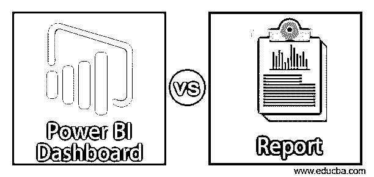
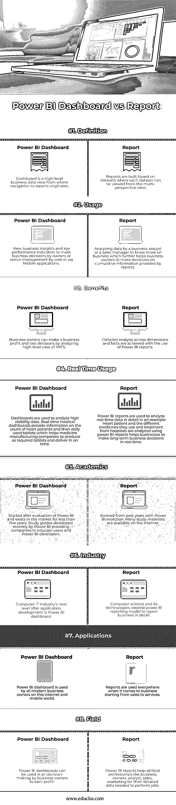

# Power BI 仪表板与报告

> 原文：<https://www.educba.com/power-bi-dashboard-vs-report/>

## Power BI 仪表板与报告的区别

Power BI 仪表盘是一个占位符，用于显示业务运营中最重要的决策事实。但是报告是以多种格式显示的更详细的数据，如图表、图形列表和表格等。仪表板是一个业务关键绩效指标视图，它显示可以改变业务利润的关键值，可以在一个屏幕上浏览。报告基于一个数据集或一个业务单位数据，例如属于加利福尼亚的商店的报告。由于任何运营价值或指标值，报告和控制面板相互依赖。Power BI 报告具有一项功能，可以深入到报告级别的详细信息粒度。

### Power BI 仪表板与报告的直接比较(信息图表)

以下是 Power BI Dashboard 与报告之间的 8 大对比

<small>Hadoop、数据科学、统计学&其他</small>

### Power BI 仪表板与报告的主要区别

以下是项目列表，解释 Power BI Dashboard 与 Report 之间的差异

*   Power BI dashboards 屏幕大小页面由跨不同报告及其数据集和事实收集和组合的关键信息组成，而报告是不同数据集的收集显示，不同页面可用于查看报告数据。
*   Power BI 仪表盘不适用于桌面，但可以在桌面上创建和查看报告。
*   power BI 控制面板使用不同的数据源，每个控制面板都包含地图、图表等，但只有一个数据集可用作 power BI 报告的源
*   Power BI dashboard 锁定现有可视化的功能只能从当前控制面板锁定到其他控制面板，通常称为控制面板导航，但是 Power BI 报告可以锁定或导航到任何报告或控制面板。
*   电子邮件订阅或 power BI dashboard 不可用，但用户可以订阅报告，以便在任何给定的时间点将报告发送到他们的电子邮箱。
*   Power BI 仪表板具有警报功能，在需要注意的情况出现时，仪表板会发出警报，但在报告中，我们不能有此功能。
*   Power BI 控制面板不能分割，但报告有多种方式进行过滤和分割。
*   自然语言查询仅在仪表板中可用，但对于报告，它不可用。
*   不能更改 Power BI 可视化，但可以更改和保存报告可视化，但这完全取决于访问控制面板和报告所涉及的用户角色和权限。
*   仅在 power BI dashboard 中，数据可以导出，而不是可视化，但在报告中，数据可以导出为任何格式，如电子表格格式。
*   电源 BI 控制面板可以设置为特色或收藏夹，但不能创建特色电源 BI 报告
*   报告是仪表板的信息提供者，这些信息可以是多种格式，如文本、表格、图表、数字等
*   控制面板在页面屏幕上显示，但在报告中，我们有多个页面可以导航，因为报告是数据的详细信息，例如当年的位置商店销售，可能有大量数据，需要许多页面来容纳数据。
*   Power BI 报告可以深入到报告所基于的不同级别的数据集。报告可以导出为任何格式，并下载到本地桌面以供进一步分析。报告可以在网上发布，也可以通过电子邮件订阅。
*   仪表板具有与报告相同的功能，但仪表板可以导出为有限的格式，因此仪表板用于可视化重要数据，而不是分析只能通过报告完成的数据。

### 比较表 Power BI 仪表板与报告

以下是要点列表，描述了 Power BI 仪表板与报告之间的比较

| ****对比**的依据** | **仪表盘** | **报告** |
| **定义** | 仪表板是一个高级业务数据视图，从中可以导航到报告。 | 报告是基于数据集构建的，其中每个数据集都可以从多视角视图中查看。 |
| **用途** | 查看业务见解和关键绩效指标，以便所有者或高级管理层通过 web 或移动应用程序做出业务决策。 | 业务分析师或销售经理分析数据以了解更多业务信息，这进一步帮助企业所有者根据报告提供的累积信息做出决策。 |
| **好处** | 企业所有者可以通过分析 KPI 的高级视图来做出企业损益决策。 | 使用 Power BI 报告可以实现跨维度和事实的详细分析。 |
| **实时使用量** | 仪表板用于分析高可见性数据。实时医疗仪表板提供了关于心脏病患者及其日常使用的药片数量的信息，这有助于医药制造公司根据需要生产药片并按时交付。 | Power BI 报告用于详细分析一名心脏病患者的实时数据，并使用 power BI 报告分析医院提供的不同药物和治疗方法，帮助企业实时做出长期业务决策。 |
| **学术界** | 在评估 Power BI 后开始，在市场上存在不到五年。Power BI 提供公司最近开发的学习指南，用于教育用户和 Power BI 开发人员。 | 由过去几年的力量演化而来。互联网上有很多学习资料。 |
| **行业** | 计算机 IT 行业在应用程序开发之后的下一个层次是 Power BI 仪表板。 | 计算机科学及其技术创造了 power BI 报告模型，以详细报告业务。 |
| **应用程序** | 在这个互联网和移动世界中，所有现代企业主都使用 Power BI dashboard。 | 从销售到服务的业务中，到处都在使用报告。 |
| **字段** | 企业所有者可以在所有决策中使用 Power BI 仪表盘来获取利润。 | Power BI 报告可帮助所有现场专业人员(如企业主、分析师、销售人员和营销人员)获取完成工作所需的详细数据。 |

### 结论

仪表板和报告是 Power BI 在线服务的一部分，这里是对人们在构建 Power BI 解决方案的初始阶段提出的一个主要问题的总结。在现场访谈中，通常会听到错误的误解，即 power BI 仪表盘和报告是相同的。但是，理解这些差异对于利用关于 Power BI 的知识非常重要。

因此，power BI 仪表盘是以单页显示格式显示的不同数据集和立方体的集合，具有高度的可视化功能，用户只需查看 Power BI 仪表盘中的关键性能指标即可做出决策，方法是将不同报告中的数据汇集在一起以创建概览或摘要。

Power BI 仪表盘是显示标题或最重要数据的一种方式。但报告是显示的单个数据集数据，而 power BI dashboard 依赖于报告，但报告不依赖于仪表板，因为报告有自己的属性和指标，可以通过跨多个页面的向下钻取和向上钻取功能来显示。

### 推荐文章

这是关于 Power BI Dashboard vs Report、其含义、直接比较、主要差异、比较表和结论的指南。您也可以阅读以下文章，了解更多信息——

1.  [Hadoop vs Cassandra](https://www.educba.com/hadoop-vs-cassandra/)
2.  [预测分析与描述分析](https://www.educba.com/predictive-analytics-vs-descriptive-analytics/)
3.  [电源 BI 图标](https://www.educba.com/power-bi-icon/)
4.  [电源双向滤波器](https://www.educba.com/power-bi-filter/)

