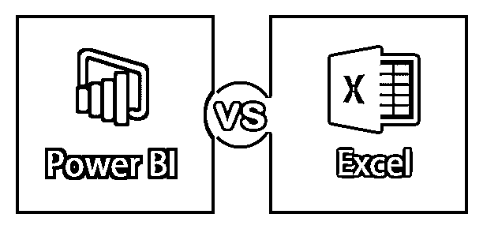
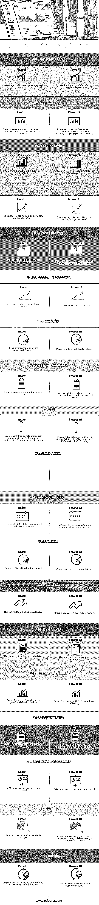

# 强大的 BI 与 Excel

> 原文：<https://www.educba.com/power-bi-vs-excel/>

## Power BI 与 Excel 的区别

Microsoft Excel 是微软的 office 365 产品。它最初于 1985 年在微软公司下发布，当前版本是 Excel 2018。Excel 是一种电子表格应用程序，它以行和列的形式捕获数据。Excel 的最新版本增加了各种功能和应用程序。你可以将数据转化为洞察力。Power BI 是微软的一款商业分析工具。Power BI 是一个软件服务、应用程序和连接器的集合，它们协同工作，将您不相关的数据源转化为交互式见解，具有连贯性和视觉沉浸感。Power BI 可以轻松连接到任何规模的不同数据源。

### 擅长

Excel 能够理解您的模式，组织您的数据，并帮助您节省时间。Excel 提供了不同的模板，帮助您创建电子表格和执行计算和现代公式。Excel 将帮助您更好地了解数据。有各种各样的图表、图形和图片可以帮助您以引人注目的方式展示数据，并通过迷你图、格式和表格来更好地理解数据。

<small>Hadoop、数据科学、统计学&其他</small>

### 功率 BI

Power BI 可以连接到 excel 电子表格、云、关系数据库、NoSQL 数据库、数据仓库、平面文件、大数据工具等等。Power BI 非常强大、简单、快速且是企业级的，可用于广泛的建模、定制开发和实时分析。Power BI 有三种形式，对于 Windows 应用程序，它是 Power BI 桌面，as [软件即服务](https://www.educba.com/what-is-software-as-a-service-saas/) (SaaS)它是 Power BI 服务，而第三种是用于手机、平板电脑和 Android 设备的 Power BI 应用程序。

### Power BI 和 Excel 的直接对比(信息图表)

以下是 Power BI 和 Excel 之间的 19 大差异:

### Power BI 和 Excel 的主要区别

让我们讨论一下 Power BI 和 Excel 之间的一些显著差异:

*   Power BI 是一个商业智能(BI)和数据可视化工具，用于从不同的数据源创建自定义和交互式仪表板，而 Microsoft Excel 是微软的一个软件应用程序，用于使用电子表格系统进行数据分析、数学运算、数据组织和许多其他功能。
*   与 Microsoft Excel 相比，Power BI 的处理速度要快得多。
*   Power BI 可以流畅处理大量数据，而 Microsoft Excel 则受限于一定程度的数据。
*   Power BI 处理大数据，而 Microsoft Excel 无法处理大数据。
*   Power BI 可以连接不同种类的源，而 Microsoft Excel 可以连接有限的源。
*   Power BI 仪表盘的交互性和定制性更强，而 Microsoft Excel 仪表盘的交互性不强。
*   Power BI 易于使用并且非常灵活，而 Microsoft Excel 使用起来就不那么方便了。
*   power BI[主要用于数据可视化](https://www.educba.com/careers-in-data-visualization/)和向大量用户共享仪表盘，而 Microsoft Excel 主要用于深入的驱动因素分析。
*   Power BI 是比 Microsoft Excel 更强大的工具。
*   Power BI 对移动设备更友好，因为 iOS、Android 和 Windows 应用程序，而 Microsoft excel 对移动设备不友好。

### 功率 BI 和 Excel 对照表

下面是 Power BI 和 Excel 最上面的对比。

| 【Power BI 与 Excel 对比的依据 | **Excel** | **功率 BI** |
| **重复表** | Excel 表格可以显示重复的表格。 | 功率 BI 表不能显示重复的表。 |
| **应用程序** | Excel 现在有一些更新的图表，它们不能连接到数据模型。 | Power BI 是仪表板、警报、KPI 和可视化(包括可视化分析数据)的理想选择。 |
| **表格样式** | Excel 更擅长处理表格风格的报表。 | Power BI 对于表格风格的报告来说并不方便。 |
| **报告** | Excel 报表是正常的和普通的比较功率 BI。 | Power BI 提供漂亮的品牌报告，与 Excel 进行比较。 |
| **交叉过滤** | Excel 不支持图表间的交叉筛选。 | Power BI 支持图表间交叉过滤的高级功能。 |
| **仪表板刷新** | Excel 不允许刷新仪表板。 | 您可以在 Power BI 中刷新数据。 |
| **分析** | 与 Power BI 相比，Excel 提供简单的分析。 | Power BI 提供高级分析。 |
| **报告可用性** | 报告仅限于特定用户使用。 | 面向不同技术水平的广大读者的报告。 |
| **工具** | Excel 是一个传统的电子表格程序，有着悠久的历史，带来了大量的功能。 | Power BI 是分析工具的高级版本，具有大量处理数据的功能。 |
| **数据模型** | Excel 完全专注于具有广泛特性的结构化和简单的数据模型。 | Power BI 真正关注的是数据接收和轻松构建潜在的复杂数据模型。 |
| **分离表** | 在 Excel 中，很难将单独的表相互关联起来。 | 在 Power BI 中，您可以轻松地将不同的表相互关联起来。 |
| **数据集** | 能够处理有限的数据集。 | 能够处理更大的数据集。 |
| **灵活** | 数据集和报表没有那么灵活。 | 共享数据和报告非常灵活。 |
| **仪表板** | 用户构建报告的功能有限。 | 用户可以构建定制的仪表板。 |
| **加工速度** | 处理表格、图形和过滤的速度很慢。 | 通过表格、图形和过滤加快处理速度。 |
| **要求** | Excel 主要用于深层驱动因素分析。 | [Power BI 主要用于](https://www.educba.com/power-bi-filter/)可视化和仪表板共享。 |
| **语言依赖性** | 用于查询数据模型的 MDX 语言。 | 用于查询数据模型的 DAX 语言。 |
| **目的** | Excel 是分析师的历史分析工具。 | Powerquery 是一个非常好的想法，可以简化任何数据源的清理和处理。 |
| **人气** | 与 Power BI 相比，Excel 应用程序有点难以使用。 | 强大的工具和易于使用的比较 excel。 |

### 结论

Power BI vs Excel 都是微软的产品。Excel 是微软的老产品，而 Power BI 是几年前推出的。我相信 95 %使用过 Windows 的用户都曾经使用过 excel。Excel 是一个广为人知的产品。Power BI 完全是微软的一款分析和数据可视化产品。大量从事分析工作的公司都在使用 Power BI。就开发时间而言，Excel 和 Power BI 这两种工具几乎有 80%相同。Power BI 让您只需点击一下鼠标，即可将完整的数据模型从 Excel 报表迁移到 Power BI 桌面。Power BI 和 excel 在数据可视化方面各有利弊。Power BI 专业人员喜欢在线功能和可视化，而 Microsoft Excel 擅长数据分析、数据探索和数据透视表。

### 推荐文章

这是 Power BI 与 Excel 之间最大差异的指南。在这里，我们还将讨论 Power BI 与 Excel 在信息图和比较表方面的主要差异。您也可以看看以下文章，了解更多信息–

1.  [Power BI 与 QlikView–22 大差异](https://www.educba.com/power-bi-vs-qlikview/)
2.  【SPSS 与 EXCEL 的 Top 比较
3.  [区别](https://www.educba.com/power-bi-vs-tableau/) [画面](https://www.educba.com/power-bi-vs-tableau/) [vs 权力匕](https://www.educba.com/power-bi-vs-tableau/)
4.  [关键区别](https://www.educba.com/excel-vs-tableau/)[Excel](https://www.educba.com/excel-vs-tableau/)[vs Tableau](https://www.educba.com/excel-vs-tableau/)
5.  [Power BI 初学者教程](https://www.educba.com/power-bi-tutorial/)
6.  [电源 BI 图标](https://www.educba.com/power-bi-icon/)
7.  【Tableau vs Power BI vs QlikView 的差异

