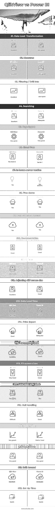

# Power BI 与 QlikView

> 原文：<https://www.educba.com/power-bi-vs-qlikview/>

## Power BI 与 QlikView 的区别

权力毕可能是杰出的。但是与 QlikView 相关的文件大小问题对我们来说是个大问题。Power BI 可以展示经过验证的结果。Power BI 在智能数据恢复方面也有所改进。Power BI 为用户提供了更多的空间(与 View 相比)来根据需要定制每个图表(可视化的)。QlikView 是世界上最灵活的商业智能平台之一。这是 USP“联想体验”。它们允许用户通过了解数据是如何关联的以及哪些数据是不相关的来获得不可预测的业务洞察力。跨应用程序中任何位置的全局和/或单个字段内的所有数据进行间接和直接搜索非常容易。

**让我们详细研究一下 Power BI 和 QlikView:**

<small>Hadoop、数据科学、统计学&其他</small>

随着范围的增加，它将开始感觉缓慢。如下所述，这种慢响应现在得到了改善。与 QlikView 相比，恢复时间较慢也是一个问题。微软可以对其进行分类，并添加一个强大的搜索选项——搜索现在好多了，允许将完成的可视化和表格固定在桌面表单中，以打断四处移动的图形。但是每次启动新会话时都必须将其固定。但至少现在可以做到。将页面内过滤器与侧边过滤器和视觉效果过滤器相链接，并在表格周围添加向下钻取功能，因为它们与其他视觉效果图表编辑功能允许导出，引入页面或图形打印，并允许从另一个 Power BI 应用程序文件加载表格。介绍一个真正的数据透视表编辑见下面的矩阵表。它现在关闭，并允许点击和/或拖动图像/视觉效果，那么他们可能有一个非常好的产品。而且年费很低(每位用户每年 119 美元。

比较 QlikView 的重新加载时间。(1 分 40 秒，相比之下，Qlik 的测试时间为几秒钟。不过，主要问题是云和桌面版本中的探索工具。这是快速定位记录的重要功能。

这很好，但是需要很长时间。两者我都喜欢，但我认为颜色主题的视图方法更好。制作专业外观的表要快得多。并且对仍在学习的新用户产生更少的糟糕结果。

向下钻取和围绕特征。要打开，请单击右侧的向下箭头按钮。向下钻取仅适用于此图表(不适用于页面上的其他图表)。现在引入了右键单击选项(见下文>>钻取)。但是向下钻取仍然只适用于一个图表。

意外是通过无查询过滤产生的。当用户点击字段中的数据点时，所有其他字段突然根据所做的选择进行自我过滤。通过使用内存架构，这种方法成为可能，它解决了传统的基于查询和基于磁盘的 BI 工具所面临的困难。最重要的是，它保证了速度。任何拥有足够处理能力的用户都可以超快地分析大量数据并产生见解。

然而，尽管如此，它并不是真的适合所有人。不是数据程序员或科学家的人可能会被高级别的细节和解决方案的自由形式结构吓到。这限制了任何由扮演不同角色的人组成的组织能够利用这个答案的程度。此外，如果您已经在使用其他微软平台和产品，PowerBI 应该是您的 BI 解决方案的默认选择，因为在您的组织内加入它再简单不过了。

### Power BI 和 Qlikview 的直接对比(信息图)

以下是 Power BI 和 QlikView 的 22 大对比:

### Power BI 和 QlikView 的主要区别

以下是要点列表，描述了 Power BI 和 QlikView 之间的主要区别:

1.  Power BI 在移动和视觉探索以及创作领域赢得了比赛。Power BI 和 Qlikview 之间的差异都提供了嵌入式高级分析，Power BI 可以展示经过验证的结果，而 QlikView 还有一些工作要做。Power BI 在智能数据恢复方面也有所改进。但是，Power BI 和 QlikView 解决方案对高级分析仪表板的配置水平相似。
2.  Qlikview 的存储数据功能和 ETL 被认为比 Power BI 的个人产品有所改进。他们强调最终客户的可用性，并使他们能够提供良好的客户体验。
3.  QlikView 具有用于分析目的的内置功能，允许用户转储代码本身，并使用他们创建的模型进行测试。这可能会受到数据开发人员和/或核心科学家的欢迎。但是，对于那些渴望获得亲身体验的人来说，为了及时做出商业决策，这一特性可能相当具有威胁性。

### Power BI 和 QlikView 对照表

以下是 Power BI 和 QlikView 之间的比较要点列表

| **比较的基础** | **Qlik 观点** | **功率 BI** |
| **数据加载&转换** | 优秀的 | 很好 |
| **措施** | 优秀的 | 很好 |
| **过滤/钻取** | 优秀的 | 见报告 |
| **搜索** | 优秀的 | 足够的 |
| **页面布局** | 很好 | 很好 |
| **无云** | 是共享 5 | 是，1 美元 |
| **内部服务器版本** | 是 | 是(2017 年 6 月) |
| **免费演示** | 是> | 是 |
| **付费云版本** | 是 | 是 |
| **文档** | 好的 | 好的 |
| **视频** | 很好 | 很好 |
| **调整不同屏幕尺寸** | 优秀的 | 好的 |
| **数据加载时间** | 非常快 | 有点慢 |
| **打印导出** | 好的 | 成为开发人员 |
| **增量负载** | 优秀的 | 好的 |
| **适合屏幕尺寸** | 很好 | 好的 |
| **只加载一次数据** | 是(QVD) | 是 |
| **空处理** | 困难的 | 好的 |
| **透视表** | 非常好+ | 矩阵。好的 |
| **向下钻取** | 很好 | 很好 |
| **钻周围** | 优秀的 | 足够的 |
| **设置时间** | 快的 | 快的 |

### 结论

每个冠军都有自己的王牌。Power BI 是微软的平台和应用程序套件。平台工作流组合的级别和对云 BI 的高级平台支持将赋予 Power BI 超越 QlikView 的优势。如果我们已经在使用 Office 365 和 SQL Server，那么采用 Power BI 将不是什么大事。移动性提供了额外的优势，Power BI mobile 应用程序与软件的其余部分相关联。对于需要随时更新信息和愿景的销售团队来说，这一特性非常重要。

最重要的是，朝着 PowerBI 创新迈出的一步是一个可喜的突破。最新版本提供了改进的质量和保证，以及对自然语言的快速洞察和查询。Andrew Peterson 补充说，虽然图表和图形往往在 Power BI 中获得最大的关注，但微软一直在不断努力推进自然语言查询的幕后工作。最新发布的潜力，以提供先进的行为，以查询数据。

### 推荐文章

这是一个关于 Power BI 与 Qlikview 的指南。在这里，我们将讨论 Power BI 与 Qlikview 之间的主要差异，并提供信息图表和比较表。您也可以阅读以下文章，了解更多信息——

1.  [强力 BI vs SSRS——你应该学会的 11 个惊人对比](https://www.educba.com/power-bi-vs-ssrs/)
2.  [Power BI Dashboard vs Report–8 个重要差异](https://www.educba.com/power-bi-dashboard-vs-report/)
3.  [Google Analytics 与 Piwik 的 11 个有用对比](https://www.educba.com/google-analytics-vs-piwik/)
4.  [电源 BI 图标](https://www.educba.com/power-bi-icon/)
5.  [如何在 Power BI 中使用日历 DAX 功能？](https://www.educba.com/power-bi-calendar/)
6.  [Tableau vs Power BI vs QlikView](https://www.educba.com/tableau-vs-power-bi-vs-qlikview/)
7.  [如何在 Power BI 中使用滤镜 DAX 功能？](https://www.educba.com/power-bi-filter/)

