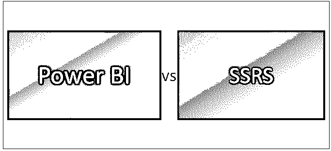
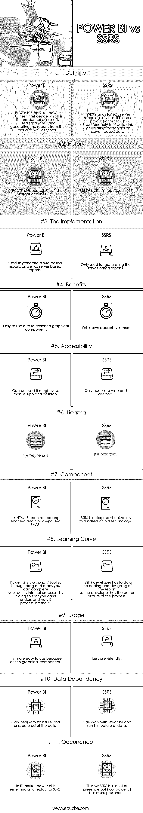

# 权力 BI vs SSRS

> 原文：<https://www.educba.com/power-bi-vs-ssrs/>

## Power BI 与 SSRS 的区别

Power bi 是一个[数据分析工具](https://www.educba.com/data-analysis-tools/)，可用于从广泛的数据源进行报告和数据分析。Power bi 简单易用，有助于提高业务分析师的技能，并使高级用户能够轻松使用它。对于复杂而庞大的数据分析能力，bi 是非常有用的。它广泛用于不定型数据的建模和结构化。

SSRS 代表 SQL Server Reporting Services，它是一个全面的可扩展报告平台。这包括一组集成的处理组件和编程接口。它用于设计测试和部署报告。这主要是一个基于服务器的平台。

<small>Hadoop、数据科学、统计学&其他</small>

与 SSRS 相比，Power bi 有更多的图形组件，它使 power bi 更加高效和易于使用，而 SSRS 则需要更多的手动工作来分析和生成报告。

Power bi 将有助于在云数据的基础上生成报告，尽管它将在可以通过您的计算机访问的关系存储的基础上分析和生成报告，但 SSRS 仅在您的数据驻留在系统上时有用。

SSRS 是发布或生成报告的经典解决方案，而 power bi 是最新的用户友好型工具。

### Power BI 和 SSRS 的直接对比(信息图)

以下是 Power BI 和 SSRS 的 11 大对比:

### Power BI 和 SSRS 的主要区别

下面列出了几点，描述了 Power BI 和 SSRS 的主要区别:

SQL Server Reporting Services 能够与 Power Bi report 以及 SSRS 现有的所有质量和功能协同工作。因此，很明显，PBIRS 将是下一个版本的 SSRS，在不久的将来肯定会取代 SSRS。由于 power bi 拥有 SSRS 现有的组件，因此它还拥有更多插件。

从功能上看，BI 和这两种动力的区别是显而易见的。PBIRS 是 SSRS 的超集。它包含了 SSRS 所拥有的一切，并且增加了呈现交互式(PBIX)和分析性(XLSX)报告的能力。

许可是事情变得更复杂的地方。SSRS 一直包含在 SQL Server 安装介质中，但在 SQL Server 2017 中，情况不再如此，它是一个单独的下载。

如果您拥有标准模式 SQL Server 的许可，您将能够使用 SSRS 的标准模式功能、企业解锁企业功能等。截至 2017 年版本，也不再有 SSRS 的集成模式，它只是本机模式。

Power BI Report Server 的许可方式有两种。购买力 BI 高级容量为您提供了运行相同数量内核的许可证。这只适用于 Premium P SKUs，不适用于 EM 等任何其他 SKU。另一种许可方式是购买 SQL Server 企业版+软件保障。

正如许可一样，SSRS 的发布时间也与 SQL Server 的发布时间相关。每当 SQL Server 的新版本发布时，SSRS 的新版本也会随之发布。PBIRS 的情况并非如此。由于 PBIRS 被认为是一个独立的产品，这是有意义的，并且 Power BI 服务本身的不断变化需要更频繁的更新节奏。

Cortana 集成在 power bi 中添加了一个在移动设备上特别受欢迎的功能，允许用户使用自然语言口头查询数据，并使用微软的数字助理 Cortana 访问结果。SSRS 没有添加此功能。

### 功率 BI 和 SSRS 对照表

下面是动力 BI 和 SSRS 的对比表。

| **比较依据** | **功率 BI** | **SSRS** |
| **定义** | Power bi 代表 power business intelligence，是微软的产品。用于从云和服务器分析和生成报告 | SSRS 代表 SQL server reporting services，它也是微软的产品。用于分析数据并生成基于服务器的数据报告。 |
| **历史** | Power bi 报表服务器于 2017 年首次推出。 | SSRS 于 2004 年首次推出。 |
| **实施** | 它用于生成基于云的报告以及基于服务器的报告 | 仅用于生成基于服务器的报告。 |
| **好处** | 由于丰富的图形组件，易于使用 | 向下钻取能力更强。 |
| **可访问性** | 可以通过网络、移动应用程序和桌面使用 | 只能访问 web 和桌面 |
| **执照** | 它是免费使用的。 | 它是付费工具。 |
| **组件** | 它是支持 HTML 5 开源应用程序和支持云的 SAAS。 | SSRS 是基于旧技术的企业可视化工具。 |
| **学习曲线** | Power bi 是一个图形工具，所以通过拖放，您可以完成您的，但它的内部处理是隐藏的，因此您无法了解它的内部处理方式。 | 在 SSRS，开发人员必须完成报告的所有编码和设计工作，因此开发人员对流程有更好的了解。 |
| **用途** | 由于丰富的图形组件，它更易于使用 | 不够用户友好 |
| **数据相关性** | 能够处理结构化和非结构化的数据 | 能够处理结构化和半结构化的数据。 |
| **事件** | 在 IT 市场，bi 正在崛起并取代 SSRS | 到目前为止，SSRS 有很多的存在，但现在权力毕有更多的存在。 |

### 结论

在功率 BI 和 SSRS 之间的选择可能很简单，并且可能由需求驱动。如果您的组织只在内部使用分页报表，您会认为 SSRS 是一个更具成本效益的选择。另一方面，如果您需要在本地呈现交互式或分析性报告，或者您已经拥有带软件保障的 SQL Server 企业版，那么 PBIRS 可能是您的首选。我想不出在什么情况下强力 BI 和 SSRS 都是可取的，如果你有 PBIRS，你就有 SSRS 提供的一切甚至更多。但是肯定会有更多的成本效益。

### 推荐文章

这是权力 BI 与 SSRS 之间差异的指南。在这里，我们讨论了 Power BI 与 SSRS 的直接比较、主要差异以及信息图和比较表。您也可以阅读以下文章，了解更多信息——

1.  [Power BI 与 QlikView-哪个更有用](https://www.educba.com/power-bi-vs-qlikview/)
2.  [Power BI 仪表盘 vs 报告](https://www.educba.com/power-bi-dashboard-vs-report/)
3.  [Hadoop vs Cassandra——找出 17 个惊人的差异](https://www.educba.com/hadoop-vs-cassandra/)
4.  [Tableau vs Domo–9 需要了解的有用差异](https://www.educba.com/tableau-vs-domo/)
5.  [Google Analytics 与 Piwik 的 11 个有用对比](https://www.educba.com/google-analytics-vs-piwik/)
6.  [电源 BI 图标](https://www.educba.com/power-bi-icon/)
7.  【Tableau vs Power BI vs QlikView 的差异
8.  [如何在 Power BI 中使用滤镜 DAX 功能？](https://www.educba.com/power-bi-filter/)

