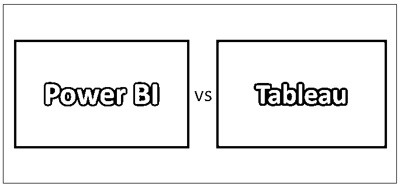
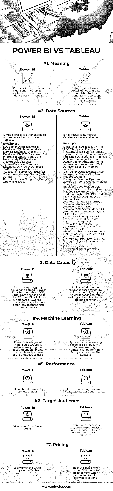

# 电源 BI 与 Tableau

> 原文：<https://www.educba.com/power-bi-vs-tableau/>

## Power BI 与 Tableau 的区别

Microsoft Power BI 是一个商业智能工具，用于处理来自不同来源的数据，并在清理和集成过程后提供可视化。它支持即席报告生成，并有助于数据分析。生成有效且易于理解的仪表板，并可在 web 上发布。新手和有经验的用户都可以使用它。它用于运行即席查询来识别模式和趋势。

Tableau 是一个[商业智能工具](https://www.educba.com/business-intelligence-tool/)，它有一个吸引人的用户界面，可以生成报告、仪表板和对来自多个数据源的大量数据的分析。它提供了[交互式数据可视化](https://www.educba.com/careers-in-data-visualization/)来理解数据并提出见解。它使用户无需技术知识就能理解数据，并以简单有效的方式理解任何复杂的过程。

<small>Hadoop、数据科学、统计学&其他</small>

### 力量对比 BI 与 Tableau(信息图表)

以下是 7 大对比力量 BI vs Tableau:

### Power BI 和 Tableau 的主要区别

以下是要点列表，描述了 Power BI 和 Tableau 之间的差异:

Power BI 与 Tableau 的主要区别在于从不同服务器提取数据的可视化能力。以下是 Power BI 与 Tableau 之间最重要的关键区别

#### 数据存取

Power BI 不能[连接到 Hadoop 数据库](https://www.educba.com/hadoop-database/)，但是它可以从 Azure、Salesforce 和 googles analytics 中提取数据。Tableau 允许访问云中的数据并连接到 Hadoop 数据库。它还会自动识别资源。

#### 形象化

Power Bi 提供了大量的数据点来提供可视化。它拥有大约 3500 个数据点，可用于深入研究数据集并进行分析。不需要任何编码语言，使用拖放的方法，用户可以创建图表，散点图在 tableau 和它也不限制数据点的数量。

#### 客户支持

Power BI 提供有限的客户支持。Tableau 有强大的客户支持，并有社区论坛进行讨论。它将支持分为在线、桌面和服务器支持。

#### 设置

Power BI 分为三类。桌面、移动和服务。最基本的设置是 Azure Tenant。Tableau 使得通过 Tableau Online 或 Tableau Server 共享 Tableau desktop 中生成的结果成为可能。

#### 部署

动力 BI 是 Saas 模式 ie。软件即服务。Tableau 在内部和云中均可用。当云中有大量数据可用时，它会产生最佳结果。

### 功率 BI 和 Tableau 对照表

下面是 Power BI 和 Tableau 的对比表。

| **功率 BI** | 表 |
| Power BI 是一款业务数据分析工具，用于分析业务并从中获得洞察力。 | Tableau 是一个商业智能和数据分析工具，用于高度灵活地生成报告和数据可视化。 |
| **数据来源:**
与 Tableau 相比，对其他数据库和服务器的访问受到限制
。
示例:
SQL Server 数据库、Access 数据库、SQL Server Analysis Services 数据库、Oracle 数据库、IBM DB2 数据库、IBM Informix 数据库(Beta)、IBM Netezza、MySQL 数据库、PostgreSQL 数据库、Sybase 数据库、Teradata 数据库、SAP HANA 数据库、SAP 商务仓库应用服务器、SAP 商务仓库消息服务器(Beta)、Amazon Redshift、Impala、Google BigQuery、雪花、Exasol。 | 
它可以访问众多的数据库资源和服务器。
示例:
Excel、文本文件、Access、JSON 文件、PDF 文件、空间文件、统计文件、其他文件(如 Tableau。超，。tds，。twbx)、连接到 Tableau Online 或服务器上的已发布数据源、Actian Matrix、Actian Vector、Amazon Athena、Amazon Aurora、Amazon EMR、Amazon Redshift、Anaplan、Apache Drill、Aster Database、Box、Cisco Information Server、Cloudera Hadoop、DataStax Enterprise、Denodo、Dropbox、EXASOL、Firebird、Google Analytics、Google BigQuery、Google Cloud SQL、Google Sheets、Hortonworks Hadoop Hive、HP Vertica、IBM BigInsights、IBM DB2、IBM PDA (Netezza) 、kognitiono、MapR Hadoop Hive、Marketo、MarkLogic、MemSQL、Microsoft Analysis Services、Microsoft PowerPivot、Microsoft SQL Server、MonetDB、MongoDB BI Connector、MySQL、OData、OneDrive、Oracle、Oracle Eloqua、Oracle Essbase、Pivotal Greenplum Database、PostgreSQL、Presto、Progress OpenEdge、QuickBooks Online、Salesforce、SAP HANA、SAP NetWeaver Business Warehouse、SAP Sybase ASE、SAP Sybase IQ、ServiceNow ITSM、SharePoint Lists、Snowflake、Spark SQL、Splunk |
| **数据容量**
每个工作区/组最多可以处理 10 **GB** 的数据。
对于超过 10GB 的数据，要么需要在云中(Azure)，如果在本地数据库中，Power BI 只从数据库中选择或提取数据，而不导入。 | Tableau 工作在基于列的结构上，该结构只存储每列的唯一值，这使得获取数十亿行成为可能。 |
| **机器学习**
Power BI 与微软 Azure 集成，它有助于分析数据，了解产品/业务的趋势和模式。 | Python 机器学习能力是 Tableau 内置的，这使得对数据集执行 ML 操作非常有效。 |
| **性能**
它能处理有限的数据量。 | 它能以更好的性能处理大量数据。 |
| **目标受众**
幼稚用户，
有经验用户。 | 尽管访问简单易行，但分析师和有经验的用户会将其用于分析目的。 |
| 与 Tableau 相比，它是非常便宜的。 | Tableau 比 power BI 贵。连接第三方应用需要多付费。 |

### 结论

商业智能工具在商业决策中起着至关重要的作用。就 Power BI vs Tableau 而言，Power BI 和 Tableau 各有特色，各有利弊。这完全取决于业务需求和要求。如果业务需求是分析有限的数据量和功能，Power BI 是最佳选择，因为它比 Tableau 便宜。但是，当涉及到处理来自各种来源的大量数据，并需要对数据执行任何统计和奇妙的数据可视化时，tableau 提供了大量的功能和向下钻取选项。同时投资成本高。因此，这在很大程度上取决于业务规模和需求。Power BI vs Tableau 工具都表现出色，所以我们不能断定只有一个工具优于另一个。因为像数据准备、数据存储、数据验证和 ETL 操作这样的功能都是由这两种工具低效且没有任何延迟地执行的。

### 推荐文章

这是权力 BI 与 Tableau 之间的差异的指南。在这里，我们讨论了 Power BI 与 Tableau 的直接比较、关键差异以及信息图和比较表。您也可以阅读以下文章，了解更多信息——

1.  [Hadoop 与 Teradata——哪个最好](https://www.educba.com/hadoop-vs-teradata/)
2.  [SQL Server 数据库管理工具](https://www.educba.com/database-management-tools/)
3.  [Power BI 与 QlikView-有用的差异](https://www.educba.com/power-bi-vs-qlikview/)
4.  [Azure Paas vs Iaas 惊人的差异](https://www.educba.com/azure-paas-vs-iaas/)
5.  [Power BI 仪表盘 vs 报告](https://www.educba.com/power-bi-dashboard-vs-report/)
6.  [视觉分析 vs Tableau](https://www.educba.com/visual-analytics-vs-tableau/)
7.  [Excel vs 表](https://www.educba.com/excel-vs-tableau/)
8.  [商业智能 vs 机器学习](https://www.educba.com/business-intelligence-vs-machine-learning/)
9.  【Tableau vs Power BI vs QlikView 的差异
10.  [如何在 Power BI 中使用滤镜 DAX 功能？](https://www.educba.com/power-bi-filter/)

