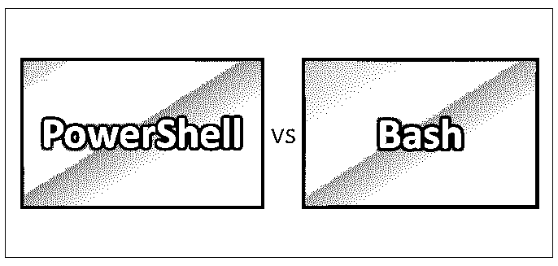
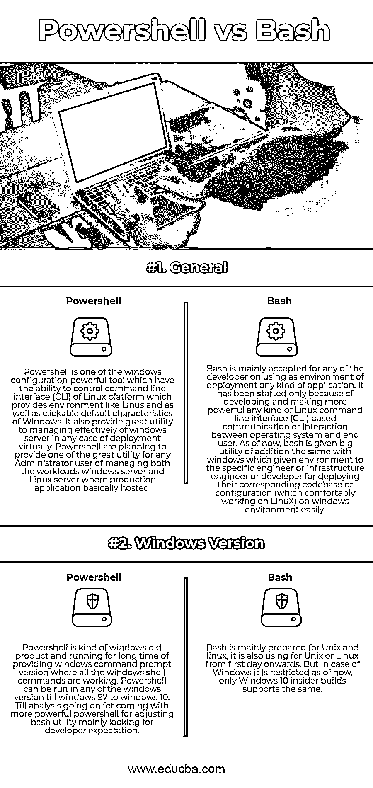

# PowerShell vs Bash

> 原文：<https://www.educba.com/powershell-vs-bash/>

## PowerShell 与 Bash 的区别

Powershell 和 Bash 都通过使用它们自己的配置管理工具提供了一个智能命令行界面。Powershell 通常在 windows 操作系统中很受欢迎，它为最终用户提供了一个良好的环境来使用命令提示符和执行 Windows 特定的命令。而 bash 通常用在 UNIX 环境中，并且最受那些愿意部署应用程序或代码库以提高利用率的开发人员的欢迎。在 bash 中部署永远是处理任何类型的安全代码部署的最安全的方法。考虑到开发人员的需求，windows 计划在 windows 环境中引入 bash，他们的策略是在 Windows 中提供 UNIX 类型的环境，以便任何开发人员更好地选择他们的部署。

它将在 canonical 的 Ubuntu 操作系统环境中提供双重引导，这实际上给最终用户一种本地 Linux 或 Unix 功能的味道。这就是为什么在当前的世界中，人们普遍认为 Bash 将会占领整个 powershell 市场，特别是在 Windows 环境中。Bash 提供了类似于 Unix 或 Linux 系统的 windows 环境，还提供了 OpenSSH 连接的一个重要工具，这是最安全的安全性，因为它遵循安全 shell 协议。Powershell 提供了适当的特定于 windows 的 Microsoft native scripting 或 automates scripting platform，它同时拥有 Linux 类型的命令行界面(CLI)和纯可点击的 windows native environment，这吸引了开发人员将其用作虚拟部署环境。

<small>Hadoop、数据科学、统计学&其他</small>

### PowerShell 和 Bash 的面对面比较(信息图表)

以下是 PowerShell 和 Bash 之间的两大区别:

### PowerShell 和 Bash 的主要区别

让我们讨论 PowerShell 和 Bash 之间的一些主要区别:

1.  Powershell 不被认为是默认的 shell，它实际上不同于操作系统中的任何其他 shell。它实际上是一个简单的脚本环境，其中任何类型的命令(主要是轻量级的 cmdlets 示例)都可以非常容易地运行，而不会产生任何问题。该命令可以通过命令提示符或自动化脚本运行，也可以通过任何定义的 API 运行。在 PowerShell 中，任何类型的操作系统都可以在完全工作的状态下控制旧的操作系统。它还使用了非常好的别名功能，这主要是为了在相应的新命令或脚本中提供旧命令的正确引用。而在 bash 的情况下，它支持所有种类的 Unix 或 Linux 命令，这对于开发人员来说是非常有用的，因为它为他们的代码库部署了环境。任何一种操作系统命令都不能够支持，甚至一些旧的命令在这里也不总是能正常工作。但是 bash 被赋予了相同的命令，只是做了一些语法上的修改，但是如果我们观察最终用户，输出可能是相同的。PowerShell 的 Bash 和 dir 几乎为最终用户提供了相同的输出。
2.  Powershell 有一个大的实现，比如对象管道。它总是维护每个对象的流水线，以便正确集成。它总是将一个对象的输出作为输入传递给另一个对象。假设我们像 cmdlet 一样执行了一个命令，那么它将执行并作为另一个对象的输入，然后显示在最终用户输出屏幕上。通过使用这种对象管道方法，可以很容易地按顺序操作多个 cmdlets。如果最终用户需要共享或复制复杂的数据，或者希望通过命令提示符将整个数据结构传递到另一个环境中，那么对于 Powershell 来说，对象管道是最佳且有用的选择。尽管 bash 在对象结构中没有遵循，但输入和输出基本上是首选的纯文本。因此，任何用户通过 bash 转换他们的信息总是很容易的，因为它总是遵循纯文本结构作为输入和输出，这对于下一个程序来说更容易理解。
3.  在比较命令的情况下，Powershell 和 Bash 之间有一些基本的区别，Powershell 通常使用下面的比较命令来编写脚本。

-eq，-no，-ceq，-cane

Bash 使用一些比较命令来编写脚本:

=, !=

### Powershell 和 Bash 比较表

我们来看看 Powershell 和 Bash 的顶级对比。

| 【Powershell 与 Bash 的基本对比 | **Powershell** | **痛击** |
| **通用** | Powershell 是 windows 配置功能强大的工具之一，它能够控制 Linux 平台的命令行界面(CLI ),提供了类似 Linux 的环境以及 Windows 可点击的默认特性。它还为在任何虚拟部署情况下在 windows 服务器上进行有效管理提供了强大的工具。Powershell 计划为任何管理员用户提供一个很好的工具，用于管理 windows 服务器和 Linux 服务器上的工作负载，生产应用程序基本上托管在这两个服务器上。 | Bash 主要被任何开发人员接受作为部署任何类型应用程序的环境。它的出现仅仅是因为 Linux 命令行界面(CLI)的开发和变得更加强大。任何类型的 CLI 都是基于操作系统和最终用户之间的通信或交互。到目前为止，bash 被赋予了很大的效用，它为特定的工程师、基础设施或开发人员提供了在 windows 环境上轻松部署相应的代码库或配置(在 Linux 上工作很舒服)的环境。 |
| **Windows 版本** | Powershell 是一种 windows 老产品，长期提供 windows 命令提示符版本，所有的 windows shell 命令都在这个版本中运行。Powershell 可以在 windows 97 到 windows 10 之前的任何 windows 版本上运行。直到分析向前发展，Windows 将提供更强大的 PowerShell 来调整 bash 实用程序，主要是为了满足开发人员的期望。 | Bash 主要是为 Unix 和 Linux 准备的，从第一天起它也为 Unix 或 Linux 使用。但在 Windows 的情况下，它目前受到限制，只有 Windows 10 insider 版本支持相同的功能。 |

### 结论

Powershell vs Bash 对于两种不同的操作系统 Windows 和 Unix 来说都是非常流行的配置管理工具。由于 bash 遵循文本结构来传输消息等，开发人员总是喜欢在 UNIX box 中部署他们的代码，而 Powershell 因其比 Bash 更友好的可点击功能而非常受普通用户的欢迎。

### 推荐文章

这是 Powershell 和 Bash 之间最大区别的指南。在这里，我们已经讨论了 Powershell 与 Bash 的直接比较、主要差异以及信息图和比较表。您也可以看看以下文章，了解更多信息–

1.  [Linux 与 Windows 10 |差异](https://www.educba.com/linux-vs-windows-10/)
2.  [Ubuntu vs FreeBSD |对比](https://www.educba.com/ubuntu-vs-freebsd/)
3.  [JSON vs AJAX](https://www.educba.com/json-vs-ajax/)
4.  [吉拉 vs 阿萨纳|对比](https://www.educba.com/jira-vs-asana/)
5.  [吉拉 vs 特雷罗:差异](https://www.educba.com/jira-vs-trello/)
6.  [JIRA vs TFS:有何不同](https://www.educba.com/jira-vs-tfs/)
7.  [吉拉 vs 雷德明:差异](https://www.educba.com/jira-vs-redmine/)
8.  [JSON vs SOAP:有哪些比较](https://www.educba.com/json-vs-soap/)
9.  [PowerShell vs 命令提示符| 14 大差异](https://www.educba.com/powershell-vs-command-prompt/)
10.  [什么是 Bash？|版本|用法](https://www.educba.com/what-is-bash/)

