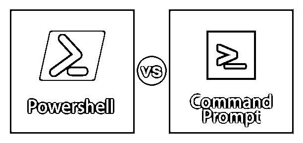
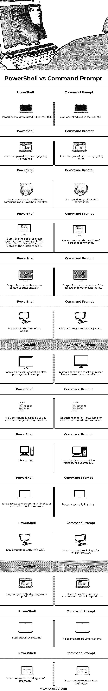

# PowerShell vs 命令提示符

> 原文：<https://www.educba.com/powershell-vs-command-prompt/>

## PowerShell 和命令提示符之间的区别

命令提示符或 cmd 是 windows 的默认应用程序，用于与 windows 操作系统中的任何 windows 对象进行交互。它使用户能够直接与系统交互。它最广泛地用于执行批处理文件或运行简单的实用程序。PowerShell 是 cmd 的更高级版本。它不仅是一个接口，还是一种脚本语言，用于更轻松地执行管理任务。在 cmd 上执行的大多数命令也可以在 PowerShell 上运行。在本帖中，我们将详细讨论 Powershell 与命令提示符的区别。

### PowerShell 和命令提示符之间的直接比较(信息图表)

以下是 PowerShell 与命令提示符之间的 14 大区别:

<small>Hadoop、数据科学、统计学&其他</small>

### PowerShell 和命令提示符之间的主要区别

让我们讨论一下 PowerShell 与命令提示符之间的一些主要区别:

*   PowerShell 和命令提示符之间的主要区别在于普通用户对命令或 cmdlet 的理解。普通用户通过查看 cmdlet 就能够猜出 PowerShell cmdlet 应该做什么，因为大多数 cmdlet 都非常容易解释，因为它们遵循一个简单的规则，即动词后跟名词。
*   cmdlet 遵循动词-名词约定，任何 cmdlet 的第一部分将指定 cmdlet 将要执行的动作的类型，即 get、set 或 add，并且由于它后面跟有名词，因此它将表示动作将执行什么。
*   PowerShell 有一个 Get-help 命令，可以帮助用户使用所有可用的命令、它们的语法和别名。cmdlets 的一些例子是 Add-Content、Get-Content、Get-Command。对于普通用户来说，只要看着它们，就更容易理解上述 cmdlets 将执行什么。另一方面，让我们看看一些 cmd 命令。普通用户不容易识别这些命令。
*   PowerShell 和 cmd 的另一个区别在于它们的用法。 [Cmd 主要用于](https://www.educba.com/what-is-cmd/)执行批处理命令，进行一些主要的故障排除，而 PowerShell 可用于执行批处理命令以及管理目的。
*   也可以在 PowerShell 中编写脚本来自动化任务。PowerShell 也有 ISE，这使得编写和调试脚本更加容易。Cmd 不能用于与内核中的系统对象进行交互，而由于 PowerShell 是基于。net 平台，它甚至可以在核心层与 windows 对象进行交互。
*   Cmd 仅适用于文本。PowerShell 类似于 Linux，它使用管道工作。这意味着一个 cmdlet 的输出可以传递给另一个 cmdlet。这确保了系统中不同程序之间的交互是可能的，或者甚至是网络中连接的不同系统之间的交互。
*   [PowerShell 为](https://www.educba.com/what-is-powershell/)用户提供了为 cmdlets 或脚本创建别名的能力，允许他们以看似简单的方式在它们之间来回切换。PowerShell 的输出是一个对象。

### PowerShell 与命令提示符对照表

让我们讨论一下 PowerShell 与命令提示符之间最重要的比较:

| **PowerShell** | **命令提示符** |
| PowerShell 于 2006 年推出。 | cmd 于 1981 年推出。 |
| 可以通过键入 PowerShell 从 run 打开它。 | 可以通过键入 cmd 从 run 打开它。 |
| 它可以操作批处理命令和 PowerShell cmdlets。 | 它只能与批处理命令一起工作。 |
| 它提供了为 cmdlets 或脚本创建别名的能力。这可以帮助用户轻松地在功能之间导航。 | 它不支持创建命令的别名。 |
| cmdlet 的输出可以传递给其他 cmdlet。 | 一个命令的输出不能传递给其他命令。 |
| 输出是对象的形式 | 命令的输出只是文本。 |
| 可以执行放在脚本中的一系列 cmdlets。 | 在 cmd 中，一个命令必须在下一个命令运行之前完成。 |
| Help 命令可用于获取有关任何 cmdlets 的信息。 | 对于有关命令的信息，没有这样的帮助选项。 |
| 它有一个 ISE。 | 只有命令行界面，没有单独的 ISE。 |
| 它在构建时可以访问编程库。net 框架。 | 没有进入图书馆的权利。 |
| 它可以直接与 WMI 集成。 | 需要一些 WMI 互动的外部插件。 |
| 我可以连接微软的云产品。 | 它不具备连接 MS online 产品的能力。 |
| 支持 Linux 系统。 | 它不支持 Linux 系统。 |
| 它可以用来运行所有类型的程序。 | 它只能运行控制台类型的程序。 |

### PowerShell vs 命令提示符示例

让我们看一些基本的操作，它们可以通过使用 cmd 和 PowerShell 的语法来完成。

#### 1.要更改目录位置

*   **Cmd 命令** : cd /d D:\testfolder
*   **Powershell cmdlet** :设置位置“D:\testfolder”

**Output** :这两个命令都是将当前目录的位置改为 D 盘的 test 文件夹。

#### 2.列出目录中的所有文件

*   **Cmd 命令** : dir
*   **Powershell cmdlet:**Get-child item

**输出:**上面将显示当前目录中的文件

#### 3.重命名文件

*   **Cmd 命令**:重命名 c: \old.txt new.txt
*   **Powershell cmdlet**:Rename-Item " c:\ file . txt "-NewName " new . txt "

**输出:**上述命令将根据需要重命名文件。

#### 4.访问帮助命令

*   **Cmd 命令:** help [commandname] [/？]
*   **Powershell Cmdlet:**Get-Help " Cmdlet name "

**Output:** 显示与提到的命令/cmdlet 相关的语法和有用信息。

#### 5.停止一个过程

*   **Cmd 命令:**停止进程名“进程名”
*   **Powershell cmdlet:** 停止进程名称“应用程序名称”

**输出:**两者都停止上述进程的运行。

#### 6.关闭本地系统

*   **Cmd 命令:**关机/秒
*   **Powershell cmdlet:** 停止计算机

**输出:**关闭本地系统

#### 7.重启本地系统

*   **Cmd 命令:**关机/r
*   **Powershell cmdlet:** 重新启动计算机

**输出:**均重启本地系统

#### 8.获取 ip 地址

*   **命令命令:** ipconfig
*   **Powershell cmdlet:** 测试-连接-计算机名(主机名)

**输出:**均返回系统的 ip 地址

### 结论

因此，本文涵盖了命令提示符和 PowerShell 的各个方面。从更广泛的角度来看，最好开始学习 PowerShell，因为与命令提示符相比，它相对较新，而且微软正在努力增强 PowerShell 的功能。Powershell 是建立在。net 框架，因此它可以访问多个库，从而更容易与多个系统连接。最后，PowerShell 是管理员的首选工具，因为它有助于自动化各种日常任务。

### 推荐文章

这是 PowerShell vs 命令提示符的指南。在这里，我们讨论了 PowerShell 与命令提示符的主要区别，包括信息图和比较表。您也可以浏览我们推荐的其他文章，了解更多信息——

1.  [ROLAP vs MOLAP vs HOLAP](https://www.educba.com/rolap-vs-molap-vs-holap/)
2.  [SSH vs SSL](https://www.educba.com/ssh-vs-ssl/)
3.  [MariaDB vs MySQL](https://www.educba.com/mariadb-vs-mysql/)
4.  【Cassandra 与 MySQL 对比指南
5.  [PowerShell Set-Location 示例](https://www.educba.com/powershell-set-location/)
6.  [PowerShell Rename-Item |如何实现？](https://www.educba.com/powershell-rename-item/)
7.  [PowerShell vs PowerShell ISE | 7 强](https://www.educba.com/powershell-vs-powershell-ise/)

