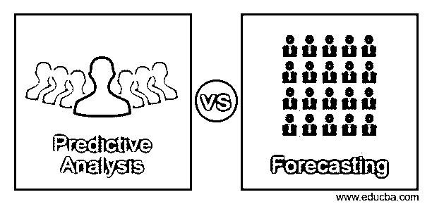
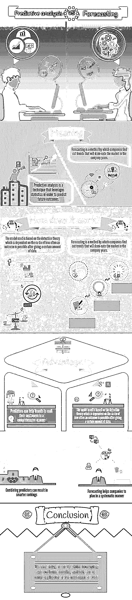

# 预测分析与预测

> 原文：<https://www.educba.com/predictive-analysis-vs-forecasting/>

## 预测分析与预测的区别

**预测分析与预测—**虽然预测未来几乎是不可能的，但了解市场将如何演变以及消费者趋势将如何形成，对于所有行业的品牌和公司都极其重要。这是因为消费者是任何品牌成功和成长故事中不可或缺的一部分。这是因为品牌和消费者是市场生态系统不可或缺的一部分。因此，为了了解这个生态系统，进行深入的市场分析非常重要。这种预测性分析一方面有助于你更好地了解你的目标受众，另一方面也有助于增强和改善品牌联系。总之，这种预测性分析与预测将有助于公司以有利可图的方式发展。

这篇关于预测分析与预测的文章结构如下

<small>Hadoop、数据科学、统计学&其他</small>

*   [预测分析与预测信息图](#vs)
*   [什么是预测分析，预测分析是如何工作的？](#work)
*   [预测分析与预测——它如何帮助公司？](#companies)
*   [4 预测的主要好处如下](#benefits)
*   [预测分析与预测的结论](#Conclusion)

### 预测性**分析**与预测的直接对比(信息图)

以下是预测分析和预测之间的比较。

那么到底什么是市场分析呢？[市场数据分析是一种技术，在这种技术中，品牌使用所有可获得的关于市场的信息](https://www.educba.com/data-analysis-techniques/ "Data Analysis Techniques for Brand Strength"),然后制定一种策略，反过来帮助他们利用现有的机会。通过正确理解[市场](https://www.educba.com/emerging-market-trends-2019/ "Emerging Market Trends 2016")的当前和未来趋势，品牌可以选择正确的战略，在市场中取得领先，并产生高额利润。市场分析是商业的一个非常重要的方面，因为它显示了任何公司的成功率，并以有效的方式描绘了公司未来的发展。简而言之，市场分析报告有助于品牌记录相关和重要的信息，这些信息可以使企业受益于推出新产品/服务的重要性或广告活动在未来的有效性。

当以适当的方式进行时，市场分析可以帮助品牌以全面的方式回答以下问题:

1.  我们的目标受众是谁？
2.  他们的需求和基本期望是什么？
3.  我如何营销我的产品/服务，让它们在市场上脱颖而出？
4.  我的竞争对手是谁，他们的 USP 是什么？
5.  我的广告活动在业内进展如何？改进的范围是什么？
6.  如何到达下一个发展阶段？
7.  我们怎样才能更好地利用我们的资源？
8.  有必要改变我的品牌的重点和目标吗？

良好的市场分析可以帮助品牌以一种重要的方式回答所有这些问题。当知道这些问题的答案时，品牌就更容易找到一条道路，在这条道路上，他们可以实施有利于品牌整体增长和发展的变革。

在理解了市场分析的重要性之后，让我们来看看进行市场分析的三个阶段。为了创建一个好的分析，以复杂的方式研究关于公司的信息是很重要的。通过了解过去，现在和未来的品牌可以创建一个良好的和全面的分析。

*   **了解过去的报告:**通过对过去的分析，品牌可以了解哪些活动在接触目标受众方面更为成功。这也将帮助品牌了解他们在实施活动时遇到的障碍和挑战，从而确保未来的活动以成功和富有成效的方式实施。
*   **分析当前市场形势:**公司了解他们所处的市场和经济非常重要。这是因为了解市场不仅有助于公司与目标受众建立联系，还能推出现有市场所需的产品和服务。这反过来将帮助公司最大限度地利用他们的物质和非物质资源。
*   **以成功的方式预测未来:**市场分析可以帮助公司预测未来的趋势，并[制定可以启动的计划，从而获得最大的优势](https://www.educba.com/effective-marketing-plan/ "How to Make a Marketing Plan for Small Business")，甚至超过竞争对手。通过建立持续而强大的客户联系，并确保高投资回报，品牌可以在未来获得更好的结果。

预测分析和预测是两种可以帮助公司[制定有效的市场分析计划](https://www.educba.com/marketing-plan-project/ "How to Build an Effective Marketing Plan")的方法。这是因为通过这两种预测分析和预测技术，品牌一方面可以更好地了解他们的客户，另一方面可以确保更好的产品和服务。

### 什么是预测分析，预测分析是如何工作的？

预测分析是一种利用统计数据来预测未来结果的技术。预测分析也可以应用于已经发生的事件。例如，预测分析可用于检测导致犯罪的事件，并识别其背后的罪犯。

所使用的模型基于检测理论，依赖于在给定一定量的数据后，结果可能出现的频率的比率，例如，与重要邮件相比，邮件是垃圾邮件的概率。

可以在模型中使用分类器来查找数据是属于一个集合还是属于另一个集合。比如说在电子邮件的情况下，邮件是垃圾邮件还是正常邮件。由于其相似的领域[学习预测分析](https://www.educba.com/data-science/courses/predictive-modeling-course/ "Predictive Modeling Training")几乎与机器学习相似。这就是为什么在商业环境中部署预测建模时，它被称为预测分析。

因此，预测分析有助于优化[营销活动](https://www.educba.com/social-marketing-campaigns/ "Top 10 Creative Social Marketing Campaigns"),但很难看到其超出预期的好处。这使得预测分析几乎不可能在对行业有很好的全面了解的情况下实施预测分析技术。这就是为什么从预测分析中获益的最佳方式是学习行业的基础知识。

 

*   **预测器可以帮助品牌对其客户进行综合排名:**任何预测分析方法的核心构件都是预测器。例如，新近度是基于自所述消费者购买该品牌的产品/服务以来的时间量的预测值。消费者越新，他们最近的价值越高。作为一个可靠的活动响应预测者，新近度较高的消费者将有更大的回电机会。这意味着，如果客户最近购买了你的产品/服务，他们就有更好的机会给你建设性的反馈。简而言之，对于每一个预测目标，都会有多个预测因子可用于对客户数据库进行排序。例如，通过预测器，品牌可以研究消费者的在线行为。那些花较少时间上网的人对延长他们的在线订阅不感兴趣。通过瞄准更频繁上网的客户，品牌可以有效地最大化他们的资源。
*   **结合预测因素可以产生更智能的排名:**品牌可以通过将多个预测因素组合在一起创建一个模型。创建模型是预测分析背后的主要思想。将两个预测值结合起来的方法之一是简单地将它们相加。因此，如果兴趣和上网时间都可以影响回复邮件的机会，那么就可以通过增加上网时间和兴趣来建立一个好的预测器。通过将两个预测器拉在一起而创建的这种方案此后被称为模型，并且在上述情况下，它是线性模型。这就是为什么[预测分析](https://www.educba.com/predictive-analytics-tool/)有时也被称为预测建模。与此同时，重要的是要记住，为了理解市场的复杂性质，预测模型不会简单，而是非常丰富和复杂，最重要的是涉及到许多预测因素。

要记住的另一个方面是，因为市场上有如此多的预测选项，所以很难选择正确的一个。由于多种配方和行业复杂性，品牌几乎不可能尝试所有配方来决定最佳模式。

预测分析模型也可以在计算机上创建，组织的集体经验可以用来理解复杂的消费者行为和人口统计。这在核心上是一种反复推敲和试错的混合。预测分析一方面可能非常复杂，另一方面可能非常简单，但重要的是要记住，简单的模型可能无法像复杂的模型那样预测。

总之，一个品牌投资于能够更好地预测客户及其行为的共同模型总是更好的。因此，虽然预测分析基于自动机器技能，但驱动它们所需的技能是人类的，因此每个品牌都必须投资于预测分析和预测，才能取得成功。

### 预测分析与预测——它如何帮助公司？

预测是一种方法，通过这种方法，公司可以发现未来几年主导市场的趋势。它不仅对新创公司有很多优势，对老牌公司也是如此。预测被定义为一种计划工具，可以帮助管理层应对不确定的未来，主要是通过使用过去的数据和分析市场趋势。预测过程始于某些假设，这些假设基于管理团队的管理经验、知识和敏锐的判断力。这些估计值然后被投射到诸如 Box- [Jenkins](https://www.educba.com/jenkins-interview-questions/) 模型、德尔菲法、指数平滑、移动平均、回归分析和趋势预测等技术上。由于假设中的任何错误也会导致预测结果中类似的或放大的错误，因此使用敏感性分析技术，将一系列值分配给不确定因素，这些因素也称为变量。

 

### 预测的 4 大好处

下面给出了预测的主要好处。

1.  **预测有助于建立新的创业公司和推广新品牌:**当新品牌在行业中建立时，预测是一个重要的因素。当这个行业充满了多重挑战，在看到一个成功品牌的道路上有许多障碍时，这一点尤其如此。预测可以帮助企业家找到克服这些挑战的最佳方式，从而建立一个成功的公司。通过预测，品牌可以了解他们在市场上将被如何看待，以及他们的产品是否有能力满足目标受众的期望和需求。简而言之，良好而有力的预测可以帮助初创公司以更好的方式规划和制定进入策略，从而增加成功的机会。同时，良好的预测可以帮助新品牌满足供求状况，从而增加其品牌影响力和忠诚度。

2.  **与以前相比，预测可以帮助品牌更好地利用其财务资源:**财务问题，尤其是对新公司和小公司而言，是一个非常重要的方面。这就是为什么在这种情况下，以适当和有效的方式利用现有资源非常重要。由于没有足够的资本，任何品牌都无法生存，因此财务预测在这种情况下扮演着非常重要的角色。通过帮助公司以适当的方式分配他们的资源，财务预测可以成为一个公司进行适当和有效的财务规划的关键。
3.  **预测可以帮助[管理层](https://www.educba.com/careers-in-linux-administration/)做出良好而成功的管理决策:**每家公司都建立在良好的管理决策基础之上。没有强大的行政骨干，公司迟早会彻底变成一个失败者。任何公司的管理团队本质上都是一个决策过程，他们有责任做出决策并确保决策得到执行。这就是为什么行政部门的车轮以持续的方式工作是很重要的，在这里，预测扮演着非常重要的角色，因为它有助于公司在正确的时间做出决策。
4.  **预测有助于公司系统地进行规划:** [规划是任何公司](https://www.educba.com/human-resource/courses/human-resource-course/ "Succession Planning")非常重要的组成部分，无论是长期还是短期。预测可以帮助公司规划他们的发展战略，同时牢记消费者的需求，同时对市场趋势有一个错综复杂的了解。换句话说，好的和适当的计划，无论是对公司的整体发展还是对公司的一部分，都完全依赖于好的预测技术。

### 结论

最后，预测分析和预测是两种技术，通过这两种技术，品牌可以正确地预测和理解市场技术，同时满足客户的期望。简而言之，今天需要的不是更好的预测分析和预测方法，而是更好地应用手头的技术。

### 推荐文章

这是预测分析与预测的指南。这里我们已经详细讨论了比较、工作和相关的主要好处。您也可以看看以下文章，了解更多信息–

1.  [詹金斯 vs 竹子有什么好处](https://www.educba.com/jenkins-vs-bamboo/)
2.  [詹金斯 vs 特拉维斯 CI:最佳特性](https://www.educba.com/jenkins-vs-travis-ci/)
3.  [带 R 的统计分析](https://www.educba.com/statistical-analysis-with-r/)
4.  [商业预测](https://www.educba.com/business-forecasting/)

