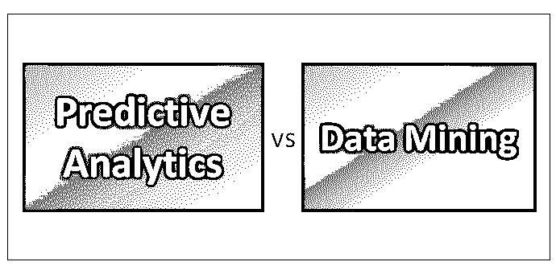
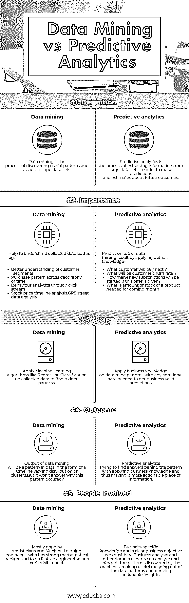

# 预测分析与数据挖掘

> 原文：<https://www.educba.com/predictive-analytics-vs-data-mining/>

## 预测分析与数据挖掘的区别

[预测分析是提炼数据资源的](https://www.educba.com/what-is-predictive-analytics/)过程，使用业务知识从这些新发现的模式中提取隐藏的价值。[数据挖掘是](https://www.educba.com/what-is-data-mining/)通过机器学习发现隐藏的数据模式——而复杂的[算法](https://www.educba.com/software-development/courses/java-course/)是挖掘工具。

数据挖掘+领域知识= >预测分析= >商业价值

<small>Hadoop、数据科学、统计学&其他</small>

### 预测分析和数据挖掘之间的直接比较

以下是预测分析和数据挖掘之间的 5 个比较:

### 预测分析与数据挖掘的主要区别

下面是预测分析和数据挖掘之间的区别

● **过程**–[数据挖掘过程](https://www.educba.com/data-mining-process/)可以概括为六个阶段-

**a.Business/Research 理解阶段—**从业务或研究单位整体的角度清楚地阐述项目目标和需求
**b .数据理解阶段—**收集并使用探索性数据分析来熟悉数据，并发现初步见解。
**c .数据准备阶段—**对原始数据进行清理并应用转换，以便为建模工具做好准备
**d .建模阶段—**选择并应用适当的建模技术，并校准模型设置以优化结果。
**e .评估阶段—**在我们部署之前，必须对模型的质量和有效性进行评估。此外，确定模型实际上是否实现了在阶段 1 中为其设定的目标。
**f .部署阶段—**在生产中使用模型可能是一个简单的部署，如生成一个报告，也可能是一个复杂的部署，如在另一个部门实现并行数据挖掘过程。

预测分析流程领域的高级步骤

**a .定义业务目标—**要实现什么样的业务目标以及数据如何匹配。例如，业务目标是为新客户提供更有效的产品，而所需的数据是具有特定属性的客户细分。
**b .收集额外数据—**需要的额外数据可能是来自在线系统的用户档案数据或来自第三方工具的数据，以便更好地理解数据。这有助于找到模式背后的原因。有时进行市场调查是为了收集数据。
**c .草拟预测模型—**用新收集的数据和业务知识创建的模型。一个模型可以是一个简单的商业规则，比如“如果我们提供这样的优惠，就有更大的机会将印度的用户从 a 年龄转换到 b 年龄”，也可以是一个复杂的数学模型。

● **商业价值**——数据挖掘本身增加了商业价值

形容词（adjective 的缩写）深入了解不同维度的客户群
b .获取特定于关键绩效指标的绩效模式(例如，订阅是否随着活跃用户数的增加而增加？)
c .识别欺诈活动企图并加以防范。
d .系统性能模式(例如不同设备的页面加载时间——任何模式？)

预测分析通过提供三个优势来增强组织的能力:

**a .视觉—**有助于看到别人看不见的东西。预测分析可以检查大量过去的客户数据，将其与其他数据关联起来，并按照正确的顺序组合所有数据。
**b .决策—**一个制作精良的[预测分析模型](https://www.educba.com/predictive-modeling/)提供不带情绪和偏见的分析结果。它提供一致和公正的见解来支持决策。
**c . Precision—**帮助使用自动化工具为您完成报告工作—节省时间和资源，减少人为错误，提高精确度。

● **绩效衡量**—[数据挖掘流程的绩效衡量](https://www.educba.com/data-mining-process/)模型在数据中发现模式的能力。大多数情况下，它是一个回归、分类或聚类模型，所有这些都有一个定义明确的性能度量。
预测分析的绩效是根据业务影响来衡量的。例如，与一般广告活动相比，定向广告活动的效果如何？.无论数据挖掘发现模式有多好，要很好地工作预测模型，商业洞察力是必须的。

● **未来**–数据挖掘领域发展非常迅速。借助深度[神经网络](https://www.educba.com/neural-networks-vs-deep-learning/)等更复杂的模型，尝试用最少的数据点和最少的特征在数据中寻找模式。这个领域的许多先驱，比如谷歌，也试图让这个过程变得简单，让每个人都可以使用。一个例子是 Google 的 Cloud AutoML。
预测分析扩展到各种各样的新领域，如员工保留预测、犯罪预测(也称为预测警务)等。与此同时，组织试图通过收集关于用户的最大信息来更准确地预测，如他们去哪里，观看什么类型的视频等。

### 预测分析和数据挖掘对照表

以下是描述预测分析和数据挖掘之间的比较的要点列表。

| **比较的基础** | **数据挖掘** | **预测分析** |
| **定义** | 数据挖掘是在大型数据集中发现有用模式和趋势的过程。 | 预测分析是从大型数据集中提取信息以预测和估计未来结果的过程。 |
| **重要性** | Help to understand collected data better. Eg:●更好地了解客户群●跨地域或跨时间的购买模式●通过点击流进行行为分析●股价时间线分析。

●GPS 街道数据分析

 | Predict on top of data mining results by applying domain knowledge –●下一个顾客会买什么？●客户流失率会是多少？●如果给予此优惠，将开始多少新的认购？●下个月需要多少产品库存 |
| **范围** | 对收集的数据应用机器学习算法，如回归、分类，以找到隐藏的模式 | 将业务知识应用于数据挖掘模式以及获得业务有效预测所需的任何附加数据 |
| **结果** | 数据挖掘的输出将是时间线变化分布或聚类形式的数据模式。但它不会回答为什么会出现这种模式？ | 预测分析试图通过应用业务知识找到模式的答案，从而使其成为更具可操作性的信息。 |
| **涉案人员** | 大部分由统计学家和机器学习工程师完成，他们有很强的数学背景来进行特征工程和创建 ML 模型 | 特定业务知识和明确的业务目标在这里是必须的。[业务分析师](https://www.educba.com/data-scientist-vs-business-analyst/)和其他领域专家可以分析和解释机器发现的模式，从数据模式中提取有用的意义，并得出可操作的见解 |

### 结论

正如里克·怀汀在《信息周刊》中所说，下一步就是下一步。预测分析是商业智能的发展方向。数据挖掘以各种方式帮助组织，其中最重要的一点是为预测分析奠定良好的基础

### 推荐文章

这是预测分析与数据挖掘之间区别的指南。在这里，我们讨论了预测分析与数据挖掘的直接比较、主要差异以及信息图表和比较表。您也可以阅读以下文章，了解更多信息——

1.  [预测分析与数据科学——了解 8 个有用的对比](https://www.educba.com/predictive-analytics-vs-data-science/)
2.  [数据分析与预测分析——哪个有用](https://www.educba.com/data-analytics-vs-predictive-analytics/)
3.  [7 数据挖掘与 Web 挖掘最有用的区别](https://www.educba.com/data-mining-vs-web-mining/)
4.  [数据仓库与数据挖掘——4 个令人惊叹的对比](https://www.educba.com/data-warehousing-vs-data-mining/)
5.  [数据挖掘架构介绍](https://www.educba.com/data-mining-architecture/)

